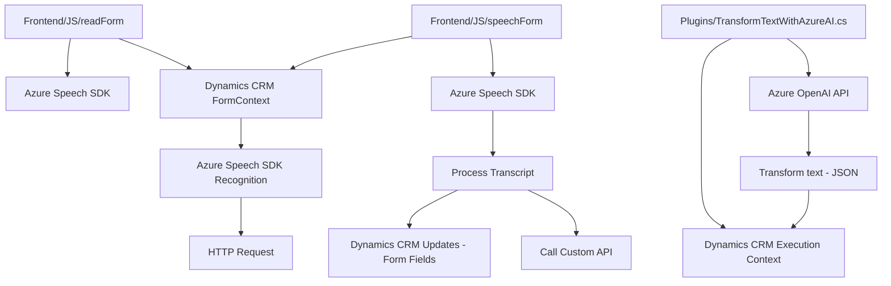

### Breve resumen técnico

El repositorio presentado es una solución que combina:
1. **Frontend basado en JavaScript** para el manejo de datos dinámicos que interactúan con formularios de Dynamics CRM utilizando el reconocimiento y síntesis de voz a través del **Azure Speech SDK**.
2. **Backend en C# como plugin para Dynamics CRM**, que utiliza Azure OpenAI para realizar transformaciones avanzadas de texto, apoyándose en REST APIs.

La solución conecta funcionalidades de Inteligencia Artificial (reconocimiento y síntesis de voz, procesamiento de texto) con el sistema de formularios de Microsoft Dynamics CRM para automatizar la interacción con los datos.

---

### Descripción de arquitectura

La solución tiene una arquitectura híbrida conformada por:

1. **Frontend funcional**:
   - Estructura orientada a lógica de negocio, diseñada con una arquitectura modular y funciones reutilizables que incorporan patrones de diseño como **Facade**. 
   - Se incluye integración directa con el navegador mediante el Azure Speech SDK y los formularios dinámicos de Dynamics CRM.

2. **Backend extensible como plugin**:
   - sigue el diseño **orientado a servicios** (SOA) y **plugin-based architecture**, típico de Dynamics CRM.
   - Utiliza el modelo de eventos de ejecución de plugins de Dynamics CRM para invocar el procesamiento de texto mediante la **API de Azure OpenAI**.

Ambas capas están diseñadas para integrarse sin problemas, respetando la idea de trabajar con tecnologías específicas de Microsoft (Azure y Dynamics) dentro de un ecosistema empresarial.

---

### Tecnologías usadas

#### **Frontend:**
- **JavaScript**: Lenguaje utilizado para la manipulación de datos en formularios.
- **Azure Speech SDK**: Biblioteca para habilitar reconocimiento y síntesis de voz.
- **Dynamics CRM**: Manejo y modificación de formularios (API basada en `Xrm.WebApi`).

#### **Backend:**
- **C# .NET**: Lenguaje para implementar el plugin.
- **Dynamics CRM Plugin Framework**: Para la ejecución de plugins relacionados con los datos del sistema.
- **Azure OpenAI API**: Procesamiento de texto basado en modelos GPT avanzados.
- **Json.Net (Newtonsoft)**: Para manipulación de datos JSON.

#### Patrones de diseño:
- **Facade**: En el frontend, para modularizar y simplificar el llamado de métodos relacionados con la voz y formularios.
- **Event-driven architecture**: Backend y frontend reaccionan dinámicamente a eventos de usuario (voz, formularios).
- **Service-Oriented Architecture (SOA)**: Integración de servicios externos como Azure OpenAI y Speech SDK.

---

### Diagrama Mermaid válido para GitHub

---

### Conclusión final

La arquitectura de este repositorio combina la interacción entre frontend y backend en un modelo de datos basado en Dynamics CRM. Utiliza tecnologías de **Microsoft Azure**, como el Speech SDK para la síntesis de voz y **OpenAI API**, para agregar valor empresarial en términos de automatización y procesamiento de texto con inteligencia artificial.

La solución exhibe características clave como modularidad, extensibilidad y la capacidad de aprovechar eventos dinámicos de Microsoft CRM como un marco para integraciones avanzadas. Es ideal para escenarios empresariales donde se prioriza la entrada de datos rápida, basada en voz y la integración con sistemas externos de AI.