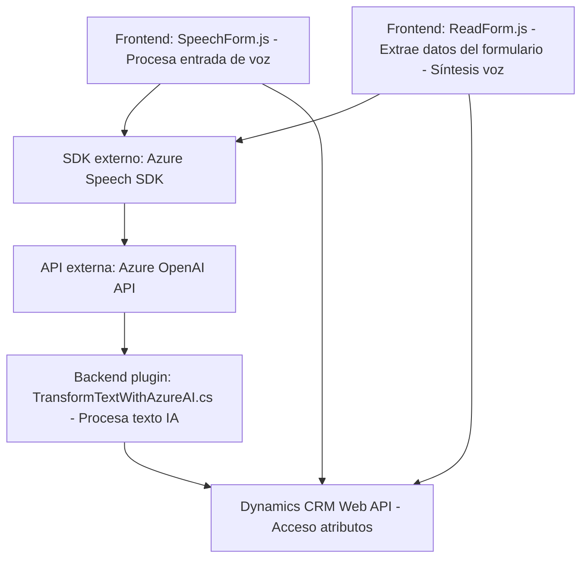

### Breve resumen técnico

El repositorio parece centrarse en una integración entre **Azure Speech SDK**, **Dynamics CRM (365)** y **Azure OpenAI** mediante un conjunto de scripts para el frontend (JavaScript) y un plugin en C# que extiende funcionalidades en la lógica del backend. La solución es una integración híbrida para procesar texto con IA, realizar síntesis de voz y manipular formularios dinámicos de Dynamics 365.

---

### Descripción de arquitectura

La arquitectura se divide en tres niveles principales:
1. **Frontend (JavaScript):**
   - Scripts como `readForm.js` y `speechForm.js` manejan interacción del usuario, entrada de voz, y conversión de texto en audio con Azure Speech SDK. Utilizan un patrón de modularidad y separación de responsabilidades.
   - Se puede categorizar como una arquitectura "cliente con servicios externos", dado que las responsabilidades de procesamiento avanzado recaen en servicios como Azure.

2. **Backend extendido (Plugins Dynamics CRM):**
   - El plugin C# `TransformTextWithAzureAI.cs` implementa una arquitectura basada en eventos disparados dentro del entorno **Dynamics CRM**. Usa Azure OpenAI para enriquecer el procesamiento de texto y comunicar resultados entre diferentes componentes.

3. **Servicios externos (Servicios Azure/AI):**
   - Usa servicios SDK y REST proporcionados por Azure (Speech SDK y APIs de OpenAI). Estos servicios actúan como microcomponentes en una arquitectura basada en servicios externos.

La solución general combina un **modelo cliente-servidor** con integración a servicios externos, mostrándose como un diseño híbrido.

---

### Tecnologías usadas

1. **Frontend:**
   - **Lenguaje:** JavaScript (ES6+).  
   - **SDK:** Azure Speech SDK.  
   - **Framework asociado:** Dynamics CRM FormContext API.  
   - **Patrones:** Modular design, facade, load-on-demand.

2. **Backend:**
   - **Lenguaje:** C#.  
   - **Framework:** Dynamics CRM SDK.  
   - **Secundarios:** HttpClient para realizar llamadas a APIs REST.  
   - **Dependencias:** Newtonsoft.Json, System.Net.Http.  
   - **Servicios:** Azure OpenAI, Dynamics APIs.

3. **Servicios externos:**  
   - **Azure Speech SDK:** Síntesis de texto a voz, reconocimiento de voz.  
   - **Azure OpenAI:** Modelo GPT para procesamiento avanzado de texto.  
   - **Dynamics CRM Web API:** Acceso a atributos y entidades CRM desde frontend/backend.

---

### Diagrama Mermaid válido para GitHub

---

### Conclusión final

La solución implementa una integración avanzada entre un frontend basado en **JavaScript**, un backend expandido con **Dynamics CRM (365)**, y un conjunto de servicios externos en **Azure** para IA y síntesis de voz. Con patrones como modularidad y fachada en el frontend, y extensiones basadas en plugins en el backend, la solución es altamente escalable y adaptable para enriquecer aplicaciones CRM dentro de entornos empresariales modernos.