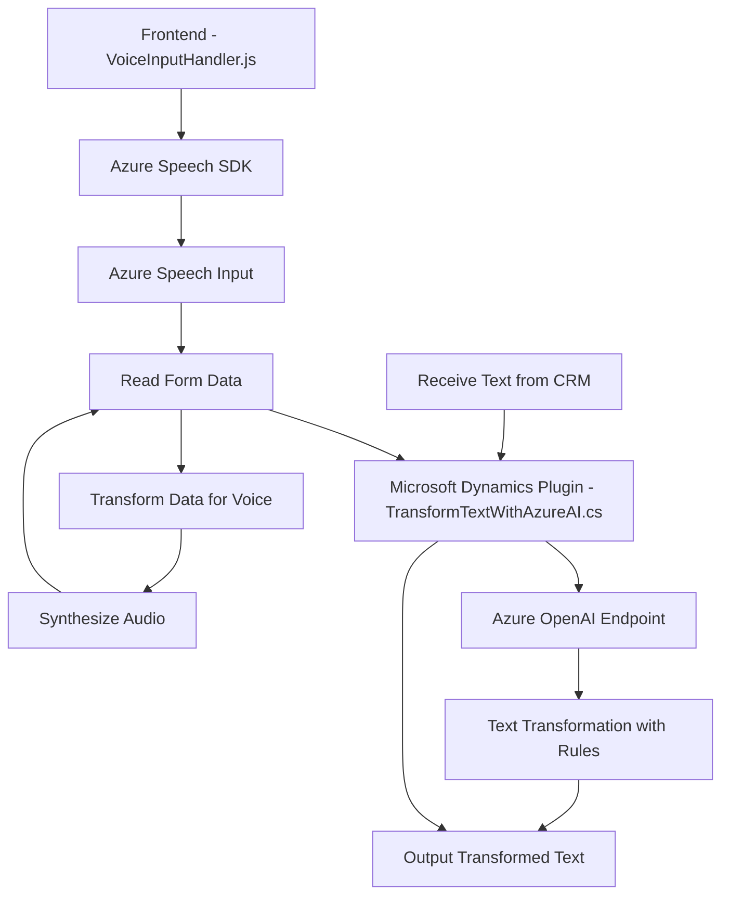

### Análisis de la solución
#### 1. **Tipo de solución:**
La solución consiste en un sistema híbrido compuesto por:
   - **Frontend:** JavaScript desarrollando una interfaz dinámica que utiliza servicios externos para síntesis de voz y reconocimiento de datos.
   - **Plugin backend:** Implementado como un **plugin de Dynamics CRM** que integra servicios de Azure OpenAI para transformación de texto según reglas específicas.

   En esencia, se trata de un sistema que mezcla **frontend basado en JavaScript** (interacción con formularios y voz mediante Azure Speech SDK) con **backend basado en plugins de Dynamics CRM** (llamadas a microservicios como Azure OpenAI).

---

#### 2. **Tecnologías, frameworks y patrones utilizados:**
   - **Frontend:**
     - Azure Speech SDK: Usado para leer formularios, procesar entradas, y síntesis de voz.
     - Callback-based architecture: Para la carga asincrónica de dependencias, como el SDK de Azure.
     - Procedural logic and layered processing: Procesa datos del formulario y los transforma para ser usados en reconocimiento de voz o APIs de inteligencia artificial.
     - Web technologies: Interacción con `window`, `document`, y `Xrm.WebApi` (Dynamics SDK).

   - **Backend Plugin:**
     - Azure OpenAI: Callouts de API para usar servicios de inteligencia artificial (GPT).
     - Web API REST: Comunicación a través de HTTP usando `System.Net.Http` para interactuar con microservicios externos.
     - Microsoft Dynamics CRM SDK: Uso de `IPlugin` y contexto CRM para realizar modificaciones de datos.
     - JSON serialization/deserialization: Uso de `System.Text.Json` y `Newtonsoft.Json.Linq` para manipular respuestas del API.
     - Dependency Injection/ServiceProvider pattern: Usado en elementos del entorno CRM para el manejo del contexto.

---

#### 3. **Arquitectura:**
   - La solución tiene una arquitectura **híbrida**, compuesta por múltiples capas y dependencias:
     - El Frontend utiliza una estructura procedural con aspectos de procesamiento en capas (formulario -> JSON -> síntesis de voz).
     - El Backend está diseñado en forma de plugin modular siguiendo patrones de **microservicio REST** y CGI-like en interacción dinámica.
     - En conjunto, crea una arquitectura de **integración n-capas**, donde la capa Cliente (JavaScript) y las capas Back-end (Dynamics Plugin + Azure API) trabajan juntas.

---

#### 4. **Dependencias o componentes externos:**
   - **Frontend:**
     - Azure Speech SDK: Para reconocimiento y síntesis de voz. Se carga dinámicamente desde el navegador.
     - Microsoft Dynamics (Xrm.WebApi): Para el manejo de formularios interactivos y llamadas API.
   - **Backend Plugin:**
     - Azure OpenAI API: Usado para transformar texto según normas predefinidas.
     - HTTP Endpoint (`https://openai-netcore.openai.azure.com/`): Punto de entrada a los servicios de la API.

Otros componentes que podrían estar presentes:
   - Claves API de servicios externos (Azure Speech y Azure OpenAI).
   - Configuración de región y permisos en Azure.

---

#### 5. **Diagrama Mermaid (compatible con GitHub):**

---

### Conclusión final
Esta solución utiliza una mezcla de tecnologías para implementar funcionalidad específica de reconocimiento de voz y transformación de datos mediante inteligencia artificial en un entorno Microsoft Dynamics CRM. La arquitectura es compleja pero modular, con una clara separación entre las capas de frontend y backend.

Este diseño optimiza la utilización de servicios externos como Azure Speech SDK y Azure OpenAI, delegando operaciones complejas a servicios especializados. Si bien los componentes están interconectados, esta mezcla de tecnología requiere una gestión adecuada de dependencias y configuraciones para facilitar futuras expansiones o ajustes.