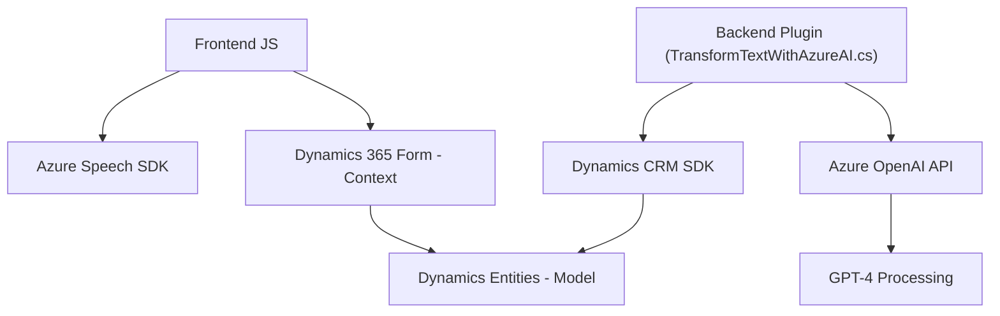

### Breve resumen técnico:
El repositorio incluye varios archivos con implementaciones para complementar la funcionalidad de formularios en Dynamics 365 mediante la integración de servicios como **Azure Speech SDK** y **Azure OpenAI**. 

Se centran en:
- **Frontend:** Procesamiento y síntesis de voz, extracción de datos visibles, y gestión de transcripciones (con/sin IA).
- **Backend (plugins):** Procesamiento de texto con modelos de inteligencia artificial Azure OpenAI, interactuando con Microsoft Dynamics CRM.

---

### Descripción de arquitectura:
La solución sigue una mezcla de **arquitectura de servicios** y **modularidad funcional**:
1. El **Frontend** está estructurado mediante JavaScript para realizar tareas relacionadas con formularios, voz, y datos visibles dentro del contexto del formulario. Usa servicios externos como **Azure Speech SDK** y dinámicas del modelo de datos de Dynamics CRM.
2. El **Plugin Backend** está basado en el patrón plugin tradicional de Dynamics CRM. Integrando la API de Azure OpenAI, habilita procesamiento de texto del lado del servidor bajo un enfoque **Service-Oriented Architecture (SOA)**.

No utiliza una arquitectura avanzada como microservicios ni hexagonal, aunque está orientada a **servicios interdependientes** con modulación clara entre frontend y backend.

---

### Tecnologías usadas:
1. **Frontend**:
   - Lenguaje: **JavaScript**.
   - SDK: **Azure Speech SDK**.
   - Framework: Interacción con formularios de **Dynamics 365**.

2. **Backend**:
   - Lenguaje: **C#**.
   - Framework: **Dynamics CRM SDK**.
   - API externa: **Azure OpenAI**.

3. **Dependencias comunes**:
   - HTTP calls: Utiliza `System.Net.Http` en el backend para interactuar con APIs externas.
   - JSON: Manejo de JSON con `Newtonsoft.Json` y `System.Text.Json`.

---

### Diagrama Mermaid válido para GitHub Markdown:

---

### Conclusión final:
La solución presentada es una combinación de arquitectura de servicios que complementa los formularios en Dynamics 365 mediante dos capacidades principales:
1. **Frontend JS:** Procesamiento de voz y mapeo de datos visibles en formularios con tecnología como Azure Speech SDK. Se sigue un enfoque de modularidad funcional con foco en tareas específicas para la arquitectura cliente.
2. **Backend Plugin:** Implementa un diseño típico de plugin en Dynamics CRM para interactuar con Azure OpenAI y transformar texto. La arquitectura mantiene la independencia entre dependencias y servicios, adoptando **service-oriented principles**.

Aunque la solución muestra una segmentación clara de tareas, podría ser optimizada integrando mejores prácticas de seguridad (manejo de claves) y adoptando una arquitectura avanzada como **hexagonal** para desacoplar aún más servicios externos y elementos internos.