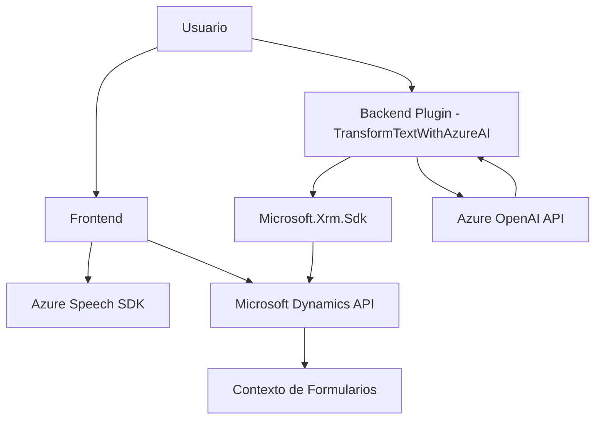

### Breve Resumen Técnico
El repositorio describe un sistema que integra procesamiento de voz y texto con funcionalidades de análisis automático, basado principalmente en servicios de **Azure Speech SDK** y **Azure OpenAI API**, además de su interacción directa con formularios en **Microsoft Dynamics CRM**. Las funciones están distribuidas con un enfoque modular y se integran en los contextos de frontend de Dynamics 365 y mediante plugins.

### Descripción de Arquitectura
La arquitectura empleada se asemeja a una combinación de:
1. **N capas (frontend-backend)**: Hay una clara separación entre el procesamiento en frontend (JS) y en backend (C# plugin).
2. **Event-driven architecture**: En la solución del frontend, los eventos como la interacción con formularios o el inicio de grabación se controlan adaptativamente.
3. **Plugin-based architecture**: El uso del plugin en el backend se basa en **Dynamics 365**, y se integra con lógica en el contexto de ejecución de CRM.
4. **External API services**: Remarcable integración con servicios como Azure Speech SDK y OpenAI para procesamiento avanzado de voz y texto.

### Tecnologías Usadas
1. **Frontend**:
   - **JavaScript (ES6+)**: Logística y procesamiento en lectura de voz y formularios.
   - **Azure Speech SDK**: Para análisis y síntesis de voz.
   - **Dynamics 365 API**: Para trabajar en contexto del DOM de Dynamics CRM.

2. **Backend**:
   - **C#**:
     - **Microsoft.Xrm.Sdk**: Para interacción con servicios de Dynamics CRM.
     - **Azure OpenAI API**: Para procesamiento de texto avanzado.
     - **HttpClient**: Para enviar solicitudes a servicios REST externos.
   - **JSON Libraries**: Serialización/deserialización eficiente.
     
3. **Servicios Externos**:
   - Azure Speech SDK
   - Azure OpenAI API

### Dependencias o Componentes Presentes
- **Frontend**:
  - Azure Speech SDK (archivo dinámico de CDN).
  - Dependencia de Dynamics CRM para validación de contexto y manipulación de formularios.
- **Backend**:
  - Microsoft Dynamics SDK y estructura de Plugins.
  - Dependencia directa en Azure OpenAI API para manipulación de texto.

---

### Diagrama **Mermaid**

---

### Conclusión Final
El repositorio representa una solución orientada a la **integración entre inteligencia artificial y lógica empresarial** mediante Dynamics CRM. La sólida separación entre frontend y backend, junto al uso de APIs modernas como Azure AI, permite un diseño modular y escalable. La solución es altamente dependiente de servicios externos pero, al mismo tiempo, es flexible al acoplarse a la arquitectura de Dynamics CRM. La arquitectura utilizada puede clasificarse como "n capas" con enfoque modular y event-driven.