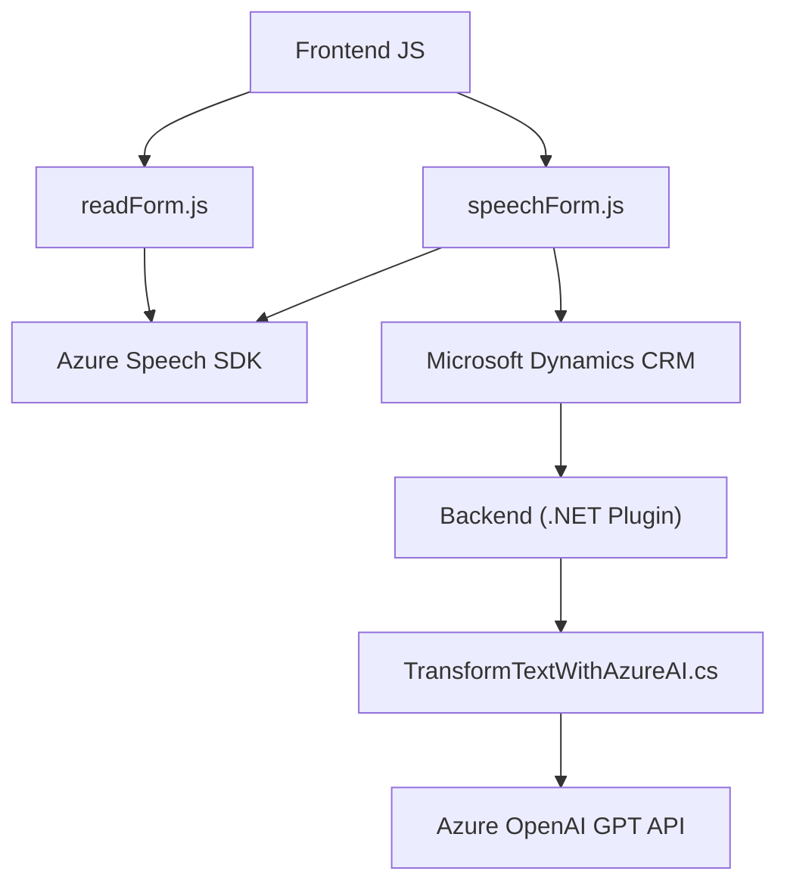

### Breve resumen técnico

El repositorio presenta los siguientes componentes:

1. **Frontend JavaScript:**
   - `readForm.js`: Recopila datos visibles de un formulario dinámico en Microsoft Dynamics CRM y los sintetiza en voz usando Azure Speech SDK.
   - `speechForm.js`: Captura comandos hablados, los transcribe usando Azure Speech SDK, procesa las transcripciones (manualmente o mediante AI) y actualiza valores en un formulario CRM.

2. **Plugin .NET para Dynamics CRM:**
   - `TransformTextWithAzureAI.cs`: Plugin que transforma texto mediante Azure OpenAI en formato JSON para actualizar dinámicamente valores en el CRM.

---

### Descripción de arquitectura

#### 1. **Tipo de solución**
   - **Principal:** Integración entre frontend (JavaScript en Dynamics CRM) y backend (Plugin .NET) para mejorar la experiencia interactiva con formularios en un CRM.
   - **Detalles:** Utiliza servicios de Microsoft Azure para síntesis de voz y transformación de texto.

#### 2. **Patrones y tecnologías**
   - **Frontend:**
     - **Tecnologías:** 
       - JavaScript (DOM manipulación, promesas).
       - Azure Speech SDK.
       - Dynamics CRM APIs (Xrm.WebApi).
     - **Patrones:** Lazy Loading, Modularidad, Pipeline de transformación.
   - **Backend:**
     - **Tecnologías:** 
       - .NET Framework, Azure OpenAI API.
       - JSON manipulación (Newtonsoft).
       - Dynamics CRM SDK.
     - **Patrones:** Plugin Design, API Integration.

#### 3. **Arquitectura global**
   - **Estilo:** N capas, donde el frontend maneja la presentación e interacción directa, y el plugin procesa datos en el backend.
   - **Front-back integration:** A través de APIs de Microsoft Dynamics y Azure.

#### 4. **Dependencias externas**
   - **Frontend:**
     - Azure Speech SDK (JavaScript).
     - Dynamics CRM `Xrm.WebApi`.
   - **Backend:**
     - API de Azure OpenAI (GPT-4 hosted endpoint).
     - Dynamics SDK (`IPlugin`).
     - Librerías auxiliares para HTTP y JSON.
   - Configuración de claves y regiones para servicios Azure.

---

### Diagrama Mermaid para GitHub Markdown

---

### Tecnologías usadas

- **Frontend:**
  - **JavaScript APIs:** DOM manipulación, Promesas.
  - **Azure Speech SDK:** Para síntesis y captura de voz.
  - **Microsoft Dynamics APIs:** Integración directa con formularios.

- **Backend:**
  - **.NET Framework:** Desarrollo del plugin en C#.
  - **Azure OpenAI API:** GPT-4 para transformación de texto.
  - **Newtonsoft.Json:** Manipulación y procesamiento JSON estructurado.

---

### Conclusión final

La solución implementada representa una integración sólida entre componentes frontend y backend para enriquecer la experiencia de usuario en Microsoft Dynamics CRM. La síntesis de voz y transcripción de comandos hablados desde el frontend complementan la transformación avanzada de texto mediante AI en el backend. La arquitectura es modular y utiliza patrones de carga diferida para optimizar recursos. Sin embargo, la solución podría beneficiarse de estrategias más robustas para el manejo de errores y ajustar configuraciones en servicios externos como Azure OpenAI.