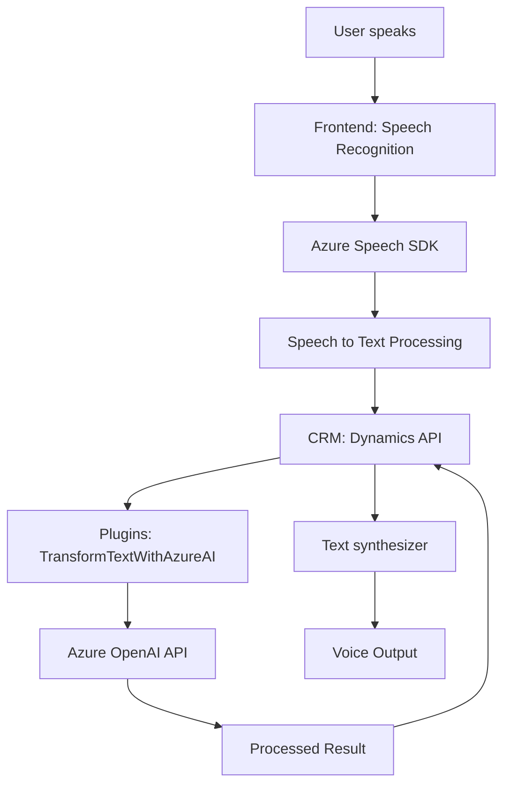

### Breve resumen técnico:
El repositorio contiene tres componentes principales:
1. **Frontend/JS/readForm.js:** Usa el SDK de Azure Speech para leer y sintetizar datos visibles de un formulario CRM en voz.
2. **Frontend/JS/speechForm.js:** Implementa reconocimiento de voz mediante Azure Speech SDK para interactuar con formularios CRM, procesar transcripciones y asignar valores a campos del formulario.
3. **Plugins/TransformTextWithAzureAI.cs:** Plugin para Microsoft Dynamics CRM que transforma texto usando Azure OpenAI API y retorna resultados estructurados en formato JSON.

---

### Descripción de arquitectura:
El proyecto implementa una arquitectura **centrada en servicios** con integración de un frontend que comunica datos hacia un backend CRM (Dynamics) y servicios externos (Azure Speech API y Azure OpenAI API). Aunque hay indicios de una **Arquitectura por Capas (n capas)** dado el flujo frontend ↔ backend ↔ servicio externo, es más un diseño orientado a integración de servicios por los siguientes motivos:
- **Modularidad:** Cada componente tiene una responsabilidad bien definida, utilizando APIs externas.
- **Adaptador de servicios:** Los scripts frontend actúan como un puente entre la interfaz de usuario y capacidades de servicios como Azure Speech.
- **Plugins de negocio:** El backend extiende las funcionalidades de Dynamics mediante plugins personalizados.

---

### Tecnologías usadas:
- **Frontend:**
  - JavaScript para la lógica de negocio y comunicación con APIs.
  - Modelos Event-driven con callbacks y Promises.
  - Integración del **Azure Speech SDK** para síntesis y reconocimiento de voz.
- **Backend (Dynamics):**
  - .NET Framework con C# para desarrollo de Plugins.
  - **Microsoft.Xrm.Sdk** para integraciones nativas en Dynamics CRM.
  - **Azure OpenAI API** para procesamiento avanzado de texto.
  - **Newtonsoft.Json.Linq** para manipulación de JSON.

---

### Diagrama Mermaid válido para GitHub:

---

### Conclusión final:
El repositorio está diseñado como una solución que vincula una interfaz de usuario con funcionalidades avanzadas de voz y texto en un CRM mediante APIs externas (Azure Speech y OpenAI). Su arquitectura puede ser vista como **un sistema orientado a servicios**, donde el frontend actúa como un adaptador, mientras que el backend en Dynamics CRM funciona como un procesador de negocio basado en plugins. Aunque funcional y modular, se podrían implementar mejoras como mayor seguridad y un manejo asíncrono de todas las interacciones HTTP para mejorar rendimiento y evitar bloqueos en comunicaciones con Azure Services.