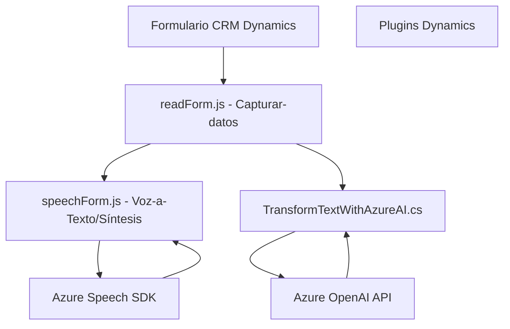

## Breve resumen técnico

El repositorio contiene una solución híbrida centrada en la integración de servicios de Azure con formularios de datos en Dynamics 365. Incluye implementación de interacción por voz, reconocimiento, síntesis de texto hablado, y transformación inteligente de datos con ayuda del modelo Azure OpenAI y el SDK de Microsoft Dynamics CRM. Se evidencia una arquitectura modular y orientada a servicios para facilitar la extensibilidad y el desacople entre componentes.

---

## Descripción de arquitectura

La arquitectura observada tiene características **modulares y orientadas a servicios**, pues cada archivo aborda una funcionalidad específica:

1. **`readForm.js` y `speechForm.js` (Frontend)**: Interacción con formularios para captura y síntesis de voz utilizando SDK y APIs de Azure. Estos archivos constituyen un modelo cliente-API que se ejecuta en capa de presentación y lógica.
   
2. **`TransformTextWithAzureAI.cs` (Plugin)**: El nivel de capa de negocio que integra directamente con Dynamics CRM y Azure OpenAI para transformar datos según reglas configuradas. Este plugin complementa procesos internos de Dynamics.

La solución emplea una arquitectura **multicapa**, donde cada componente tiene responsabilidades específicas:
- **Capa de presentación**: Archivos en el directorio `FRONTEND/JS` manejan interacción usuario-aplicación.
- **Capa de negocio/procesamiento**: Representada por el plugin en `TransformTextWithAzureAI.cs`.
- **Servicios externos**: Azure Speech SDK y Azure OpenAI realizan procesamiento de voz y transformación inteligente mediante APIs.

---

## Tecnologías usadas

### Frontend
- **JavaScript**: Lenguaje para implementar lógica del cliente en los formularios de Dynamics 365.
- **Azure Speech SDK**: Utilizado para síntesis y reconocimiento de voz. Cargado dinámicamente en el navegador para procesar audio y texto en tiempo real.

### Backend
- **Microsoft Dynamics CRM SDK**: Framework de desarrollo para plugins en Dynamics 365, basado en `IPlugin` y las interfaces de CRM.
- **Azure OpenAI**: API de procesamiento de lenguaje natural (GPT) para transformación avanzada de texto.
- **System.Net.Http / Newtonsoft.Json.Linq**: Herramientas para serialización/deserialización de datos JSON y manejo de solicitudes HTTP.

### Patrones y enfoques
- **Separación de preocupaciones**: La lógica de síntesis, obtención de campos visuales y transformación están aisladas en métodos o funciones específicas.
- **Uso de SDKs externos**: Técnicas de integración para aprovechar servicios avanzados mediante APIs externos (Azure Speech y OpenAI).
- **Modularidad**: Cada funcionalidad está diseñada como unidad independiente, facilitando el mantenimiento y escalabilidad.

---

## Diagrama Mermaid válido para GitHub

---

## Conclusión final

Esta solución implementa una arquitectura modular e integradora entre tecnologías de Microsoft Dynamics, Azure Speech, y Azure OpenAI para optimizar la interacción de voz y transformación de datos en un entorno CRM. Utiliza técnicas adecuadas de desacoplamiento y externalización de servicios para maximizar flexibilidad y eficiencia. La documentación del código y su organización sugieren una solución bien estructurada, ampliable y alineada con patrones modernos de desarrollo en entornos empresariales.