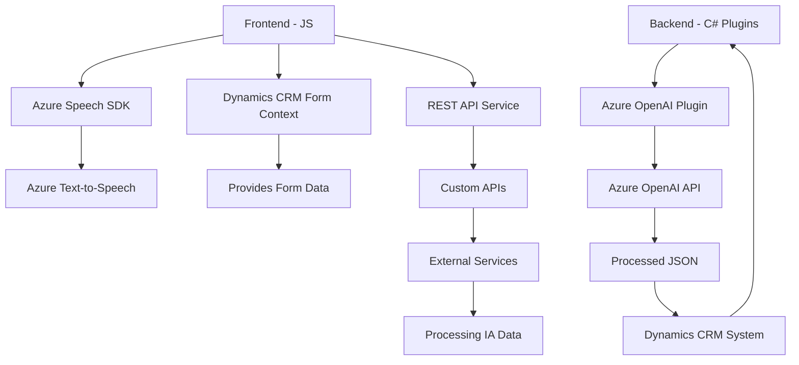

### Breve Resumen Técnico
El repositorio contiene múltiples archivos diseñados para integrar servicios externos (Azure Speech SDK, Azure OpenAI) con una plataforma web, probablemente Dynamics 365 CRM. Los archivos presentan una solución modular y desarrollos entrelazados que habilitan funcionalidades de entrada y salida de voz, transcripción, procesamiento de texto con inteligencia artificial, lectura y actualización de formularios, y generación estructurada de datos JSON mediante servicios externos.

---

### Descripción de Arquitectura
La arquitectura general se puede describir como una solución de **N capas** que integra capas de presentación, negocio y datos con servicios externos como Azure Speech SDK y Azure OpenAI. Además, se notan características propias de patrones como **hexagonal** en el diseño de plugins y facilitadores para interactuar con Dynamics CRM. Las funcionalidades están distribuidas entre el frontend (interacción directa con usuario y SDK) y backend (procesamiento avanzado de datos). La solución no es un monolito porque utiliza una combinación de microservicios (SDK y plugins) para desacoplar las responsabilidades.

---

### Tecnologías Usadas
1. **Frontend**:
   - JavaScript: Funcionalidades de entrada/salida de datos usando Azure Speech SDK.
   - Azure Speech SDK: Servicio de síntesis y reconocimiento en tiempo real.
   - APIs de navegador: Utilizadas para manipular DOM y formularios.
   - Async/Await y Promises: Para operaciones asíncronas (grabación, llamadas a APIs externas).

2. **Backend**:
   - C# (.NET): Desarrollo del plugin `TransformTextWithAzureAI.cs`.
   - Microsoft Dynamics CRM SDK: Gestión del contexto de CRM e integración en tiempo de ejecución.
   - Azure OpenAI Service: Para procesamiento de texto avanzado (GPT/Machine Learning).
   - HTTP Client API: Para comunicación con servicios web.

3. **Otros**:
   - JSON para datos estructurados.
   - Newtonsoft.Json y System.Text.Json para parsing y serialización.

---

### Diagrama Mermaid válido para GitHub

---

### Conclusión Final
Esta solución combina interacción entre el frontend, un CRM platform (Dynamics 365), y dos robustos servicios de Azure (Speech SDK y OpenAI). La arquitectura basada en tres capas (presentación, negocio y datos) con integración de servicios muestra un diseño moderno y funcional que aprovecha tecnologías avanzadas para facilitar tareas de entrada de voz, lectura de formularios y generación de texto asistido por IA. La modularidad de la solución hace que sea escalable, adaptable y fácil de mantener. Sin embargo, para expandirla sería recomendable incluir documentación más extensa sobre la configuración y acceso a servicios externos (API Keys, regiones, etc.).