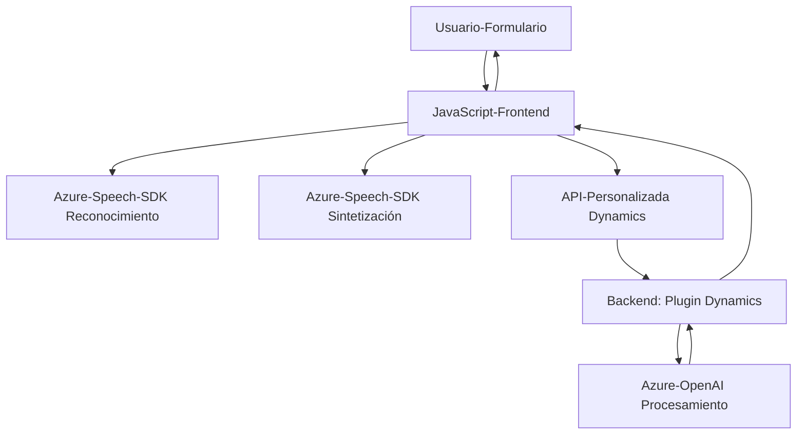

### Breve resumen técnico

El repositorio define varios componentes que integran funcionalidades con tecnologías de Microsoft Azure (Azure Speech SDK y Azure OpenAI API) y Dynamics CRM. Los archivos proporcionados describen un sistema centrado en la interactividad de formularios web mediante reconocimiento de voz, síntesis de texto a voz y actualización de campos en un contexto CRM. Además, incluye un plugin para transformar texto en estructuras JSON usando inteligencia artificial.

---

### Descripción de arquitectura

La arquitectura corresponde principalmente a dos capas:
1. **Frontend basado en JavaScript**:
   - Implementa la interacción de usuarios mediante el navegador:
     - Primero, captura datos de formularios visibles.
     - Adicionalmente, usa reconocimiento de voz y la síntesis de texto a voz mediante Azure Speech SDK.
     - Puede enviar datos recopilados a APIs personalizadas y gestionar respuestas.
   
2. **Backend basado en Dynamics CRM**:
   - Introduce un plugin (en .NET), que se conecta a Dynamics CRM y a la Azure OpenAI API.
   - Este backend permite extender las capacidades nativas de Dynamics, añadiendo transformación avanzada de datos con inteligencia artificial.

La solución utiliza una **arquitectura en n capas**:
- **Frontend**:
  - Interfaz de usuario principal (formularios en Dynamics).
  - Configuración y lógica de manipulación de datos (JavaScript).
- **Gateway/API**:
  - Se comunica con servicios externos (Azure Speech SDK y Azure OpenAI API).
  - Lógicas de transformación y almacenamiento mediante llamadas HTTP y servicios específicos de Dynamics (API personalizada y OpenAI).
- **Backend**:
  - Plugin implementado en Dynamics CRM que actúa bajo el patrón "Extension Plugin" para procesar datos y enviar respuestas transformadas.

---

### Tecnologías usadas

1. **Frontend (JavaScript)**:
   - Azure Speech SDK: Reconocimiento de voz y síntesis de texto en tiempo real.
   - Navegadores compatibles con JavaScript para interacción web.
   - Integración directa con Dynamics CRM para manipulación de formularios y campos (contexto `executionContext`).

2. **Backend (.NET)**:
   - Microsoft Dynamics SDK (`IPlugin`, `IServiceProvider`): Expande capacidades del sistema CRM.
   - Azure OpenAI API: Procesamiento mediante llamadas REST.
   - Sistema de servicios de organización y servicios HTTP para conectar componentes externos.

3. **Patrones y enfoques arquitectónicos**:
   - Lazy Loading: Carga de Speech SDK solo cuando es necesario.
   - Service-Oriented Gateway: Llamadas declarativas entre componentes y APIs.
   - Plugin-Based Development: Extensiones en Dynamics CRM mediante clases y manejo de eventos del sistema (registros del plugin del pipeline).

---

### Dependencias o componentes externos presentes

1. **Dependencias internas**:
   - Contextos de formularios (`executionContext`, `formContext`): Para manipular, leer y actualizar campos desde el entorno Dynamics.
   - APIs propias de Dynamics CRM (como actualizaciones de campos o mapeos internos).

2. **Dependencias externas**:
   - **Azure Speech SDK**: Servicios relacionados con la conversión de texto hablado, síntesis de voz, y reconocimiento.
   - **Azure OpenAI API**:
     - Procesamiento de texto usando inteligencia artificial.
     - Conversión de entradas en objetos JSON estructurados.
   - **Dynamics Web API**:
     - Funcionalidades personalizadas usando `trial_TransformTextWithAzureAI`.

---

### Diagrama Mermaid válido para GitHub

El siguiente diagrama representa los principales componentes y flujo de datos entre ellos:

---

### Conclusión final

El repositorio describe un sistema de integración avanzada entre frontend basado en JavaScript, servicios web proporcionados por Microsoft Azure y un backend orientado a Dynamics CRM. La arquitectura en n capas facilita la modularidad y separación de preocupaciones: mientras el frontend gestiona la interacción directa del usuario y la comunicación rápida con APIs, el backend extiende capacidades de Dynamics CRM mediante plugins personalizados e integración con Azure OpenAI.

La solución es escalable, especialmente en términos de ampliación de AI en Azure. Sin embargo, su mayor dependencia de servicios externos (Azure Speech y Azure OpenAI APIs) requiere garantizar un manejo seguro de claves y configuración.