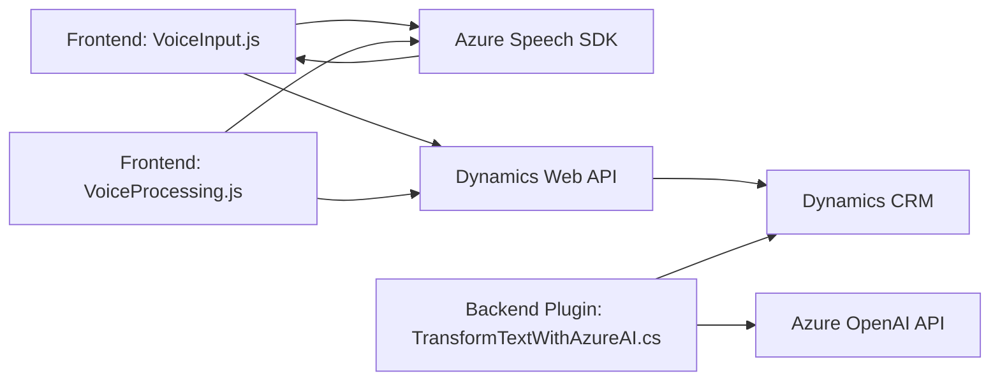

### Breve resumen técnico
El repositorio contiene una solución que integra procesamiento de lenguaje natural y síntesis de voz mediante el **Azure Speech SDK** y **Azure OpenAI** para aplicaciones orientadas a formularios en Dynamics CRM. Los tres archivos mencionados (dos frontend y uno backend) manejan la interacción entre reconocimiento de voz, síntesis y procesamiento de texto para gestionar datos dinámicamente en formularios CRM.

---

### Descripción de arquitectura
La solución mezcla una arquitectura de **n capas**:
1. **Frontend (VoiceInput.js y VoiceProcessing.js)**: Maneja la captura de voz, síntesis y el procesamiento inicial de datos del formulario. Aunque utiliza servicios externos (Azure Speech SDK), está diseñado como parte del cliente de CRM, en una estructura monolítica.
2. **Backend (TransformTextWithAzureAI.cs)**: Se presenta como un **plugin bajo demanda**, que se integra mediante el modelo de extensibilidad de Dynamics CRM. Aquí encontramos una dependencia directa con Azure OpenAI y Dynamics API.

Pese a ser una solución monolítica en cuanto a desarrollo, utiliza patrones **event-driven** y **dependency-driven**, con microservicios externos para procesamiento especializado.

---

### Tecnologías usadas
- **Frontend**:
  - **JavaScript** para manejar lógica cliente.
  - **Azure Speech SDK** para reconocimiento y síntesis de voz.
  - **Dynamics CRM Web API** para actualizaciones en formularios.
- **Backend**:
  - **C#** para la lógica del plugin.
  - **Azure OpenAI API (GPT-4)** para transformación de datos.
  - **Dynamics CRM SDK** para integración.
  - **Newtonsoft.Json** para manipulación JSON.
  - **HTTP Client Libraries (.NET)** para comunicación REST.

---

### Diagrama Mermaid
El siguiente diagrama muestra la interacción de los componentes principales:

---

### Conclusión final
La solución integra tecnologías modernas (Azure SDKs y Dynamics CRM APIs) para democratizar el acceso a datos y procesamiento asistido por voz en formularios CRM. Gracias a su separación modular entre frontend y backend, permite flexibilidad y adaptabilidad, con un notable enfoque en **archivos monolíticos** desempeñando funcionalidades claras y en colaboración con microservicios externos (Azure Speech API y OpenAI API). Sin embargo, su modelo carece de escalabilidad que podría beneficiarse de una arquitectura más distribuida, como **microservicios independientes** en el frontend y backend.