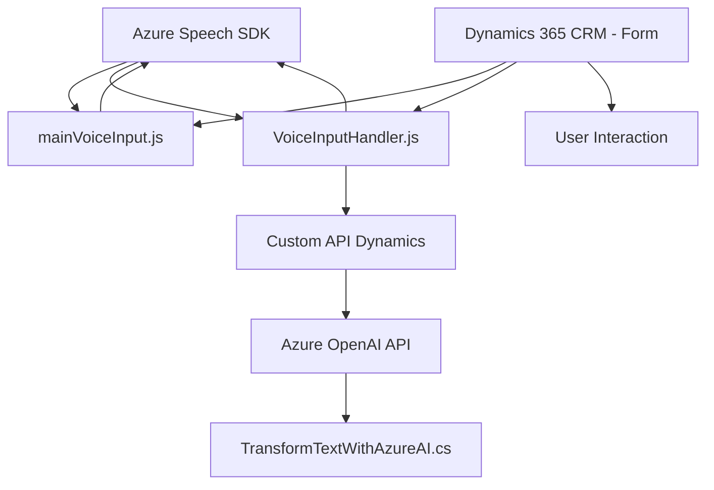

## Breve Resumen Técnico
El repositorio contiene múltiples archivos funcionales que integran tecnologías de voz y procesamiento de datos basadas en **Azure Speech SDK** y **Azure OpenAI**. Se utilizan para interactuar con formularios en aplicaciones **Dynamics 365 CRM**, procesar datos visibles en formularios y realizar síntesis de voz. Además, hay un Plugin que extiende la funcionalidad con un procesamiento avanzado mediante APIs externas.

---

## Descripción de Arquitectura
La arquitectura es híbrida:
1. **N Capas**: Organización en capas funcionales (frontend para capturar datos, lógica de procesamiento para síntesis/transcripción y backend para interacción con APIs y procesamiento de texto).
2. **Cliente-Servidor**: El frontend actúa como cliente, invocando APIs externas como Azure Speech y Dynamics Custom APIs.
3. **Microservicios y Plugins**: La integración con **Azure OpenAI** y la implementación del Plugin en Dynamics CRM separan responsabilidades específicas del procesamiento en servicios externos.

---

## Tecnologías Usadas
1. **Frontend**:
    - Framework: JavaScript.
    - SDK: Azure Speech SDK (para síntesis y transcripción de voz).
    - Contexto: Dynamics 365 CRM (Interacción con formularios).

2. **Backend**:
    - Microsoft Dynamics CRM SDK (para Plugins).
    - Azure OpenAI API (para transformación de texto).
    - C# (.NET) para definir Plugins y lógica de negocio.

3. **Patrones Aplicados**:
    - **Carga dinámica de dependencias**: Scripts SDK cargados en tiempo de ejecución.
    - **Cliente-API**: Invocación de APIs externas para sintetizar voz y transformar texto.
    - **N Capas**: Organización en frontend, lógica y procesamiento Backend/Plugin.
    - **Encapsulación**: Métodos con objetivos específicos que refuerzan modularidad.

---

### Dependencias o Componentes Externos
1. **Azure Speech SDK** (API de síntesis y reconocimiento de voz).
2. **Azure OpenAI API** (para la transformación avanzada de texto).
3. Plugins y Custom APIs en Dynamics CRM (dinámicamente configurados).
4. JSON, HTTP (para solicitudes y respuestas de APIs externas).

---

## Diagrama Mermaid

---

## Conclusión Final
El repositorio implementa una solución para enriquecer la experiencia de uso de **Dynamics 365 CRM** mediante tecnologías avanzadas de síntesis/transcripción de voz y procesamiento de texto con AI. El enfoque usa una arquitectura híbrida basada en N Capas y Cliente-Servidor, con integración de **Azure Speech SDK** y **Azure OpenAI API**. Esto permite una extensibilidad escalable y modular con alto nivel de especialización en procesamiento multicanal y servicios en la nube.