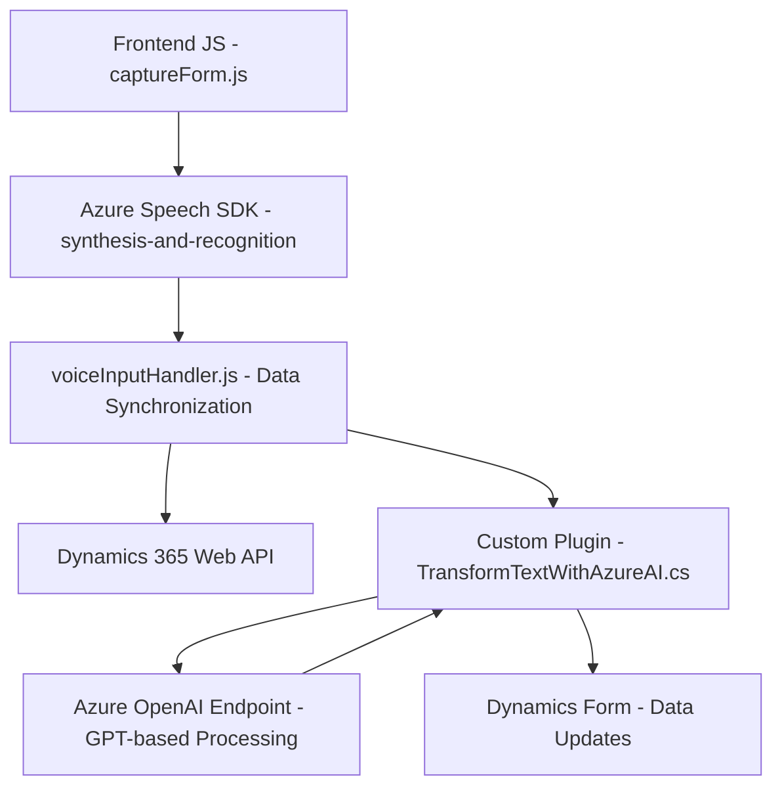

### Breve Resumen Técnico
El repositorio contiene un conjunto de módulos que implementan funcionalidad para admitir reconocimiento de voz, síntesis de texto hablado y actualización dinámica de formularios en una solución basada en **Dynamics 365**. Además, utiliza integración con **Azure Speech SDK** para la transformación de entrada/salida de voz y un plugin que logra transformaciones avanzadas del texto mediante **Azure OpenAI API**.

---

### Descripción de Arquitectura
La solución se organiza principalmente en una arquitectura **de capas**:  
1. **Frontend (JavaScript):** Procesamiento de datos del formulario y encapsulación de interacción con Dynamics 365 y Azure Speech SDK.  
2. **Backend Plugin (C#):** Transformación avanzada mediante Azure OpenAI API para soportar procesamiento extensivo.  
3. **Servicios externos (Azure):** Llamadas HTTP hacia APIs de Azure Speech y OpenAI para lógica de síntesis, reconocimiento y transformación de texto.  

El diseño es **modular** y **orientado a servicios**, delegando tareas específicas como reconocimiento de voz o transformación de datos a SDK y APIs externas, aplicando principios de **Single Responsibility**.

---

### Tecnologías Usadas
- **Frontend:**  
  - **JavaScript/ES6:** Modularización a través de funciones independientes y encapsulación.  
  - **Azure Speech SDK:** Reconocimiento y síntesis de voz.  
  - **Dynamics 365 Custom Web API:** Manipulación de datos en formularios e interacción directa con objetos de CRM.  
  - **Promise-Based Asynchronous Management:** Para manejo no bloqueante de eventos y servicios remotos.

- **Backend Plugin:**  
  - **C#:** Desarrollo del plugin basado en `IPlugin`.  
  - **Microsoft Dynamics SDK:** Interacción con el contexto operacional del CRM.  
  - **Azure OpenAI API:** Generación y transformación de texto en un formato JSON estructurado.  
  - **HTTP Client:** Implementación REST para comunicación con Azure Services.  

---

### Diagrama Mermaid

---

### Conclusión Final
La solución es una aplicación híbrida con componentes distribuidos entre **frontend**, **backend** y **servicios externos en Azure**, que implementa **patrones reconocidos** como diseño por capas y modularización funcional. Aunque altamente funcional, las dependencias externas hacen que su mantenimiento y costo operativo estén atados principalmente a Azure, lo cual debe considerarse como una parte crítica del despliegue. 

Es ideal para entornos empresariales donde capacidades de voz y transformación dinámica son imprescindibles, pero se deben reforzar medidas de seguridad, como la gestión de claves de API (actualmente expuestas en el código origen).