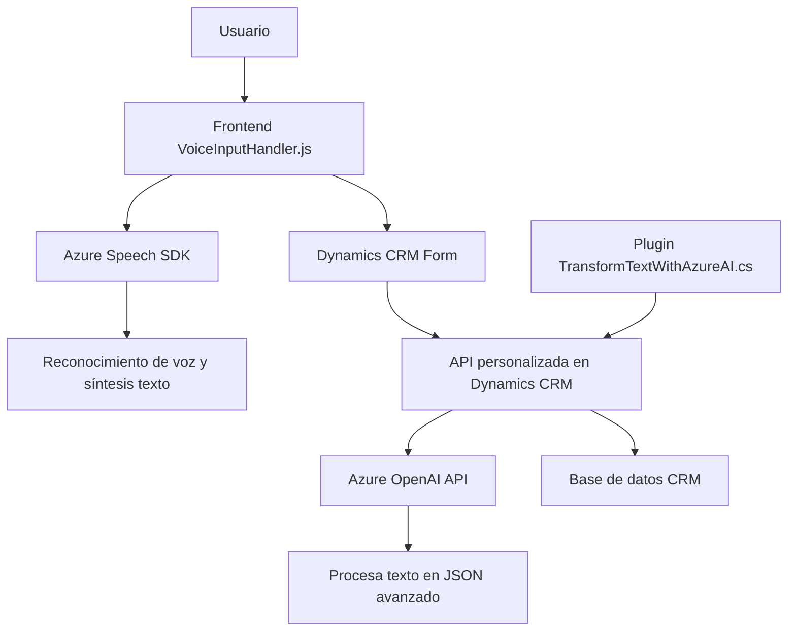

### Breve resumen técnico
El repositorio parece contener una solución orientada a la integración de datos con voz, utilizando **Azure Speech SDK** y **Dynamics CRM API**. Es un sistema que permite realizar interacciones con formularios de Dynamics CRM mediante comandos de voz y procesamiento de texto con IA. También incluye un plugin que extiende Dynamics CRM para transformaciones avanzadas utilizando **Azure OpenAI**.

### Descripción de arquitectura
La solución sigue un modelo de arquitectura distribuida con integración directa entre módulos independientes:
1. **Frontend**: Implementado en JavaScript. Usa el Azure Speech SDK para proporcionar entrada y salida de voz y admite interacción con formularios (Navegador/Cliente).
2. **Backend/Plugin**: Define plugins en C# para Dynamics CRM que interactúan con la API de Azure OpenAI para transformación y procesamiento de texto.
3. **Integración API**: Establece comunicación entre Dynamics CRM y servicios cognitivos externos a través del SDK y solicitudes HTTP.

### Tecnologías usadas
1. **Frontend**:
   - **JavaScript ES6**.
   - **Azure Speech SDK**.
   - **Integración con Dynamics CRM mediante XRM.Client API**.
   - Procesamiento síncrono/asíncrono con Promesas.

2. **Backend**:
   - **Microsoft Dynamics CRM SDK**.
   - **Azure OpenAI API** para procesamiento avanzado de texto.
   - **C# Plugins**.
   - Uso de `HttpClient` para solicitudes HTTP.

3. **Patrones**:
   - **Callback Pattern**: Para la carga del Azure Speech SDK.
   - **Facade Pattern**: Uso de funciones encapsuladas para interactuar con APIs externas.
   - **Proxy API Pattern**: Intermediario del servicio de Azure OpenAI integrado al Plugin CRM.
   - **Modularidad**: Componentes independientes en frontend y backend.

### Dependencias o componentes externos que podrían estar presentes
- **Azure Speech SDK** para síntesis y reconocimiento de voz.
- **Azure OpenAI API** para procesamiento avanzado de lenguaje.
- **Microsoft Dynamics CRM API** para manipulación de datos de formularios.
- **Newtonsoft Json** y **System.Net.Http** para deserialización y manejo de solicitudes web en plugins C#.
- **Browser environment** para cargar dinámicamente SDKs y ejecutar scripts.

### Diagrama Mermaid válido para GitHub

### Conclusión final
La solución es una integración de varios componentes orientados al reconocimiento de voz, síntesis de texto y procesamiento inteligente de datos para una plataforma CRM corporativa (Dynamics CRM). Utiliza tecnologías modernas como Azure Speech SDK y OpenAI para brindar soporte avanzado en la interacción usuario-formulario. Además, emplea una arquitectura modular, lo que facilita el mantenimiento e interconectividad entre el frontend, plugin y servicios externos. Este diseño es robusto para entornos corporativos y fácilmente escalable.