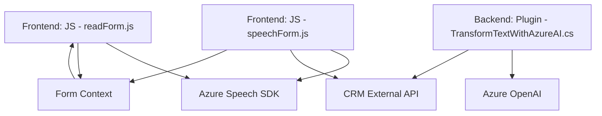

### Análisis Técnico de los Archivos

#### **Breve Resumen Técnico**
Los archivos analizados hacen parte de un sistema que integra funcionalidad de síntesis de voz y transcripción de audio con capacidades avanzadas de procesamiento de inteligencia artificial. La solución utiliza el **Azure Speech SDK** para voz y transcripciones, además de integrar API de Dynamics CRM y un plugin en C# que procesa texto con el servicio Azure OpenAI.

#### **Descripción de Arquitectura**
La solución combina componentes del frontend y backend. En el frontend, el JavaScript gestiona la interacción entre el usuario y un formulario dinámico para la síntesis y grabación de voz, apoyado por el cargador dinámico del Azure Speech SDK. Los componentes del backend están organizados como microservicios, donde el plugin de Dynamics actúa como un enlace entre los inputs del usuario y el procesamiento basado en inteligencia artificial. Esto representa una arquitectura **combinada de N capas con integración de microservicios**.

#### **Tecnologías y Frameworks**
- **Frontend**:
  - Lenguaje: **JavaScript**.
  - Framework: No se utiliza un framework específico, pero se observa el uso de ECMAScript moderno y gestión del DOM.
  - SDK Externo: **Azure Speech SDK**.
  
- **Backend**:
  - Lenguaje: **C#**.
  - Framework: Dyamics CRM Plugins (`Microsoft.Xrm.Sdk`).
  - API: **Azure OpenAI** para el procesamiento de texto y transformación mediante IA.

#### **Patrones y Dependencias**
1. **Patrones usados**:
   - **Modularidad**: Cada archivo está dividido en funciones o clases especializadas con responsabilidades específicas.
   - **Service-oriented Architecture (SOA)**: Comunicación directa entre el sistema y servicios externos como Azure Speech SDK y OpenAI.
   - **Manager-Worker Pattern**: Métodos principales delegan tareas específicas a funciones auxiliares.
   - **Dependency Injection**: Uso de servicios de Dynamics CRM (`IServiceProvider`).

2. **Dependencias**:
   - Externas:
     - **Azure Speech SDK**: Sintetización y grabación de voz.
     - **Azure OpenAI**: Procesamiento avanzado mediante IA.
     - **Custom APIs**: Integradas con Dynamics CRM.
   - Internas:
     - **Contexto CRM**: Manipulación de formularios y atributos del sistema CRM.
     - **Xrm.WebApi**: Para realizar llamadas a APIs internas del CRM.

---

### **Diagrama Mermaid**

### **Conclusión Final**
Este sistema combina capacidades frontend modernas con integraciones backend en un entorno CRM empresarial. Utiliza Azure Speech SDK para voz y transcripciones, con funcionalidad avanzada de procesamiento y transformación de texto mediante Azure OpenAI. La arquitectura es **modular y basada en SOA**, con patrones robustos que garantizan extensibilidad, escalabilidad y integración directa con servicios externos. A pesar de su fortaleza técnica, es recomendable mejorar la gestión de credenciales y configuración externa para incrementar la seguridad y flexibilidad del sistema.