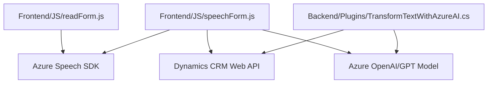

### Breve resumen técnico
El repositorio presenta una solución integrada para extender la funcionalidad de formularios en Dynamics 365, utilizando reconocimiento de voz y síntesis de texto basada en voz, así como transformación de texto estructurado a través de Azure Speech SDK y Azure OpenAI. Combina un **frontend en JavaScript** para la lógica en el lado cliente con un **plugin de backend en C#** que interactúa directamente con el servicio Dynamics CRM. Esto sugiere que la solución tiene un enfoque multifacético: usa servicios **SaaS** de Azure y técnicas avanzadas de procesamiento de lenguaje natural (PLN).

---

### Descripción de arquitectura
#### Tipo de arquitectura:
La solución parece estar organizada bajo el modelo de **n capas**, con separación lógica entre las responsabilidades de:
1. **Frontend:** Captura y manipula datos del cliente (navegador).
2. **Integración API:** Interactúa con servicios externos como Azure Speech SDK y Web APIs de Dynamics 365.
3. **Backend:** Plugin dinámico escrito en C# realiza transformación de texto usando Azure OpenAI y opera directamente sobre el CRM.
4. **Dependencias externas específicas:** Integración con Azure Speech SDK y Azure OpenAI para extender capacidades de reconocimiento de voz y PLN.

#### Patrones presentes:
- **Event-driven architecture:** Uso de *callbacks* y promesas para manejar eventos asincrónicos (carga del SDK, síntesis de voz, procesamiento de respuestas).
- **Plugin architecture:** Implementación de *Dynamics CRM* como base para extensibilidad.
- **Modularidad funcional:** Separación de funciones según su propósito (sintetizar voz, reconocimiento de texto, transformación mediante IA).

---

### Tecnologías usadas
1. **Frontend/JavaScript:**
   - **Azure Speech SDK:** Para reconocimiento de voz y síntesis de texto a voz.
   - **Dynamics 365 Web API:** Manipulación de formularios dentro del CRM.
   - **JavaScript ES6:** Uso de funciones modernas y estándares del lenguaje.
   - **Promise y callbacks:** Manejo asincrónico de eventos en la interacción con APIs.
   - **Dynamics Xrm**: Para acceder a registros relacionados en el CRM.

2. **Backend/C#:**
   - **Azure OpenAI (GPT Model):** Transformación de texto en formatos estructurados (JSON).
   - **Microsoft.Xrm.Sdk:** Extensiones de SDK para desarrollo de plugins en Dynamics CRM.
   - **HttpClient/System.Net.Http:** Llamadas HTTP REST/POST hacia API externas.
   - **JSON Handling:** Serialización y deserialización a través de Newtonsoft Json o System.Text.Json.

3. **Servicios externos:**
   - **Azure AI Services:** Speech SDK y OpenAI para reconocimiento y transformación de texto.
   - **Dynamics 365 API:** Form Actions y Lookup manipulado con métodos nativos.

---

### Diagrama Mermaid válido para GitHub

---

### Conclusión final
La solución implementada en el repositorio está diseñada para incrementar la capacidad de interacción con formularios en Dynamics 365 utilizando tecnologías avanzadas como reconocimiento de voz, síntesis de texto y PLN. Combina un diseño modular y una arquitectura de **n capas**, enfocándose en la integración con servicios externos como Azure Speech SDK y Azure OpenAI. Esto permite una ejecución eficiente desde el frontend hasta el backend, con event-driven patterns que aseguran la recepción de datos y fácil procesamiento.

Aunque la arquitectura es funcional para casos específicos en Dynamics 365, podría evolucionar hacia una arquitectura más desacoplada, como **hexagonal** o un modelo basado en microservicios, para mejorar la reutilización y escalabilidad.