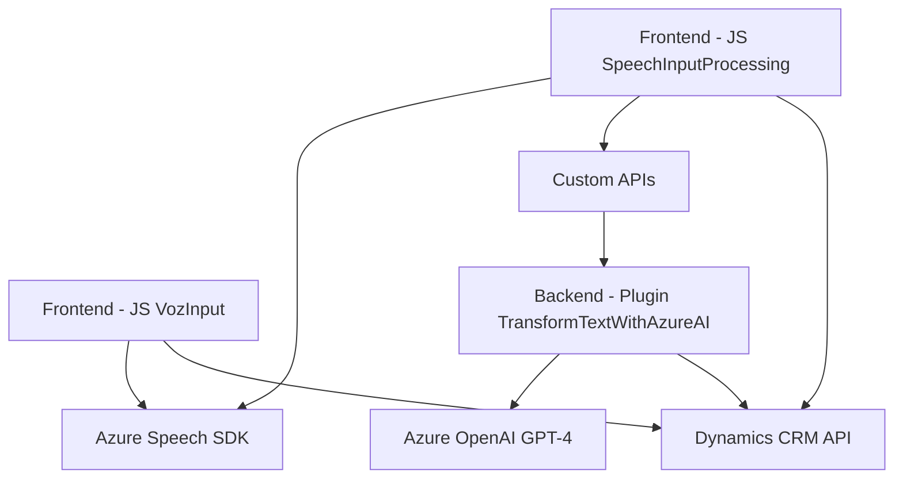

### Breve resumen técnico
Este repositorio contiene tres principales módulos orientados a la interacción entre formularios dinámicos, síntesis y reconocimiento de voz, además de la transformación avanzada de texto mediante la integración de Azure AI y Dynamics CRM. Los componentes incluyen un **frontend de JavaScript** para la interacción directa con formularios, un **plugin de Dynamics CRM** para transformar datos con OpenAI GPT-4, y una arquitectura orientada al uso de servicios externos (API y SDKs).

---

### Descripción de arquitectura
La arquitectura general se puede describir como una **arquitectura de n capas** con componentes separados:
1. **Frontend (JS)**: Gestiona la interacción del usuario y la lógica de entrada/salida mediante una interfaz dinámica de voz basada en Azure Speech SDK.
2. **Backend (plugin)**: Implementa un microservicio en Dynamics CRM que transforma texto con Azure OpenAI GPT-4.
3. **Servicios externos**: Integración del SDK de Azure Speech para procesos de reconocimiento de voz y síntesis, y de Azure OpenAI para procesamiento de texto estructurado.

Estas capas están conectadas a través de servicios REST y dependencias de SDKs, lo que permite modularidad y escalabilidad en la solución.

---

### Tecnologías usadas
1. **Frontend**:
   - **JavaScript**: Para la lógica de interacción en el navegador.
   - **Azure Speech SDK (external)**: Para síntesis y reconocimiento de voz.
   - **Web APIs**: Procesamiento de datos y interacción dinámica.

2. **Backend**:
   - **C# (Dynamics Plugins)**: Utilizado en la clase `TransformTextWithAzureAI` para la lógica de negocio y transformación textual.
   - **Azure OpenAI (SDK external)**: Para transformación avanzada de texto a través de GPT-4.
   - **Microsoft Dynamics CRM SDK**: Integración con CRM y gestión de entidades.

3. **Libraries**:
   - `Newtonsoft.Json` y `System.Text.Json`: Para el manejo de objetos JSON en el backend.

---

### Dependencias o componentes externos que podrían estar presentes
1. **Azure Speech SDK**: Para gestión de reconocimiento y síntesis de voz en el frontend.
2. **Azure OpenAI GPT-4**: Procesamiento de texto en el backend.
3. **Microsoft Dynamics CRM SDK**: Dependencia esencial del plugin de Dynamics CRM para integrarse con las entidades y datos del CRM.
4. **Custom APIs**: En el frontend, existe interacción con Web APIs personalizadas utilizadas para transformar datos.

---

### Diagrama Mermaid

---

### Conclusión final
La solución está diseñada para facilitar la interacción entre formularios dinámicos de usuario y funciones avanzadas de voz y procesamiento de datos. La arquitectura modular facilita el desarrollo y escalabilidad, permitiendo integrar servicios de terceros (Azure Speech SDK y OpenAI GPT-4) con un sistema empresarial basado en Dynamics CRM. Representa una solución de nivel empresarial que implementa patrones de desarrollo como modularidad y programación asíncrona, además de utilizar enfoques de n capas y servicios externos.