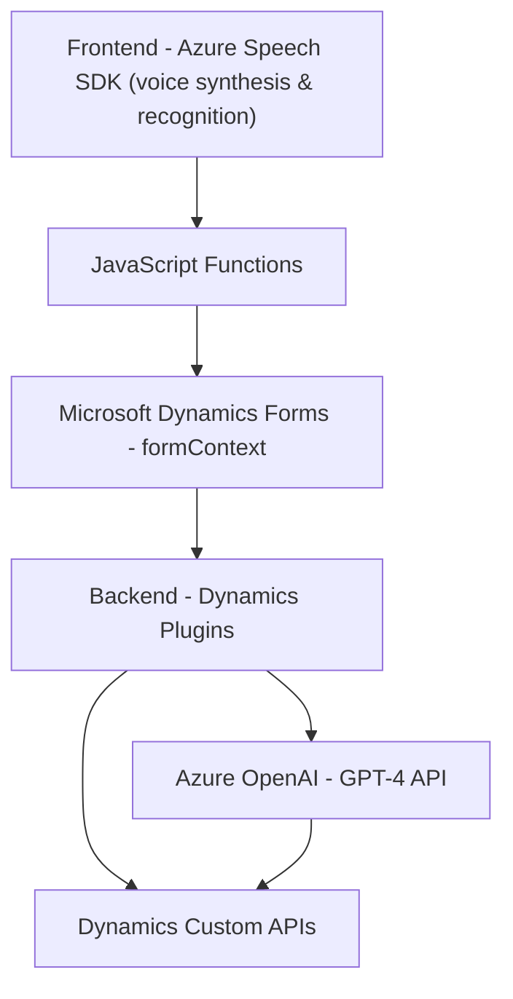

### Breve resumen técnico
El repositorio presentado configura un sistema integrado con capacidad de síntesis y reconocimiento de voz, utilizando el **Azure Speech SDK** y servicios externos como **Azure OpenAI API**. Está orientado a interactuar principalmente con formularios de **Microsoft Dynamics 365** para realizar tareas basadas en la voz, como lectura, transcripción, actualización de campos y transformación de texto mediante inteligencia artificial.

---

### Descripción de arquitectura
La arquitectura del proyecto combina tanto lógica backend en forma de plugins para Dynamics CRM como lógica frontend, que incluye funcionalidades basadas en JavaScript. La funcionalidad se centra en:
1. **Frontend**:
   - Implementación de funcionalidades de reconocimiento y síntesis de voz utilizando **Azure Speech SDK**.
   - Manipulación dinámica de formularios (`formContext`) dentro de **Dynamics 365**.
   - Implementación modular: Cada archivo representa un conjunto específico de responsabilidades (entrada de voz, lectura de formularios y síntesis de voz).

2. **Backend**:
   - Utilización de **Microsoft Dynamics Plugins** (implementados en C#) para extender la funcionalidad del CRM.
   - Uso de **Azure OpenAI API** dentro de un plugin que procesa y transforma texto.

La arquitectura general tiene características de **n capas** pero se integra con servicios de nube y APIs externas, acercándose indirectamente a una **arquitectura híbrida** con patrones de servicios externos.

---

### Tecnologías y frameworks usados

#### **Frontend**
1. **Azure Speech SDK**:
   - Reconocimiento de voz (speech-to-text).
   - Síntesis de voz (text-to-speech).
2. **Microsoft Dynamics 365 API**:
   - Manipulación de formularios usando APIs dinámicas como `formContext`.
3. **DOM API**:
   - Manipulación dinámica de scripts y el entorno de ejecución de JavaScript.

#### **Backend**
1. **Microsoft Dynamics CRM SDK**:
   - Extensión de funcionalidad mediante plugins y APIs del CRM.
2. **Azure OpenAI API**:
   - Procesamiento avanzado de texto con modelos como GPT-4 para transformación y análisis.
3. **Newtonsoft.Json y System.Text.Json**:
   - Manipulación de objetos JSON para integraciones externas.

#### **Patrones arquitectónicos usados**
1. **Patrón delegado**:
   - Separación de responsabilidades en módulos y funciones específicas.
2. **Cargador dinámico**:
   - Incorporación condicional del SDK para voz.
3. **Proxy API client**:
   - Comunicación con APIs externas (Speech SDK y OpenAI).
4. **Patrón n capas** (adaptado):
   - Separación entre frontend, capa de servicios externos y backend de CRM.

---

### Dependencias y componentes externos presentes
1. **Azure Speech SDK** (reconocimiento y síntesis de voz).
2. **Azure OpenAI API** (GPT-4 para procesamiento de texto).
3. **Microsoft Dynamics CRM Plugins** para la extensión del comportamiento de formularios.
4. APIs externas dinámicas:
   - `https://aka.ms/csspeech/jsbrowserpackageraw`: SDK de voz cargado durante la ejecución.
   - APIs personalizadas de Dynamics (`trial_TransformTextWithAzureAI`).
5. Principales herramientas del entorno:
   - **JavaScript DOM API**.
   - **Microsoft.Xrm.Sdk** y WebAPI Dynamics para el backend.

---

### Diagrama Mermaid válido para GitHub

---

### Conclusión final
El repositorio integra tecnologías avanzadas como **Azure Speech SDK** y servicios de **Azure OpenAI** para potenciar un sistema interactivo basado en inteligencia artificial. Utiliza APIs de **Microsoft Dynamics 365** para actualizar formularios en tiempo real y un plugin en **C#** para extender la funcionalidad de CRM. Aunque la arquitectura tiene rasgos de **n capas**, la interacción con servicios externos le da un toque de arquitectura híbrida. Las funcionalidades son modulares y dinámicas, lo que permite adaptabilidad y expansión en entornos empresariales complejos.