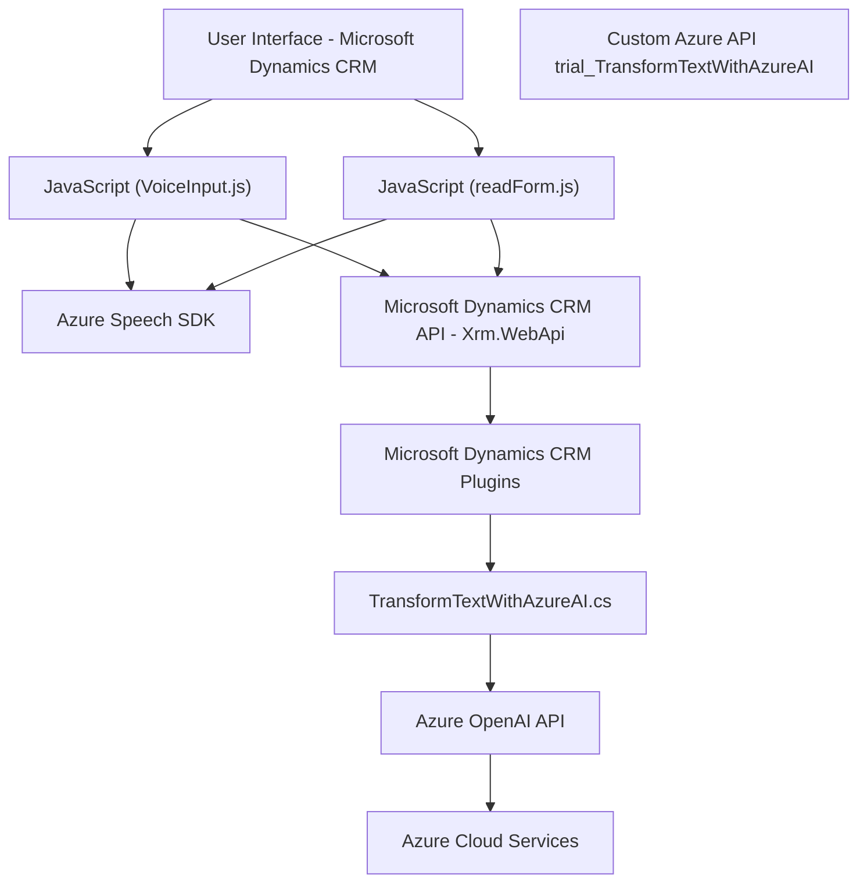

### Breve resumen técnico

El repositorio incluye tres archivos principales: dos archivos JavaScript destinados a proveer funcionalidades relacionadas con la entrada y salida de voz en formularios, integrados con **Azure Speech SDK** y Microsoft Dynamics CRM API, y un archivo C# que implementa un plugin para procesar texto utilizando **Azure OpenAI's ChatGPT API**.

Los componentes del sistema están diseñados para interactuar con formularios dinámicos en Microsoft Dynamics CRM, mejorando la experiencia de usuario mediante las tecnologías de voz (reconocimiento y síntesis) y procesamiento de lenguaje natural.

---

### Descripción de arquitectura

#### Tipo de solución
La solución es una combinación de **front-end en JavaScript**, encapsulada en un sistema mayor posiblemente de integración/scripting para **Microsoft Dynamics CRM**, con un plugin de back-end en C#. Es parte de un **ecosistema CRM extendido**, donde las interacciones modifican la experiencia del usuario en tiempo real mediante funcionalidades avanzadas de voz y procesamiento de lenguaje basado en inteligencia artificial.

#### Arquitectura
La arquitectura tiene características propias de **SOA (Service-Oriented Architecture)** y **n capas**, aprovechando tanto el SDK de Azure Speech como la API de Azure OpenAI en un modelo de integración con servicios externos. La solución utiliza cliente-servidor con lógica de presentación en el frontend y lógica empresarial asociada al plugin.

Aunque no presenta una típica arquitectura limpia como la **hexagonal** ni aborda conceptos distribuidos como **microservicios**, aprovecha APIs externas para ofrecer capacidades avanzadas, constituyendo algo cercano a una arquitectura de **composición de servicios**.

---

### Tecnologías usadas
1. **JavaScript** (frontend):
   - Manejo de formularios en Microsoft Dynamics CRM.
   - Asynchronous API calls utilizando `async/await`.
   - Uso extenso del **Azure Speech SDK** para procesos de síntesis y reconocimiento de voz.

2. **C# Plugin (backend)**:
   - SDK de Microsoft Dynamics CRM (`IPlugin`, `IOrganizationService`, etc.).
   - Comunicación con **Azure OpenAI API** y Chat Completions para transformación avanzada de texto.
   - Manejo de JSON con **Newtonsoft.Json** y `System.Text.Json`.
   - Uso de **System.Net.Http** para realizar peticiones HTTP.

3. **Azure External Services**:
   - **Azure Speech SDK**: Reconocimiento de voz y síntesis de voz (en el frontend).
   - **Azure OpenAI Services (GPT)**: Proceso de transformación avanzada de texto y APIs de AI (en el backend).

---

### Diagrama Mermaid compatible con GitHub

---

### Conclusión final

La estructura presentada es parte de una solución de extensión para un sistema CRM (Microsoft Dynamics CRM) que integra servicios de voz y inteligencia artificial. La solución se divide en dos partes principales:

1. **Frontend JavaScript**: Proporciona capacidades de entrada y salida de voz utilizando Azure Speech SDK y dinámica de formularios mediante CRM Web API. Esto permite tanto la vocalización de campos como la actualización de formularios basándose en entrada de voz transcrita y procesada.

2. **Backend Plugin en C#**: Implementa lógica de procesamiento enriquecida con la ayuda de Azure OpenAI API y sigue el patrón de arquitectura basado en complementos para Dynamics CRM.

En conjunto, esta solución sigue principios de **modularidad** y **composición de servicios externos**, con operaciones asincrónicas y dinámicas. Sin embargo, también presenta dependencia directa de servicios específicos (Azure SDK y Azure OpenAI). Esto podría plantear desafíos en términos de desacoplamiento y escalabilidad si se desea trasladar esta lógica a otros contextos fuera del entorno CRM de Microsoft.