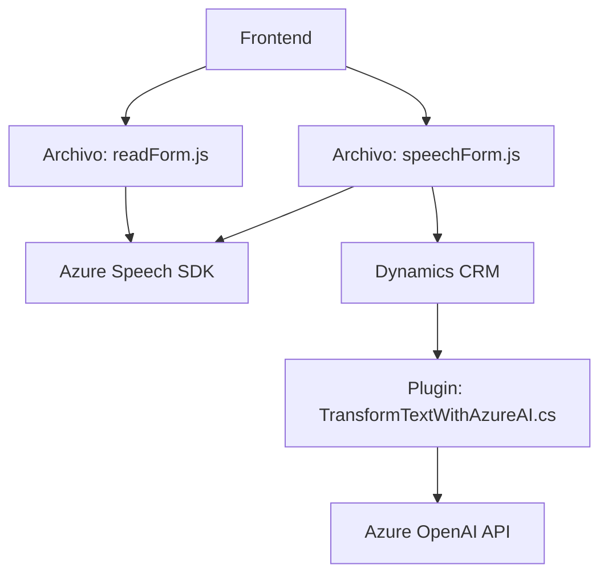

### Breve resumen técnico

El repositorio contiene componentes que implementan funcionalidades relacionadas con reconocimiento y síntesis de voz, además de un plugin que transforma texto usando Azure AI. Se utilizan tanto tecnologías de frontend como plugins para Dynamics CRM con .NET. Los archivos analizados demuestran un sistema compuesto que interactúa con APIs externas (Azure Speech y Azure OpenAI) para realizar tareas específicas.

---

### Descripción de arquitectura

#### Solución:
La solución es una combinación de frontend (para interacción y procesamiento de voz) y extensiones de backend en forma de plugins (Dynamics CRM), lo que indica un enfoque híbrido.

#### Arquitectura:
1. **Frontend:** Contiene scripts en JavaScript organizados en funciones independientes que integran Azure Speech SDK para reconocimiento y síntesis de voz, además de facilitar la interacción con formularios en una plataforma como Dynamics.
   - **Patrón:** Arquitectura modular con orientación a componentes reutilizables.
   - **Modelo:** Monolítico en el contexto del frontend, pero modular mediante scripts específicos.

2. **Plugin para Dynamics CRM:** Es una extensión basada en el patrón de **Plugin Architecture**, diseñado para ampliar capacidades de Dynamics mediante interacción con Azure OpenAI.
   - **Patrón:** Arquitectura basada en eventos con el entorno CRM (Dynamics).
   - **Modelo:** Plugin único que se ejecuta dentro del marco CRM (Dinámica de capas: `Dynamics CRM SDK Layers`).

Aunque las partes del sistema tienen modularidad interna, no están completamente desacopladas. La solución global puede clasificarse como **arquitectura híbrida**, con una orientación a interacción entre componentes en un entorno monolítico más extensiones asíncronas.

---

### Tecnologías, frameworks y patrones usados

1. **Frontend (JavaScript):**
   - Tecnologías:
     - **Azure Speech SDK**: Para tareas relacionadas con síntesis y reconocimiento de voz.
     - Interacción con formularios (`DOM manipulation`) estándar del entorno de Dynamics.
   - Patrones:
     - **Callback-based architecture**: Flujo basado en funciones asíncronas con callbacks para cargar y ejecutar SDKs y APIs externas.
     - **Modularidad funcional:** Dividir responsabilidad por función (e.g., `leerFormulario`, `speakText`).
     - **Aislamiento de dependencias externas:** Scripts eliminan acoplamiento directo al cargar SDK dinámicamente.

2. **Backend Plugins (.NET):**
   - Tecnologías:
     - **Dynamics CRM SDK** para extender funcionalidades del entorno CRM.
     - **Azure OpenAI API** para procesamiento de texto mediante una solicitud REST.
     - **Newtonsoft.Json/System.Text.Json:** Para manejo de objetos JSON.
   - Patrones:
     - **Event-driven execution:** El plugin sigue el modelo de ejecución disparado por eventos nativos de Dynamics CRM.
     - **Single Responsibility Principle:** Enfocado únicamente en la transformación de texto y respuesta estructurada.

3. **Ecosistema adicional:**
   - Integración con APIs externas (Azure Speech y OpenAI).
   - Uso indirecto de `environment variables` o configuración externas para claves API y parámetros de región.

---

### Dependencias y componentes externos

1. **Externos:**
   - **Azure Speech SDK**: Procesos de reconocimiento y síntesis de voz.
   - **Azure OpenAI API**: Transformación de texto según reglas definidas.
   - **Dynamics CRM SDK**: Proporciona interfaces como `IPluginExecutionContext` y servicios para interactuar con datos de CRM.

2. **Internos:**
   - Scripts modulares en frontend son interdependientes, aunque desacoplados del SDK al cargarse dinámicamente.
   - Plugins en .NET son independientes, pero interactúan parcialmente a través del contexto de ejecución y niveles internos (como los servicios `IOrganizationService`).

---

### Diagrama Mermaid

---

### Conclusión final

La solución híbrida destaca por integrar capacidades de voz e inteligencia artificial al explorar dos capas diferentes:
- Un **frontend modular** construido sobre JavaScript y Azure Speech SDK, utilizado para mejora de interacción mediante reconocimiento voz-texto.
- **Plugins backend**, diseñados para extender funcionalidad de Dynamics CRM con procesamiento avanzado de texto mediante Azure OpenAI.

La arquitectura está orientada más hacia la modularidad que hacia un enfoque totalmente desacoplado. Aunque funciona eficientemente en base a patrones independientes, un enfoque más consolidado podría considerar la adopción de arquitecturas como **hexagonal o microservicios** para desacoplar aún más las funcionalidades integradas.