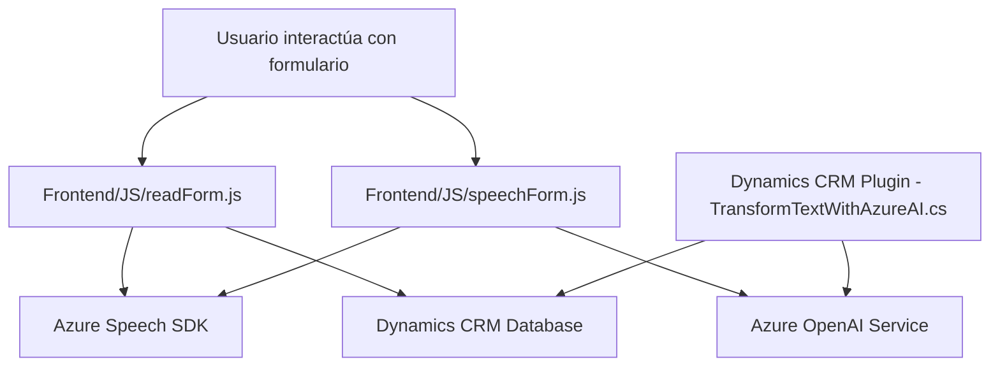

### Breve resumen técnico
El repositorio presenta múltiples archivos que implementan soluciones relacionadas con procesamiento de texto, voz y datos en formularios mediante integración de tecnologías Microsoft, como Azure Speech SDK, Azure OpenAI y Microsoft Dynamics CRM API. El enfoque modular y la interacción directa con servicios externos indican que el repositorio está diseñado para mejorar la accesibilidad y automatización en sistemas CRM.

---

### Descripción de arquitectura
La arquitectura es **modular** y utiliza principios de integración a través de APIs y SDKs externos. Cada archivo tiene funciones específicas y opera como un microcomponente orientado a actividades concretas, como reconocimiento de voz, síntesis de texto a voz o transformación de texto en JSON. Aunque no se implementan microservicios como tal, la dependencia de servicios externos indica una arquitectura distribuida.

#### Características principales:
1. **API facade**: Plugins y scripts funcionan como una interfaz para simplificar el acceso al SDK y las APIs de Microsoft.
2. **Capas y modularidad**: Distribución lógica en capas:
   - **Frontend**: Para interacción directa con usuarios en formularios dinámicos.
   - **Plugins**: Operación en la capa de backend del CRM.
3. **Integración con servicios externos**:
   - Azure Speech SDK para voz.
   - Azure OpenAI Service para transformación de texto basado en IA.
   - Microsoft Dynamics CRM SDK para acceso y actualización de datos de formularios.

#### Arquitectura específica:
- Uso de patrones de **event-driven programming** para manejar interacciones asincrónicas.
- **Modularidad funcional** en el frontend y plugins del CRM.
- **Servicios distribuidos** para procesamiento de datos (voz, texto estructurado).
 
La arquitectura podría acercarse a un enfoque **n-capas**, pero con dependencias significativas en servicios externos.

---

### Tecnologías usadas
1. **Microsoft Azure Speech SDK**
   - Funcionalidad de síntesis y reconocimiento de voz servida desde Azure.
2. **Azure OpenAI Service**
   - Procesamiento de texto basado en IA con un enfoque estructurado hacia tareas específicas.
3. **Microsoft Dynamics CRM SDK**
   - Extensión del CRM mediante APIs y plugins personalizados.
4. **Lenguajes y frameworks**:
   - **JavaScript (Frontend)**: Maneja eventos de usuario y lógica del cliente.
   - **C# (.NET Framework)**: Define plugins de CRM y lógica del backend.
5. **Librerías para JSON**:
   - `System.Text.Json` y `Newtonsoft.Json.Linq` para manipulación avanzada del formato JSON.

---

### Diagrama Mermaid válido para GitHub

---

### Conclusión final
El repositorio implementa una **solución orientada a la gestión dinámica de formularios** en Dynamics CRM, integrando tecnologías modernas como **Azure Speech SDK** y **Azure OpenAI** para procesar voz y texto respectivamente. La arquitectura es funcionalmente modular y basada en servicios externos, reflejando un enfoque distribuido con dependencias en nubes públicas como Azure. Está diseñado para mejorar la accesibilidad, automatización y productividad en contextos donde la interacción fluida entre humanos y tecnología es esencial.

- **Fortalezas**:
  - Uso efectivo de servicios externos que agilizan el desarrollo y la capacidad de escalabilidad.
  - Modularidad e integración directa con el ecosistema Dynamics CRM.

- **Debilidades**:
  - Dependencia crítica de los servicios de Microsoft y de APIs específicas reduce la portabilidad del sistema para clientes que usan alternativas como AWS o Google Cloud.

Se podría mejorar adoptando principios que hagan la arquitectura más flexible a otros entornos y servicios, pero como solución específica para Dynamics, el diseño es robusto y cumple con sus objetivos.