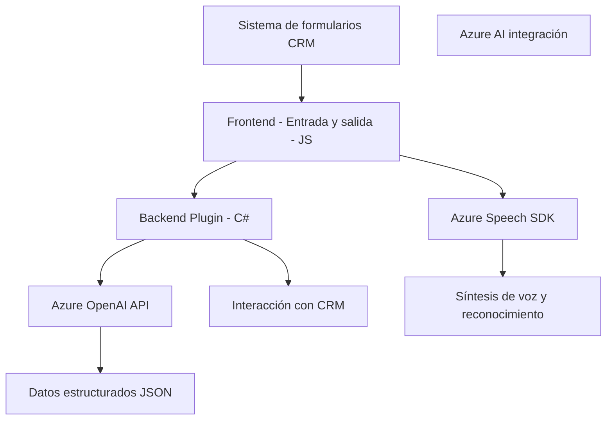

### Breve resumen técnico

El repositorio corresponde a una solución cuyo propósito principal es integrar **Azure Speech SDK** y **Azure OpenAI** en un contexto de formulario dentro de **Microsoft Dynamics CRM**. Con esta arquitectura, ofrece funcionalidades avanzadas como la conversión de datos visuales y auditivos en texto, lectura de datos de formularios en voz, procesamiento de voz basada en inteligencia artificial y la modificación de formularios en un entorno CRM. 

Se complementa con un plugin para Microsoft Dynamics CRM que efectúa transformación de textos en datos estructurados mediante Azure OpenAI API.

---

### Descripción de arquitectura

La arquitectura del sistema sigue un enfoque de **n-capas**, donde las partes del sistema están separadas por su rol en el flujo de datos:

1. **Frontend**: 
   - Un conjunto de JavaScript ubicado en la carpeta `FRONTEND/JS`, encargado de procesar entrada y salida de datos en el contexto de formularios (interfaz de usuario). Usa prácticas de modularización y separación de responsabilidades.

2. **Backend (Plugin)**:
   - El archivo `Plugins/TransformTextWithAzureAI.cs` actúa como un *microservicio* especializado que interactúa con el **Microsoft Dynamics CRM** y se conecta al servicio externo **Azure OpenAI** para transformar texto. Este componente adopta el patrón de integración de servicios en la nube y el estándar de plugins de Dynamics CRM.

3. **Dependencias externas**:
   - **Azure Speech SDK** es responsable de la síntesis de voz y el reconocimiento de entrada por medio de APIs.
   - **Azure OpenAI** genera datos estructurados o ejecuta transformaciones de texto desde el plugin CRM.

4. **Comunicación entre capas**:
   - Las capas se comunican mediante las interfaces estándar de Dynamics CRM (`Xrm.WebApi`). Por ejemplo, los scripts de JavaScript interactúan con formularios visibles en la interfaz y realizan llamadas a las APIs configuradas en el backend.

El sistema utiliza un enfoque integral basado en **servicios externos** (SaaS) y **modularización funcional** de las responsabilidades. Es importante destacar que utiliza diferentes tecnologías (JavaScript para el frontend, C# para el backend) para una integración fluida.

### Tecnologías usadas

1. **Frontend**:
   - **JavaScript**: Para manipular formularios DOM y gestionar Azure Speech SDK.
   - **Azure Speech SDK**: Utilizado para proveer funcionalidad de síntesis y reconocimiento de voz.
   - **Promises y async/await**: Para manejar operaciones asincrónicas al interactuar con las APIs.

2. **Backend**:
   - **Microsoft Dynamics SDK**: Para interactuar con el entorno CRM.
   - **C#**: Lenguaje principal del código backend y plugins.
   - **Azure OpenAI API**: Para generación de texto natural y datos estructurados.
   - **HttpClient**: Para llamadas HTTP hacia Azure OpenAI.
   - **Newtonsoft.Json**: Manejo de JSON en el plugin.

3. **General**:
   - **Service-oriented Architecture (SOA)**: Independencia de servicios SaaS para síntesis de voz y AI.
   - **Single Responsibility Principle (SRP)**: Uso de funciones desacopladas con tareas específicas.
   - **REST API**: Comunicación con Azure Speech y Azure OpenAI.

---

### Diagrama Mermaid

---

### Conclusión final

Este proyecto es una solución fusionada de **Frontend** (JavaScript) y **Backend** (C#), diseñada para trabajar en conjunto con **Microsoft Dynamics CRM**. Implementa funcionalidades avanzadas de síntesis de voz y procesamiento de datos con integración hacia servicios de Azure (Speech SDK y OpenAI).

La arquitectura es de **n-capas**, donde cada capa se especializa en un aspecto funcional del sistema (manipulación de formularios visibles, sintetización de voz, procesamiento estructural de datos, interacción con APIs externas). Este diseño modular, combinado con tecnologías modernas basadas en SaaS, asegura flexibilidad y alta escalabilidad del sistema.