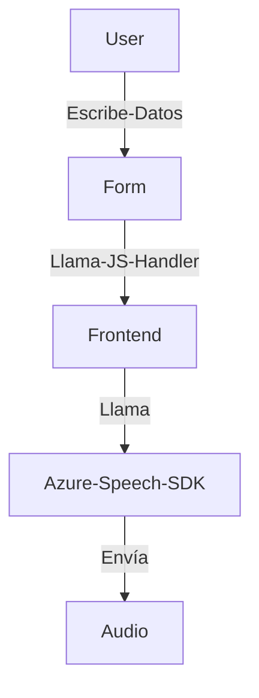
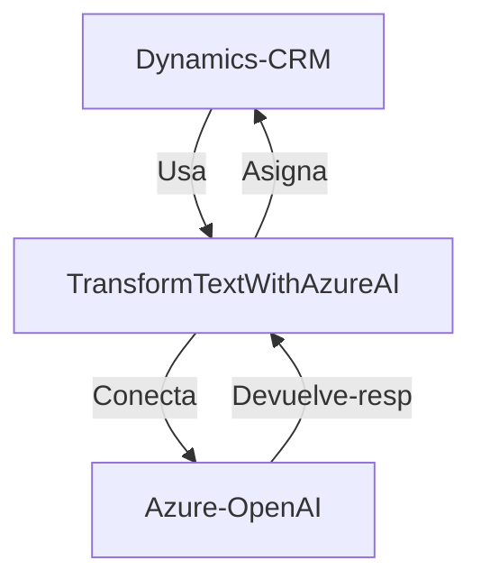

### Breve resumen técnico
Este repositorio combina tres componentes clave:
1. Un frontend basado en JavaScript con integración al SDK de voz de Azure para lectura y síntesis de texto (archivos `readForm.js` y `speechForm.js`).
2. Implementaciones backend usando Microsoft Dynamics CRM Plugins (`TransformTextWithAzureAI.cs`) que ejecutan lógica personalizada vinculada a eventos y procesan texto con servicios Azure OpenAI.

La solución implementa procesamiento por voz para formularios, transformación textual avanzada con IA, y funcionalidades CRM extendidas mediante servicios integrados de Microsoft Azure.

---

### Descripción de arquitectura
La arquitectura es **multicapa** porque:
1. Hay separación entre el frontend para interacción basada en voz (captura y síntesis) y el backend que extiende funcionalidades de Dynamics CRM.
2. El backend actúa como una capa de negocios independiente, ejecutando procesos asincrónicos y delegando lógica a servicios externos como Azure Speech SDK y OpenAI.

Patrones destacados:
- **Callback y promesas** para manejar interactividad asincrónica de SDKs API.
- **Plug-in basado en eventos** para Dynamics, extendiendo acciones sobre procesos de negocio.
- **External API consumption**: Uso de Azure Speech para voz y Azure OpenAI para texto.

---

### Tecnologías usadas
#### Frontend:
- **JavaScript**.
- **Azure Speech SDK** (dinámicamente cargado).
- **Xrm.WebApi.online** para comunicación con Dynamics CRM personalizadas.

#### Backend:
- **Microsoft Dynamics SDK**: Para capturar eventos y ejecutar extensiones de lógica mediante plugins.
- **Azure OpenAI**: Reconocimiento y transformación de texto con OpenAI (modelo GPT-4).
- **C#**: Lenguaje de escritura para lógica extendida en Dynamics.

---

### Diagramas Mermaid para cada nivel del sistema

#### Nivel de interacción general: front con servicios de Azure


#### Flujo backend (plugin)


#### Flujo de interacción con formulario y voz
```mermaid
graph TD
  User--Habla-->Form-VoiceInput
  Form-VoiceInput--Texto-de-Voz-->Azure-Speech-SDK
  Azure-Speech-SDK--Devuelve-->Form-Handler
  Form-Handler--Procesa-->Dynamics-API
  Dynamics-API--Modifica--Formulario
```

---

### Conclusión final
La solución combina un procesamiento avanzado de voz con conversión de texto a través de APIs de Azure. La arquitectura de capas hace que sea flexible para integrarse en ecosistemas empresariales basados en Dynamics CRM. Sin embargo, la conexión directa a servicios de Azure como Speech y OpenAI requiere una infraestructura dedicada y una buena gestión de API Keys para seguridad.