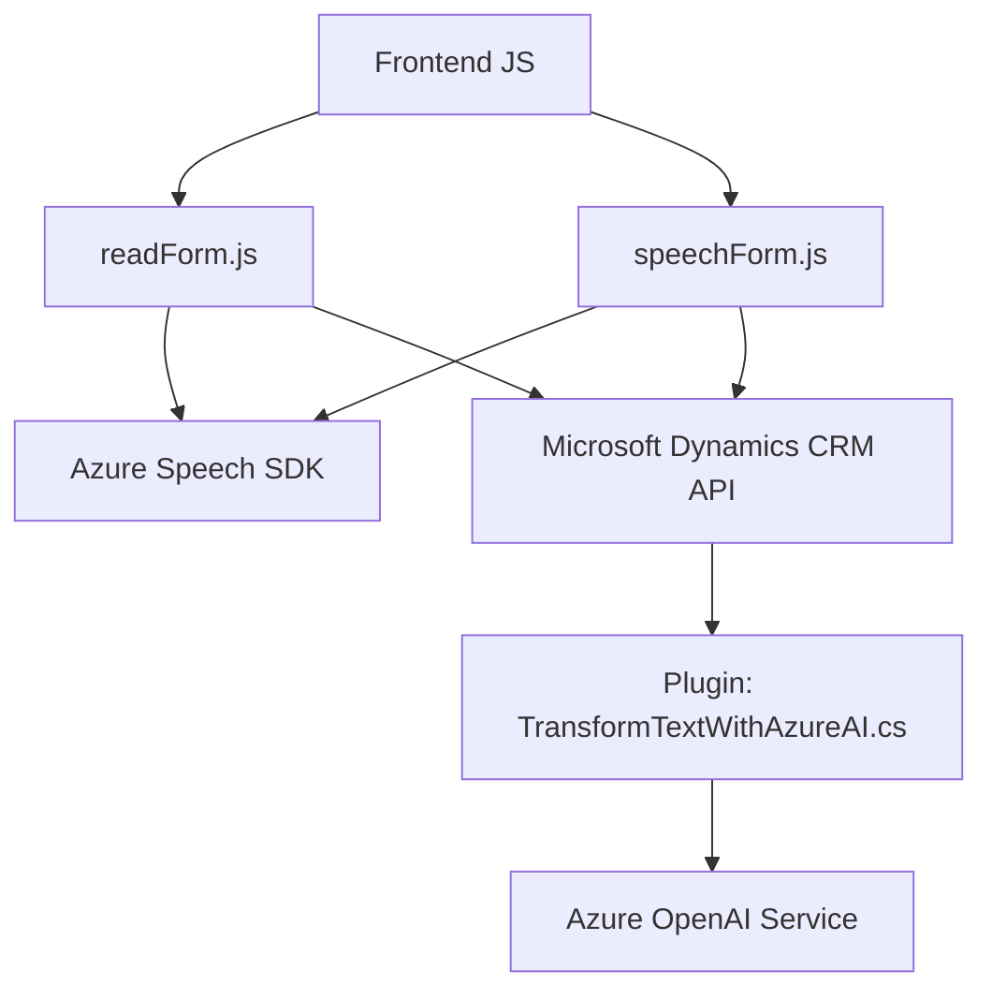

### Análisis técnico y explicación detallada

#### 1. **Qué tipo de solución es**
La solución es un sistema de integración basado en una arquitectura híbrida, compuesto por:
  - **Frontend:** Dos archivos JavaScript (`readForm.js` y `speechForm.js`) que interactúan con formularios de Dynamics CRM y utilizan el SDK de Azure Speech para procesar voces y datos de formulario.
  - **Backend:** Un plugin en C# (`TransformTextWithAzureAI.cs`) que transforma texto utilizando el servicio Azure OpenAI en Dynamics CRM y genera un JSON estructurado.
  - **API:** Dependencias con APIs externas, como Azure Speech SDK y Azure OpenAI, para procesamiento de voz y transformación de texto.

#### 2. **Tecnologías, frameworks y patrones empleados**
- **Frontend/JavaScript:**
  - **Azure Speech SDK:** Procesos de síntesis de voz y reconocimiento.
  - **Microsoft Dynamics CRM API:** Para manipular formularios y usar datos desde un contexto.
  - **Patrones:** Modularización, asincronía (Promises/async-await), procesamiento basado en eventos.
  
- **Backend/C#:**
  - **Azure OpenAI:** Transformación de texto hacia JSON siguiendo estructuras específicas.
  - **Microsoft Dynamics CRM Plugin Architecture:** Desarrollado con la interfaz `IPlugin` y ajustado a requisitos de Dynamics CRM.
  - **Patrones:** Cliente-Servidor, Message-based processing.
  
- **Generales:**
  - **Arquitectura híbrida:** Incluye integración no solo entre cliente y servidor, sino también con servicios externos.

#### 3. **Arquitectura utilizada**
La solución tiene una arquitectura **n capas** adaptada a Dynamics CRM. Las capas identificadas son:
- **Capa de presentación (Frontend):** Implementada en JavaScript, encargada de capturar y manipular datos de formularios, junto con integración de audio y voz.
- **Capa de negocio/middle (Backend Plugin):** Centraliza la lógica específica de generación de JSON utilizando servicios de IA (Azure OpenAI) y transmite los resultados al contexto CRM.
- **Capa de servicios externos (Azure Speech/AI):** Responsable de la conexión con servicios externos para reconocimiento de voz y procesamiento basado en inteligencia artificial.

#### 4. **Dependencias o componentes externos**
- **Azure Speech SDK:** Permite reconocimiento, síntesis y reproducción de audio.
- **Azure OpenAI:** Utilizado por el plugin para transformar texto en JSON estructurados.
- **Microsoft Dynamics CRM APIs:** Punto de conexión entre el sistema desarrollado y la plataforma de Dynamics CRM.
- **Newtonsoft.Json & System.Net.Http:** Adicionales para manejo de mensajes y JSON.

#### 5. **Diagrama Mermaid: Representación simplificada**

### Conclusión final
La solución implementa una arquitectura basada en n capas con características híbridas que conectan un frontend en JavaScript con un plugin backend en C#, utilizando servicios externos como Azure Speech SDK y OpenAI. La integración está bien estructurada y prioriza modularidad, reutilización y asincronismo en las operaciones. El diseño es claramente orientado a la plataforma de Dynamics CRM, permitiendo automatización y procesamiento avanzado de formularios interactivos tanto con reconocimiento de voz como mediante inteligencia artificial.