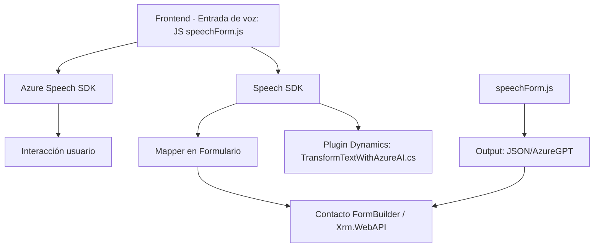

### Breve resumen técnico
El repositorio contiene tres archivos con diferentes funcionalidades relacionadas con la integración entre una aplicación frontend y servicios externos (Azure Cognitive Services y Dynamics CRM). Su propósito principal es la entrada de datos con voz y transformación de texto, utilizando tecnologías modernas como Azure Speech SDK, AI/ML de OpenAI, y Dynamics CRM plugins.

---

### Descripción de la arquitectura
La solución tiene una estructura híbrida:
1. **Frontend con JavaScript**: Compuesto por archivos que manejan la interacción directa en el navegador y la lógica para conectarse a servicios externos (Azure Speech SDK y Dynamics CRM).
2. **Backend mediante plugins**: Implementado como extensiones de Dynamics CRM, por medio de la interfaz `IPlugin`, que permite realizar transformaciones avanzadas de datos usando Azure OpenAI.
3. **Service-Oriented Architecture (SOA)**: Integración con servicios de Azure (Speech SDK y OpenAI) y Dynamics CRM, actuando juntos en un esquema modular y orientado a servicios.

---

### Tecnologías usadas
1. **Frontend**:
   - JavaScript.
   - Azure Speech SDK (Dynamic loading via browser package).
   - Event-driven programming (handler for speech recognition).
2. **Backend**:
   - C# (.NET Framework/SDK).
   - Dynamics CRM (through `IPlugin` interface).
   - Azure OpenAI Services (via GPT models).
   - JSON libraries (`Newtonsoft.Json` and `System.Text.Json`).
   - HTTP client for API communication.
3. **Cloud integration**:
   - Azure Cognitive Services (Speech SDK).
   - Azure AI (GPT-3/4 for text transformation).

---

### Dependencias/componentes externos
1. **Azure Speech SDK**: SDK para reconocimiento y síntesis de voz.
2. **Azure OpenAI Service**: Procesamiento avanzado de texto con IA.
3. **Microsoft Dynamics CRM**: Extensiones tipo plugin para transformar datos recibidos.
4. **Librerías JSON**: Herramientas para manejar procesamiento JSON (`Newtonsoft.Json` y `System.Text.Json`).
5. **HTTP Client**: Para comunicación directa con APIs.

---

### Diagrama **Mermaid** válido para GitHub

---

### Conclusión final
La solución combina múltiples tecnologías para enriquecer la experiencia en formularios de Dynamics CRM mediante:
- **Frontend**: Herramientas modernas para manejo de voz y conversión de datos.
- **Backend (plugins)**: Implementación escalable dentro del ecosistema Dynamics CRM, con transformación avanzada utilizando Azure OpenAI.
- **SOA**: Arquitectura basada en servicios externos (Azure Speech SDK y OpenAI) para una integración eficiente y extensible.

Aunque funcional, puede optimizarse con mejoras de seguridad (API keys) y desacoplamiento de lógica de negocio del código base principal. En general, la solución ofrece características poderosas y bien estructuradas para casos de negocio interactivo con datos dinámicos y generación por voz.