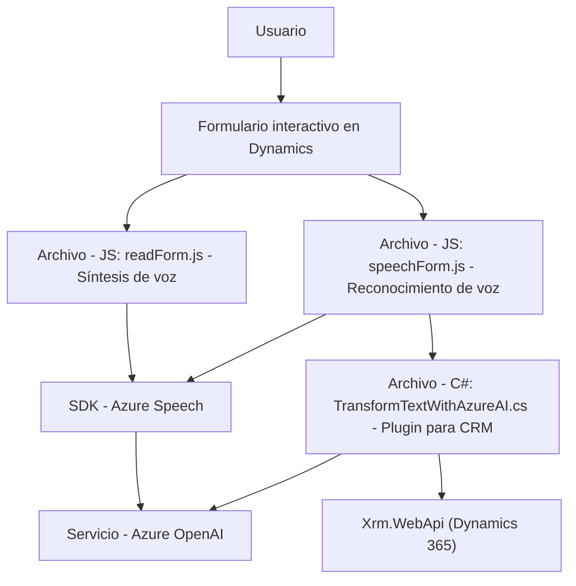

### Breve resumen técnico
El repositorio incluye componentes que interactúan con formularios dinámicos, sintetizan datos a voz, reconocen comandos hablados, y emplean servicios basados en inteligencia artificial para procesar texto estructurado. Utiliza Azure Speech SDK y Azure OpenAI junto con Dynamics 365 para integrar capacidades avanzadas en una solución modular, interoperable y extensible.

---

### Descripción de arquitectura
La arquitectura del repositorio es **modular basada en n capas**, con una clara separación de responsabilidades entre frontend, backend y servicios externos:
1. **Frontend:** Procesa datos visuales y comandos de voz de formularios, utiliza SDKs externos y sigue una estructura orientada a modularidad funcional.
2. **Plugins en backend:** Utilizan Dynamic CRM, cumplen la arquitectura de *hexagonal* para interactuar con servicios externos como Azure OpenAI.
3. **Servicios externos:** Utilizan los SDKs y APIs de Azure Speech y Azure OpenAI para proporcionar reconocimiento, síntesis de voz y transformación de texto estructurado.

Estos módulos trabajan juntos bajo principios de separabilidad y reutilización, permitiendo un desarrollo desacoplado y una integración progresiva de servicios.

---

### Tecnologías usadas
1. **Frontend:**
   - JavaScript.
   - Azure Speech SDK (JavaScript).
   - Dynamics 365 `Xrm.WebApi`.
2. **Backend (Plugins):**
   - C# (.NET Framework/Standard).
   - Microsoft XRM SDK.
   - Azure OpenAI (modelo GPT-4).
   - Dependencias para JSON manipulación (System.Text.Json y Newtonsoft.Json).
3. **Servicios Externos:**
   - Azure Speech.
   - Azure OpenAI API.
4. **Patrones:**
   - Event-driven programming (callbacks para SDK).
   - API Gateway (interacciones con Azure Speech y OpenAI).
   - Modularización clara (separación de funciones).

---

### Diagrama Mermaid válido para GitHub

---

### Conclusión final
La solución presentada utiliza una arquitectura modular orientada al uso de servicios en la nube y componentes dinámicos de Dynamics 365. Se integra eficazmente con Azure Speech y OpenAI para habilitar funcionalidades inteligentes, como reconocimiento y síntesis de voz, procesamiento de texto estructurado, y diálogo con formularios interactivos. Es una solución extensible y adecuada para aplicaciones basadas en inteligencia artificial en entornos empresariales.