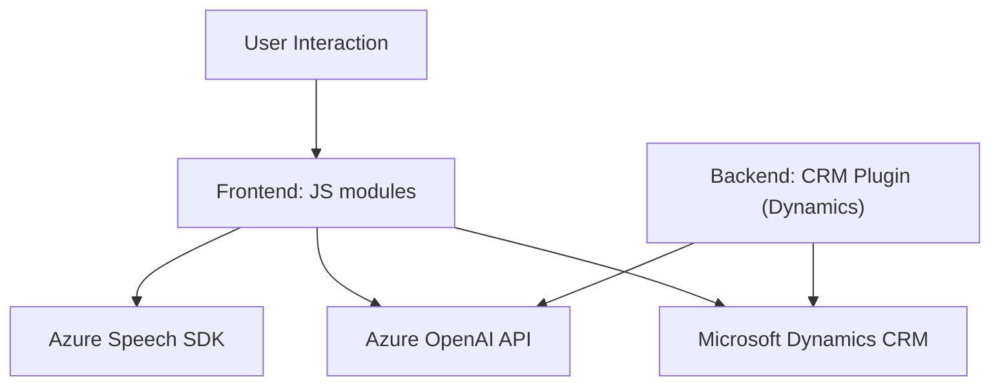

### Breve resumen técnico:
El repositorio combina múltiples componentes destinados a integrar funcionalidad de reconocimiento y síntesis de voz mediante **Azure Speech SDK**, junto con procesamiento avanzado de texto basado en **Azure OpenAI** en un entorno de **Microsoft Dynamics CRM**. Estos componentes están organizados en diferentes capas: funcionalidad de frontend y plugins dinámicos de backend.

---

### Descripción de arquitectura:
1. **Frontend:**
   - Se utilizan scripts de JavaScript organizados en el directorio `FRONTEND/JS`. Proporcionan funcionalidades específicas para interacción con datos visibles en un formulario, incluyendo síntesis de texto a voz y transcripción de voz a texto enriquecido mediante IA.
   - Modularidad del código permite encapsular responsables (e.g., lectura de datos del formulario, manejo de transcripciones, interacción con APIs).

2. **Backend:**
   - Compuesto por un plugin (`TransformTextWithAzureAI`) diseñado para ejecución en el contexto de un **CRM Dynamics**, que se encarga de realizar transformaciones gracias a integración directa con **Azure OpenAI API**. Este plugin emplea patrones conocidos como el **Plugin Pattern** y **Facade Pattern**.

3. **Arquitectura observada:**  
   - Principalmente **n capas**, con una compartimentación entre presentación (frontend web) y lógica empresarial (backend plugins).  
   - Integración **service-based**: APIs externas como Azure Speech SDK o Azure OpenAI desempeñan un rol clave, haciendo que este diseño sea fácilmente escalable y orientado a servicios. Este enfoque podría ser ampliado hacia microservicios en entornos más aislados.

---

### Tecnologías usadas:
- **Frontend:**  
  - **JavaScript**: Principal lenguaje para manejar operaciones en el cliente.  
  - **Azure Speech SDK**: Para procesamiento de voz/txt.  
  - **WebAPI Dynamics CRM**: Proporciona interacción directa con los datos del CRM.

- **Backend:**  
  - **C#**: Lenguaje del plugin.  
  - **Azure OpenAI API:** Para procesamiento de texto avanzado mediante IA.
  - **Newtonsoft.Json**, **System.Net.Http**: Para deserialización de datos y comunicación HTTP.  
  - **Microsoft Dynamics CRM SDK**: Para la lógica del plugin en el CRM.

---

### Dependencias y componentes externos:
1. **Azure Speech SDK**:
   - Reconocimiento y síntesis de voz aplicadas al frontend.

2. **Azure OpenAI API (GPT-based)**:
   - Procesamiento avanzado de texto (reconocimiento, transformación según reglas definidas).

3. **Microsoft Dynamics CRM**:
   - Entorno de ejecución para los plugins dinámicos.

4. **WebAPI y SDK de Dynamics CRM**:
   - Componente nativo para acceder y manipular datos del CRM.

5. **Newtonsoft.Json**:
   - Procesamiento y serialización/deserialización de estructuras JSON.

6. **System.Net.Http**:
   - Comunicación con servicios externos, como Azure OpenAI.

---

### Diagrama Mermaid:

---

### Conclusión final:
El repositorio presenta una solución híbrida basada en **n capas** con una fuerte orientación a servicios externos (Azure Speech SDK, Azure OpenAI) y una integración directa con un entorno **CRM Dynamics**. La combinación de modularidad en el frontend junto con la lógica de un plugin, garantiza una infraestructura escalable y adaptable para ampliar funcionalidad o soportar escenarios futuros.