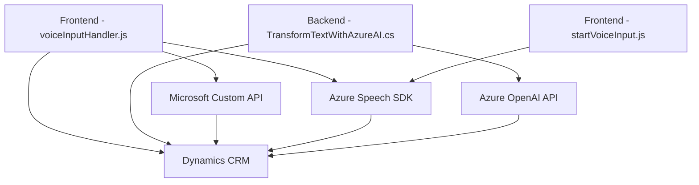

### **Breve resumen técnico**
Este análisis aborda detalles técnicos y arquitecturales de tres archivos en un repositorio. Aunque faltan otros elementos, se puede concluir que el repositorio implementa una solución híbrida basada en la interacción entre frontend, microservicios y servicios externos (Azure Speech SDK, Azure OpenAI), destinada a automatizar flujos con voz y procesamiento de datos integrados en Microsoft Dynamics CRM.

---

### **Descripción de arquitectura**
La arquitectura del repositorio combina componentes en diferentes capas:
- **Frontend**:
  - Compuesto por archivos JavaScript que interactúan con Microsoft Dynamics CRM a través del DOM y APIs internas para procesar interrogaciones, datos de formularios y voz. 
  - Integra servicios externos utilizando Azure Speech SDK y llamadas HTTP asíncronas.
- **Backend**:
  - Representado por el archivo C# que actúa como un plugin en Dynamics CRM. Este implementa lógica personalizada y consume el servicio Azure OpenAI para transformar datos en el CRM.

#### **Patrones usados**
1. **Capas de servicios externos**:
   - Azure Speech SDK y Azure OpenAI son puntos clave en la interfaz de integración.
   - Se adoptan patrones como Adaptador y Facade para abstraer la lógica de consumo de APIs externas.
2. **Plugins**:
   - El backend actúa como un microservicio dentro del ecosistema Dynamics CRM. 
   - Las operaciones están diseñadas en base al ciclo de vida de la entidad CRM, delegando procesamiento especializado mediante llamadas a servicios externos.
3. **Event-Driven Programming**:
   - En frontend y backend se procesan eventos de usuarios (voz, clicks, formularios) y del sistema para realizar operaciones asincrónicas.

4. **Modularidad**:
   - La lógica del frontend está distribuida en funciones separadas, cada una manejando tareas específicas (interacción DOM, transformación de voz, etc.).
   - En el plugin, métodos compactos gestionan tareas específicas como configuración de conexión, consumo de API y procesamiento del CRM.

---

### **Tecnologías usadas**
1. **Frontend**:
   - **JavaScript**: Para implementar lógica en el navegador y funciones auxiliares.
   - **Azure Speech SDK**: Procesamiento de entrada y síntesis de voz, integración completa.
   - **Microsoft Dynamics CRM**: Funciones de API (`formContext`, `Xrm.WebApi`) para gestionar entidades.
2. **Backend**:
   - **C#**: Lenguaje principal para implementar plugins (TransformTextWithAzureAI).
   - **Microsoft Dynamics SDK**: Extensiones para CRM mediante plugin-based architecture.
   - **Azure OpenAI**: Consumo de APIs para procesamiento avanzado.
3. **Protocolos y formatos**:
   - **JSON**: Intercambio de datos entre componentes y Azure OpenAI.
   - **HTTP/REST**: Para integraciones con servicios externos.
4. **Navegadores y DOM**:
   - Lógica para carga dinámica de scripts en frontend mediante APIs DOM.

---

### **Diagrama Mermaid**

---

### **Conclusión final**
Este repositorio muestra una solución híbrida orientada a automatizar procesos dentro de Microsoft Dynamics CRM usando integración de voz y procesamiento avanzado mediante servicios de inteligencia artificial. La arquitectura empleada tiene características de capas múltiples que conectan servicios frontend, plugins backend y APIs externas. Estos componentes se integran utilizando patrones que garantizan modularidad y escalabilidad, pero requieren refinamientos en la gestión de seguridad (como autenticación de API) y configuración del entorno para mayor robustez.