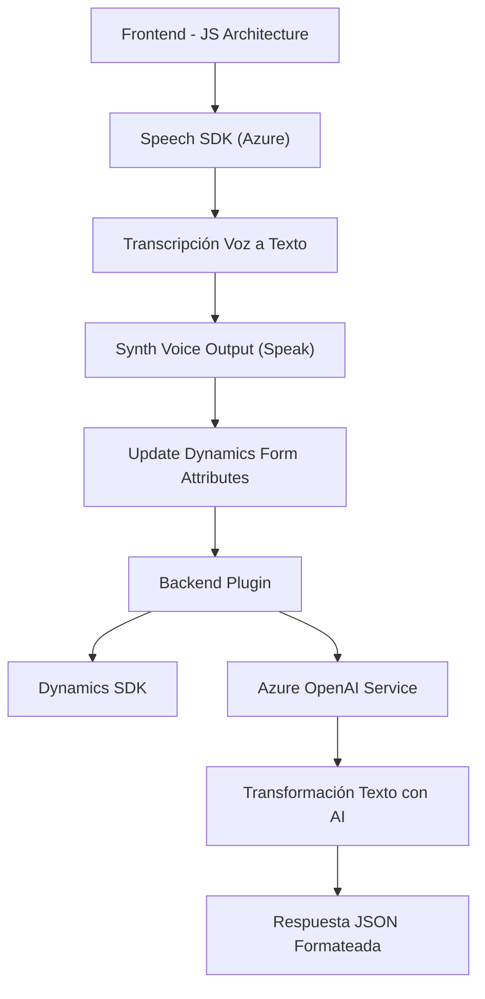

### Breve Resumen Técnico

El repositorio parece formar parte de una solución que integra funcionalidades relacionadas con Microsoft Dynamics CRM y Azure AI. Específicamente, los archivos muestran implementación tanto en el **frontend** como en los **plugins de back-end** para gestionar interacción de voz, transcripción texto-voz y procesamiento utilizando servicios en la nube como **Azure Speech SDK** y **Azure OpenAI**.

### Descripción de Arquitectura

La solución utiliza un diseño orientado a servicios con integración de componentes de terceros (Azure y Dynamics), pero también muestra una arquitectura **híbrida**:
1. **Frontend - Modularidad**: Encapsulación de funcionalidades específicas para entrada y síntesis de voz mediante el navegador y Azure Speech SDK.
2. **Backend - Plugins en Dynamics**: Implementación del plugin como parte del backend mediante `TransformTextWithAzureAI.cs`. Esto sigue el modelo de **Service-Oriented Architecture** utilizando API REST (Azure OpenAI), encapsulado en un modelo de evento desencadenado por la lógica del CRM.

No se utiliza una arquitectura de microservicios propiamente dicha, ya que los componentes están interdependientes del CRM. Sin embargo, estos están modularizados y desacoplados en sus respectivos contextos.

### Tecnologías Usadas

1. **Frontend (JavaScript)**:
   - **Azure Speech SDK** para la síntesis de voz y transcripción texto-voz.
   - Manipulación del DOM y objetos de formulario en Dynamics CRM.
   - Gestión asíncrona (`Promises`).

2. **Backend (C#)**:
   - **Dynamics CRM SDK** (`Microsoft.Xrm.Sdk`) para desarrollo de plugins e interacción con formularios del CRM.
   - **Azure OpenAI Service API** para el procesamiento de texto utilizando IA.
   - Manejo de JSON (`Newtonsoft.Json`, `System.Text.Json`) y comunicación HTTP (`HttpClient`).

3. **Patrones de Arquitectura**:
   - **Modularidad**: Frontend con funciones encapsuladas por propósito.
   - **Service-Oriented Architecture (SOA)**: Integración de SDKs y APIs externas.
   - **Factory/Adapter**: Métodos mapean datos transcritos y campos del formulario en Dynamics CRM.
   - **Dynamic Dependency Injection**: Carga dinámica de librerías en el frontend.

### Diagram Mermaid

### Conclusión Final

La solución consiste en una integración entre **frontend**, **backend** y servicios en la nube que amplifica las capacidades de Dynamics CRM para lograr interacción de voz y procesamiento de texto estructurado. Utiliza patrones modernos como SOA, modularidad funcional y arquitectura orientada a eventos.

A nivel técnico, destaca la correcta implementación del **Azure Speech SDK** y **Azure OpenAI API**, aunque podría mejorarse en escalabilidad mediante separación de componentes o introducción de arquitecturas más distribuidas si fuese necesario.