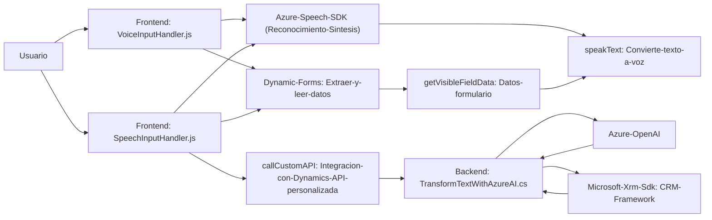

### Breve resumen técnico

El repositorio implementa funcionalidades relacionadas con el procesamiento y manejo de voz y texto en un entorno de formularios (Dynamics CRM), utilizando Azure Speech SDK y Azure OpenAI. Los archivos del frontend (`VoiceInputHandler.js` y `SpeechInputHandler.js`) manejan reconocimiento y síntesis de voz, así como el mapeo de datos de formularios, mientras que el archivo backend (`TransformTextWithAzureAI.cs`) utiliza un plugin Dynamics CRM para interactuar con Azure OpenAI y transformar texto según reglas específicas.

---

### Descripción de arquitectura

#### Global:
La arquitectura consiste en una combinación de **front-end modular basado en servicios** para interacción usuario-dispositivo mediante voz/texto, con un backend **orientado a plugins** interoperando con APIs externas. Subsistemas están integrados mediante SDKs externos (Azure Speech) y servicios Azure (OpenAI), apoyados por la API de Dynamics 365.

#### Frontend:
Los archivos JavaScript están organizados en **funciones independientes** que procesan datos de formularios y se comunican con el reconocimiento y síntesis de voz de Azure Speech SDK. En particular, utilizan asincronía para encadenar operaciones relacionadas con la carga dinámica del SDK, exponer texto transcrito a formularios, y enviar solicitudes API.

#### Backend:
El plugin ejecuta transformaciones de texto en Dynamics CRM siguiendo el patrón de una **arquitectura hexagonal con adaptador**. La lógica del plugin está centrada en cumplir su propósito mediante delegación de operaciones clave (procesamiento de texto) a un servicio externo Azure OpenAI.

---

### Tecnologías usadas

#### Frontend:
1. **Azure Speech SDK**: Manejo de reconocimiento y síntesis de voz en aplicaciones basadas en formularios.
2. **JavaScript ES6+**: Funciones modulares y asincrónicas.
3. **Dynamics 365 (Contexto)**: Usa `executionContext` y APIs específicas (`Xrm.WebApi`).
4. **Integration mediante APIs**: Usa frameworks CRM para personalización y expansión.

#### Backend:
1. **Azure OpenAI (GPT 4)**: Procesamiento avanzado de texto basado en IA.
2. **Microsoft.Xrm.Sdk (Dynamics CRM)**: Plugin que personaliza CRM según necesidades empresariales.
3. **.NET Framework**:
   - `System.Net.Http` y `Newtonsoft.Json.Linq` para solicitudes a APIs externas y procesamiento de JSON.
   - `IServiceProvider` como interfaz para interacción con contexto de CRM.

#### Patrones comunes:
1. **Asincronía**:
   - Callbacks en el frontend aseguran la carga dinámica del SDK.
   - Promesas para esperar resultados de APIs.
2. **Adapter Pattern**:
   - Traducción de datos (entradas y respuestas) entre los SDKs de Azure y la estructura interna (formulario/atributos).
3. **Plugin Design**:
   - El backend sigue un patrón de plugins típico en Dynamics CRM.

#### Dependencias externas:
1. **Azure Speech SDK**: Integración para síntesis y reconocimiento de voz.
2. **Azure OpenAI**: Procesamiento de texto avanzado.
3. **Dynamics 365 API**: Contexto y servicios modulares del sistema CRM.
4. **http/JSON Libraries**:
   - `Newtonsoft.Json.Linq` y `System.Net.Http`.

---

### Diagrama Mermaid compatible con GitHub

---

### Conclusión final

El repositorio implementa un sistema orientado a mejorar la interacción usuario-software en ambientes CRM como Dynamics 365. La solución utiliza Azure Speech SDK en el frontend para mejorar accesibilidad mediante síntesis y reconocimiento de voz, mientras que en el backend usa un plugin para ejecutar transformaciones de texto utilizando inteligencia artificial (Azure OpenAI). 

**Puntos fuertes:**
- Modularidad en los servicios de frontend.
- Integración profunda con Dynamics CRM.
- Uso avanzado de APIs externas para funcionalidad punta.

**Aspectos a mejorar:**
- Seguridad de credenciales y API keys.
- Refactorización de dependencias redundantes en el backend.
  
Este diseño es ideal para organizaciones que buscan aplicar inteligencia artificial y accesibilidad en sistemas CRM, pero requiere ajustes para mejores prácticas en seguridad y escalabilidad.