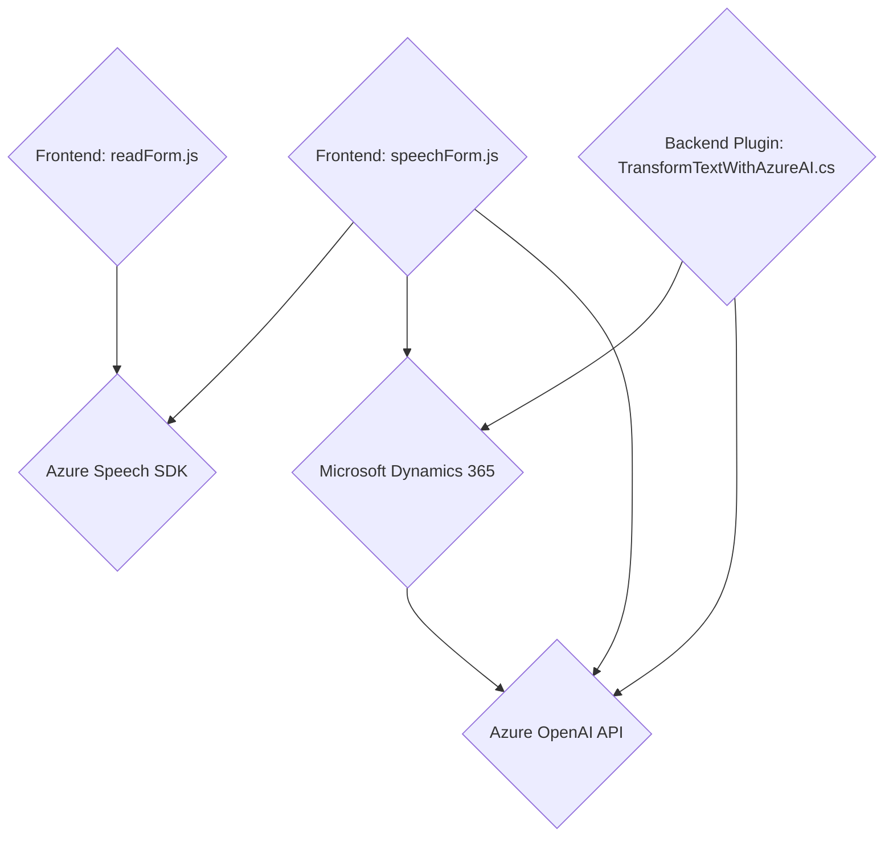

### Resumen técnico de la solución
La solución presentada en el repositorio combina capacidades de frontend con interacciones en formularios (Dynamics 365) y la integración con servicios externos, como Azure Speech SDK y Azure OpenAI API. Su objetivo es mejorar la experiencia de usuario mediante la síntesis de voz, el reconocimiento de voz y la transformación de datos estructurados utilizando inteligencia artificial.

---

### Descripción de la arquitectura

#### Tipo de solución
La solución puede ser clasificada como una **aplicación híbrida** que incluye:
1. **Frontend en JavaScript**: Manipulación de formularios y funcionalidad interactiva (lectura/síntesis de voz).
2. **Plugins para Dynamics CRM**: Modularidad backend para procesamiento mediante plugins y APIs externas.

#### Tipo de arquitectura
La arquitectura del sistema presenta características de un diseño de **SOA (Service-Oriented Architecture)**:
- Dividida en múltiples componentes funcionales:
  - Frontend (interacción con formularios y voz).
  - Plugins (procesamiento backend en Dynamics 365).
  - Servicios externos (Azure Speech SDK y Azure OpenAI API).
- Uso de dependencias externas como SDK y APIs para manejar funcionalidad avanzada (voz, IA).
- **Event-driven** y **callback-based design** en su lógica de frontend.

#### Tecnologías usadas
1. **Frontend**
   - Lenguaje: JavaScript.
   - Frameworks/Librerías:
     - Azure Speech SDK.
     - Microsoft Dynamics 365 Web API.
   - Integra mapeo dinámico de campos de formulario y lógica condicional (procesamiento IA vs clásico).
2. **Plugins Backend**
   - Lenguaje: C#.
   - Plataforma: Dynamics CRM.
   - Dependencias:
     - Newtonsoft.Json.
     - Azure OpenAI API (para transformar texto).

#### Patrones presentes
- **Event-driven programming** en la ejecución de SDK y callbacks.
- **SOA** al delegar responsabilidades a servicios externos.
- **Dynamic Mapping** para formularios y atributos con funciones de procesamiento auxiliar como `getFieldMap`.
- **Service Wrapper** en las API externas como la llamada a Azure Speech SDK y OpenAI API.
- **Modular architecture** en funciones independientes con delimitación clara de responsabilidades.

---

### Dependencias y componentes externos presentes
1. **Azure Speech SDK**
   - Utilizado para funcionalidades de síntesis y reconocimiento de voz.
   - Dependencias del lado cliente.
2. **Microsoft Dynamics 365**
   - Ejecución de APIs internas.
   - Mapeo y manipulación de formularios y atributos.
3. **Azure OpenAI API**
   - Transformación de texto y generación de respuestas JSON.
   - Plugin backend basado en Dynamics CRM.
4. **.NET Libraries**
   - Newtonsoft.Json para serialización/deserialización.
   - System.Text.Json para manejo extendido de JSON.

---

### Diagrama **Mermaid**
La siguiente representación muestra los módulos, dependencias y flujo de información entre los diferentes componentes de la solución.

---

### Conclusión final
La solución representa una **aplicación híbrida orientada a la interacción y automatización, diseñada bajo principios de modularidad y service-oriented architecture (SOA)**. El frontend gestiona la experiencia de usuario mediante la integración de Azure Speech SDK, mientras que el backend complementa esto con plugins en Dynamics CRM, que aprovechan Azure OpenAI para la transformación de datos.

Las tecnologías utilizadas indican un enfoque avanzado hacia el trabajo con datos no estructurados y la síntesis y reconocimiento de voz. El uso de dependencias externas refuerza la modularidad y reduce las complejidades, delegando capacidades específicas a servicios de terceros como Azure Speech y Azure OpenAI.