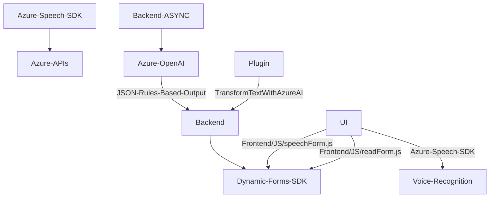

### Breve resumen técnico
El repositorio contiene múltiples archivos que implementan funcionalidades para la interacción mediante voz y texto con formularios de **Dynamics 365**, utilizando **Azure Speech SDK** y **Azure OpenAI Service**. Por otro lado, un plugin basado en **Dynamics CRM** se integra con **Azure OpenAI** para transformar texto con normas específicas.

---

### Descripción de arquitectura
La solución completa tiene una arquitectura **n capas** con separación entre las siguientes niveles:
1. **Capa de Presentación/Frontend**:
   - Implementada mediante archivos JavaScript que gestionan la interacción con el usuario, incluyendo lectura y procesamiento de formularios mediante voz.
   - Usa SDKs como **Azure Speech SDK** y el objeto `formContext` de Dynamics.
   
2. **Capa de Negocio/Integración**:
   - Aparece en la ejecución de lógica personalizada en los plugins de Dynamics CRM. Aquí el plugin `TransformTextWithAzureAI` se encarga de interactuar con **Azure OpenAI** para transformar texto en formatos estructurados.
   
3. **Capa de Servicios Externos**:
   - Comunicación con servicios en la nube, específicamente **Azure Speech SDK**, **Azure OpenAI API** y APIs personalizadas en Dynamics 365.

---

### Tecnologías usadas
- **Frontend**:
  - **JavaScript**.
  - **Dynamics 365 SDK** (para manipular formularios y llamadas asincrónicas).
  - **Azure Speech SDK**: Manejo de conversión de voz a texto y viceversa.

- **Backend/Plugins de CRM**:
  - **Microsoft Dynamics SDK**: Utilizado para integrar clases y lógica específica mediante la interfaz `IPlugin`.
  - **C# (.NET)**: Codificación del plugin personalizado para consumir el endpoint de Azure OpenAI.
  - **Azure OpenAI Service**: Procesamiento de texto siguiendo reglas de transformación específicas.
  - **Newtonsoft.Json** y **System.Text.Json**: Manipulación y serialización JSON.
  - **System.Net.Http**: Realización de llamadas REST para consumir APIs de Azure OpenAI.

---

### Diagrama Mermaid válido para GitHub

---

### Conclusión final
La solución presentada tiene una arquitectura de **n capas**, donde las operaciones del frontend interactúan con formularios de Dynamics 365 y funcionalmente se basan en **Azure Speech SDK** para integración de voz. En el backend, se implementa lógica adicional mediante plugins personalizados que consumen servicios de **Azure OpenAI** para transformar texto inteligentemente. Este enfoque modular y extensible es ideal para sistemas CRM que necesitan integrar servicios de inteligencia artificial y mejorar la experiencia del usuario mediante nuevas formas de interacción como el uso de voz/IA.