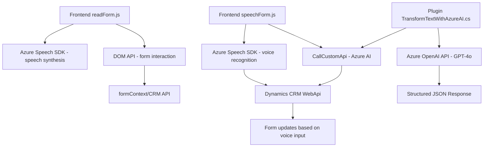

### Breve Resumen Técnico:
El repositorio contiene tres componentes principales:
1. **Archivo de Frontend (`readForm.js`)**: Lectura de formularios y síntesis de voz mediante integración con Azure Speech SDK a través de la API del navegador. Procesa datos visibles en formularios y los convierte en texto hablado.
2. **Archivo de Frontend (`speechForm.js`)**: Reconocimiento de voz y mapeo dinámico de transcripciones (texto) a atributos de formularios en Dynamics CRM. También permite integrar transcripciones procesadas con IA mediante llamadas a APIs externas.
3. **Plugin Backend (`TransformTextWithAzureAI.cs`)**: Complemento de Dynamics CRM que utiliza Azure OpenAI para transformar textos de entrada en respuestas JSON procesadas, siguiendo estándares definidos.

---

### Descripción de Arquitectura:
#### Tipo de Solución:
- **Híbrida**: Combina frontend para interacción del usuario mediante el navegador/web con un backend (plugin) ejecutado en el servidor CRM.

#### Arquitectura:
- **Modelo Cliente-Servidor**:
  - El **frontend** implementa una arquitectura modular basada en componentes de lectura y reconocimiento vocal, trabajando con SDKs externos (Azure Speech SDK) y APIs (Azure/OpenAI).
  - El **plugin backend** sigue un modelo **basado en eventos** con la **arquitectura de n capas** de Dynamics CRM, que permite ejecutar lógica en el servidor, transformando datos usando servicios externos (Azure OpenAI).

---

### Tecnologías Usadas:
1. **Frontend**: 
   - **JavaScript**.
   - **Azure Speech SDK**: Para síntesis y reconocimiento de voz.
   - **APIs DOM**: Para interacción con elementos del navegador y formulación de solicitudes dinámicas.
   - **Frameworks Dynamics CRM**: Como `formContext` y `WebApi`.

2. **Backend Plugin**:
   - **C#**: Lenguaje de implementación del plugin.
   - **Azure OpenAI API**: Para transformar texto usando un modelo GPT.
   - **Newtonsoft.Json**: Para el manejo JSON dentro del plugin.

3. **Patrones y Principios de Diseño**:
   - Divisiones de responsabilidad.
   - Modular and layered architecture (separación de lógica por cantidad y tipo de operación).
   - Callback-pattern (para garantizar dependencias en la carga de SDKs y APIs).
   - External service integration: Uso de Azure Speech SDK y Azure OpenAI API.
   - Plugin event-driven pipeline: Define cambios en el CRM tras eventos definidos.

---

### Dependencias o Componentes Externos:
1. **Externo**:
   - Azure Speech SDK (síntesis & reconocimiento).
   - Azure OpenAI API para transformación de texto hacia JSON.
   - Dynamics CRM SDK para interacción entre componentes del CRM.

2. **Interno**:
   - API personalizada: Desarrollada específicamente para interactuar con el sistema Dynamics CRM y servicios Azure.

---

### Diagrama Mermaid:

---

### Conclusión Final:
La solución presentada es un sistema basado en la combinación de aplicaciones frontales y eventos dinámicos en Microsoft Dynamics CRM. Está diseñada para realizar lectura y reconocimiento de voz en tiempo real, con generación de voz (speech synthesis) y la capacidad de transformar texto con IA de Azure OpenAI siguiendo reglas predefinidas. Los tres componentes interoperan utilizando APIs y SDKs externos, integrándose a una arquitectura híbrida cliente-servidor.