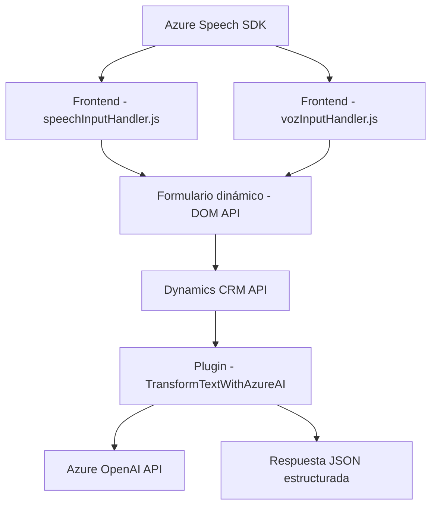

### Breve resumen técnico

El repositorio contiene módulos y archivos orientados a la integración de capacidades cognitivas en aplicaciones empresariales. Estos módulos interactúan con servicios de **Azure Speech SDK** y **Azure OpenAI** para enriquecer formularios, procesar datos mediante reconocimiento de voz, y aplicar transformaciones basadas en IA. Los patrones comunes incluyen arquitecturas en capas y dependencias con Dynamics CRM.

### Descripción de arquitectura

La arquitectura adoptada es una **n capas** con interacciones en la capa de presentación (formularios), capa de lógica de negocio (procesamiento y transformación), y capa de servicios (Azure servicios y CRM API). El diseño sigue el paradigma de encapsulación de lógica en módulos que se pueden desacoplar en escenarios empresariales.

### Tecnologías usadas

- **Frontend**:
  - **Azure Speech SDK**: Reconocimiento de voz y síntesis de texto a voz.
  - **JavaScript (ES6)**: Desarrollo de componentes para interactuar con formularios.
  - **DOM API**: Manipulación de formularios HTML.

- **Backend**:
  - **Dynamics CRM (Microsoft.Xrm.Sdk)**: Procesamiento de datos vinculados a formularios y gestión del contexto del CRM.
  - **Azure OpenAI**: Procesamiento de texto mediante modelos generativos (GPT).
  - **Plugins .NET C#**: Lógica personalizada ejecutada como parte del ecosistema CRM.

### Diagrama Mermaid

El siguiente diagrama muestra las interacciones principales entre los componentes del repositorio:

### Conclusión final

Este repositorio implementa una solución orientada a mejorar la accesibilidad y automatización en plataformas empresariales a través de **Azure Cognitive Services**. La arquitectura está basada en un modelo **n capas**, con una clara separación entre presentación, lógica de negocio y servicios externos. El uso de patrones como **Dynamic Loading**, **Service Layer**, y **Event-Driven** asegura que las implementaciones sean flexibles y eficientes. Sin embargo, es importante considerar la gestión segura de parámetros API, especialmente las claves y configuraciones de conexión.