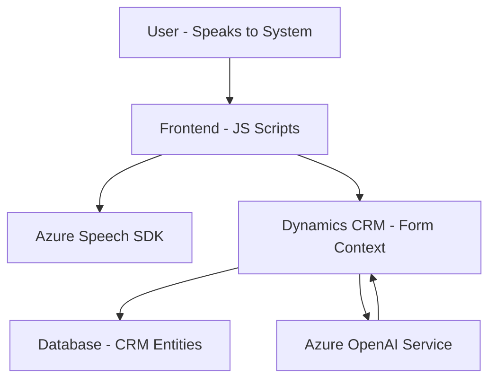

### Breve resumen técnico

El conjunto de archivos forma una solución que permite ingresar texto mediante reconocimiento de voz, procesar ese texto con inteligencia artificial en Microsoft Azure y utilizar un plugin personalizado para integrarlo con Microsoft Dynamics CRM. Es una solución híbrida, donde un frontend permite la interacción del usuario y se conecta con un servidor para realizar llamadas a un servicio externo (Azure Speech SDK y Azure OpenAI).

### Descripción de arquitectura

La arquitectura implementada corresponde a un modelo híbrido de **arquitectura de n capas** con elementos de integración de **Service-Oriented Architecture (SOA)**. Las capas principales observadas son:

1. **Capa de presentación (Frontend)**, que interactúa con el usuario, permite entrada a través de reconocimiento de voz y proporciona una interfaz visual (formularios dinámicos).
2. **Capa de lógica empresarial (Plugins)**, que maneja los datos ingresados, realiza integración con el servicio de Azure OpenAI para procesamiento avanzado y conecta con Dynamics CRM.
3. **Capa de servicios externos**: Los servicios de Azure Speech y Azure OpenAI son utilizados como proveedores externos para realizar reconocimiento de voz y procesamiento inteligente de texto.
4. **Capa de datos**: Utilización de Dynamics CRM para almacenar y manejar datos del formulario.

### Tecnologías usadas

- **Frontend**:
  - JavaScript para el manejo del cliente web.
  - Azure Speech SDK para reconocimiento y síntesis de voz.
  - Dynamics 365 (`Xrm` API): Permite interactuar con el backend y formularios.
- **Backend**:
  - .NET Framework o .NET Core para desarrollo del plugin.
  - Microsoft.Xrm.Sdk para conectar el plugin con Dynamics CRM.
  - Azure OpenAI para procesamiento y transformación de texto.
  - API REST para comunicación entre Dynamics CRM y los servicios de Azure.

### Diagrama **Mermaid** (100% compatible con GitHub)

### Conclusión final

El repositorio representa una solución tecnológica para combinar reconocimiento/calidad de voz, inteligencia artificial aplicada al procesamiento de texto y una integración con Microsoft Dynamics CRM para acceder, actualizar y administrar datos de usuario. Utiliza una arquitectura de **n capas** junto con integración basada en servicios externos (**SOA**) a través de APIs. Las tecnologías empleadas, como Azure Speech SDK y OpenAI Service, incrementan el valor añadido al habilitar capacidades de reconocimiento y síntesis de voz y la transformación inteligente de datos como JSON estructurado.

En términos de diseño, los patrones aplicados como programación modular, programación orientada a eventos, y conexión con servicios externos a través de APIs son excelentes para asegurar extensibilidad y modularidad. Sin embargo, la solución parece estar fuertemente acoplada a los servicios de Azure y Dynamics CRM, lo que podría limitar su portabilidad en otros entornos.