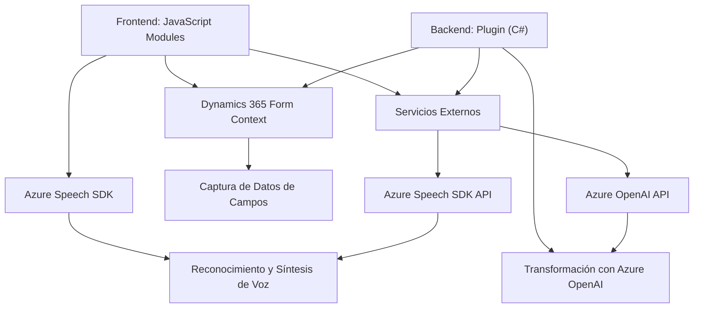

### Breve Resumen Técnico
El repositorio contiene módulos para la integración de reconocimiento de voz, síntesis de voz y procesamiento del habla en el contexto de una aplicación empresarial, específicamente mediante Dynamics 365 y servicios de Microsoft Azure (Speech SDK y Azure OpenAI). Los principales componentes presentan funcionalidades para interactuar con formularios, extraer datos, modificarlos y transformarlos en tiempo real.

---

### Descripción de Arquitectura
La arquitectura es de **n-capas** con integración a servicios externos. Existen capas separadas para:
1. **Frontend**: Contenido en JavaScript que interactúa directamente con formularios y SDKs (Azure Speech).
2. **Backend**: Implementación de lógica empresarial mediante plugins en C#, procesando datos y realizando interacciones con servicios externos como Azure OpenAI.
3. **Servicios Externos**: Dependencia directa de Azure Speech y OpenAI SDK para reconocimiento, síntesis de voz y transformaciones avanzadas de texto.

Es una solución **orientada a eventos y servicios**. Los métodos cargan SDKs en tiempo de ejecución, delegan tareas críticas a Azure APIs y ejecutan procesos de captura y transformación de datos.

---

### Tecnologías Usadas
1. **Frontend (JavaScript)**:
   - Dinámico con Azure Speech SDK.
   - Uso de promesas para manejar tareas asíncronas (grabación de voz, API Calls).
   - Manipulación de DOM/Formularios en Dynamics 365.

2. **Backend (Dynamics CRM Plugin en C#)**:
   - SDK de Microsoft Dynamics (`IPlugin`).
   - Integración con **Azure OpenAI REST API** para procesamiento de texto.
   - Manejo de JSON con librerías como `System.Text.Json` y `Newtonsoft.Json`.

3. **Servicios Externos**:
   - **Azure Speech SDK**: Para conversión de texto a voz y reconocimiento del habla.
   - **Azure OpenAI Service**: Procesamiento avanzado del lenguaje natural usando modelos como GPT.

4. **Patrones Arquitectónicos:**
   - **Delegación**: Uso de métodos que delegan tareas para la carga de SDK y procesamiento.
   - **Service-Oriented Integration**: Consumo de APIs de Azure para lógica compleja.
   - **Modularidad**: Separación de responsabilidades entre frontend, backend y servicios.

---

### Dependencias o Componentes Externos
1. **Azure Speech SDK** para síntesis y reconocimiento de voz.
2. **Azure OpenAI Service APIs** para procesamiento de lenguaje natural.
3. **Microsoft Dynamics CRM SDK** para interactuar con formularios de la plataforma.
4. **Scripts distribuidos**: E.g., carga de scripts de Azure Speech desde `aka.ms`.

---

### Diagrama Mermaid (GitHub Markdown Compatible)

---

### Conclusión Final
La solución implementada en este repositorio es un **integración de servicios con frontend y backend** que extiende las capacidades de Microsoft Dynamics 365 mediante servicios de Azure. Se aprovechan componentes SaaS como Azure Speech y OpenAI para ofrecer interacciones avanzadas (voz-texto, transformación de texto). La arquitectura cumple con principios de modularidad, delegación y extensibilidad, permitiendo el intercambio fluido entre diferentes capas.

Aunque la solución es técnicamente robusta, existen **consideraciones importantes**:
1. Manejo seguro de claves de acceso (`api-key`) hacia SDK y servicios.
2. Mecanismos para gestión de errores en procesamiento de dependencias externas.
3. Mejora en la implementación de pruebas robustas para garantizar la estabilidad ante configuraciones no previstas.