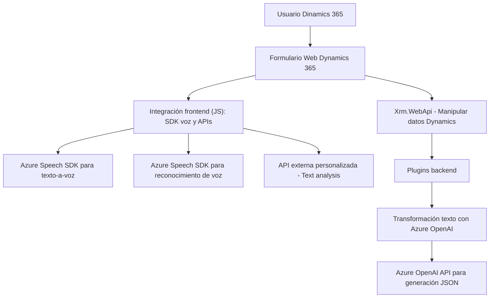

### Breve resumen técnico
El repositorio consiste en una solución híbrida, cuya principal funcionalidad gira en torno a la integración entre formularios de Dynamics 365 y servicios de Azure (Azure Speech SDK y Azure OpenAI). Se implementa conversión texto-a-voz, reconocimiento de voz para formularios, y transformación de texto con inteligencia artificial. Por lo tanto, la solución implica una combinación de frontend funcional con procesamiento en tiempo real y plugins backend basados en RESTful.

---

### Descripción arquitectónica
La arquitectura se puede clasificar como **modular híbrida**:
- **Frontend:** Implementado con JavaScript/HTML para interactuar con Dynamics 365 mediante manipulación de formulario (DOM) y el SDK de Azure para conversión texto-voz y reconocimiento de voz.
- **Backend:** Plugins .NET que extienden las capacidades de Dynamics CRM usando Microsoft.Xrm.Sdk y Azure OpenAI.
- **Interacción con servicios externos:** Tanto en el frontend como el backend se delega el procesamiento especializado a APIs de Azure (Speech Recognition/SDK y OpenAI).

Se observa un enfoque **n-capas**:
1. **Capa de presentación:** Frontend basado en JavaScript.
2. **Capa de negocio:** Plugins (TransformTextWithAzureAI.cs) en Dynamics CRM.
3. **Capa de datos:** Manipulación de datos de formulario de Dynamics 365 mediante APIs internas (`Xrm.WebApi`) y servicios externos (Azure).

Además, usa patrones como **modular**, **event-driven** (frontend) y **plugin-based** (backend).

---

### Tecnologías utilizadas
1. **Frontend:**
   - HTML/JavaScript.
   - Azure Speech SDK (Dynamic Loading via URL).
   - Dynamics 365 APIs (`Xrm.WebApi`).
   - Azure APIs.
   - REST para consumir servicios externos (backend).

2. **Backend:**
   - C# .NET (Microsoft.Xrm.Sdk y extensiones como `Newtonsoft.Json` y `System.Net.Http`).
   - Azure OpenAI API.
   - Plugins en Dynamics CRM.

3. **Servicios Externos:**
   - Azure Speech SDK: Conversión texto-a-voz y reconocimiento de voz en tiempo real.
   - Azure OpenAI: Procesamiento avanzado del texto.

---

### Diagrama Mermaid válido para GitHub

---

### Conclusión final
La solución presentada combina tecnologías modernas (Servicios Cloud de Azure, Dynamics 365, y API RESTful) con un enfoque híbrido. Evalúa y manipula datos contextuales del sistema central de Dynamics CRM mediante integración web y plugins especializados. Con arquitectura modular y n-capas, es lo suficientemente extensible y dinámica para soportar casos de uso avanzados de interacción entre usuarios y datos, procesados con inteligencia artificial basada en la nube.