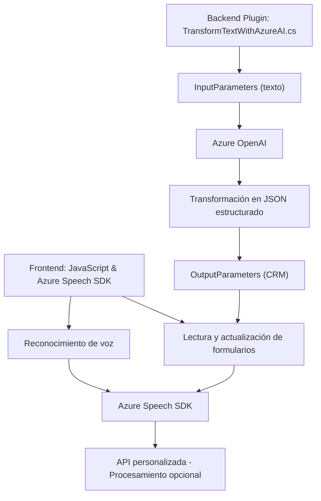

### Breve Resumen Técnico
El repositorio parece contener una solución integrada que combina una interfaz de usuario dinámica en JavaScript con reconocimiento y síntesis de voz, inteligencia artificial para procesamiento de texto, y plugins para Dynamics CRM. Utiliza servicios externos como Azure Speech SDK y Azure OpenAI para proporcionar capacidades avanzadas de interacción con formularios mediante voz y la transformación de texto en objetos JSON estructurados.

### Descripción de Arquitectura
La arquitectura sigue un enfoque híbrido:
1. **Frontend:** Se basa en JavaScript modular que interactúa con el DOM, servicios de voz, y APIs externas, sugiriendo un patrón MVVM enfocado en la interfaz de usuario.
2. **Backend Plugin:** Extiende Dynamics CRM con un plugin de procesamiento de datos mediante Azure OpenAI. Este componente utiliza el patrón SOA y plugin típico de Dynamics CRM para añadir servicios avanzados como procesamiento de lenguaje natural.
3. **Conexión con APIs Externas:** Tanto el frontend como el plugin establecen comunicación con servicios externos (Azure Speech SDK y OpenAI) para completar tareas específicas.

La solución parece estar diseñada como una arquitectura **n-capas**:
- Presentación: Código JavaScript (Frontend), interactuando con formularios y el usuario.
- Lógica de negocios: Plugins (TransformTextWithAzureAI.cs) que integran con el sistema CRM.
- Capa de servicios: Azure Speech SDK y Azure OpenAI.
  
Existe una posible transición hacia un modelo **orientado a servicios (SOA)**, dado el uso de APIs externas para procesamiento avanzado.

### Tecnologías Usadas
1. **Frontend**:
   - JavaScript (DOM Manipulation, `async/await`).
   - Azure Speech SDK (sintetización y reconocimiento de voz).
   - Navegador como motor principal.

2. **Backend**
   - Dynamics CRM SDK (Microsoft.Xrm.Sdk).
   - Plugins en C# (.NET Framework o Core).
   - Azure OpenAI para procesamiento de texto.

3. **Frameworks y Libs**
   - NewtonSoft.Json y System.Text.Json (Transformación).
   - HttpClient (para llamadas REST).
   - Event-driven programming (JavaScript y Speech SDK).

### Dependencias o Componentes Externos
1. **Azure Speech SDK**: Integrado para reconocimiento y síntesis de voz.
2. **Azure OpenAI**: Usado por el backend para transformar texto mediante IA.
3. **Dynamics CRM Framework**: Para el plugin del backend, dependiente de Microsoft OpenXrm SDK.
4. **APIs Personalizadas**: Posible referencia en el frontend (`callCustomApi`).
5. **Librerías de navegador**: DOM manipulation y gestión de eventos.

---

### Diagrama Mermaid

---

### Conclusión Final
La solución está orientada a mejorar la experiencia del usuario al interactuar con formularios mediante comandos de voz y síntesis de texto hablado. Integra tecnologías modernas como Azure Speech SDK y Azure OpenAI con Dynamics CRM utilizando patrones como plugin y SOA. Aunque el trabajo está estructurado en capas claras, existe suficiente modularidad para refactorizar hacia una arquitectura hexagonal, especialmente en el componente de API y conectividad. El diagrama sintetiza el flujo general de datos y dependencias.