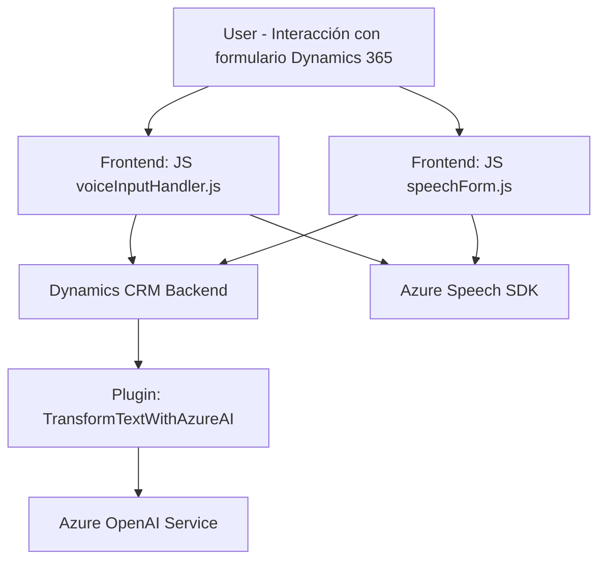

### Breve resumen técnico

El repositorio en cuestión contiene tres componentes principales:
1. **Frontend (JS)**: Funcionalidades relacionadas con voz (sintetización y reconocimiento) integradas con Azure Speech SDK y el entorno Dynamics 365.
2. **Plugin (C#)**: Un complemento de Dynamics CRM diseñado para transformar texto utilizando Azure OpenAI.
3. **Dependencias externas**: Azure Speech SDK y Azure OpenAI son las principales integraciones de servicios en la nube.

La solución general parece ser una integración personalizada para formularios de Dynamics 365 que incorpora características de voz y procesamiento de texto mediante IA.

---

### Descripción de arquitectura

#### Tipo de solución
La solución es una **API y Frontend** híbrida, diseñada para interactuar con formularios en Dynamics 365. A nivel backend, utiliza un **plugin de Dynamics CRM** basado en C# que se conecta con servicios externos de IA (Azure OpenAI).

#### Arquitectura
La arquitectura principal es de **cliente-servidor**:
- **Frontend**: Scripts que interactúan con el navegador del usuario y hacen uso del contexto del formulario de Dynamics 365.
- **Backend**: Transformaciones textuales mediante un plugin implementado en Dynamics CRM que se integra con el servicio Azure OpenAI.

Esta solución también adopta patrones de integración:
- **Eventos asíncronos**: Carga dinámica del Speech SDK en el navegador utilizando técnicas event-driven.
- **APIs externas**: Conexión con Azure Speech y Azure OpenAI para manejar procesos que van más allá del entorno CRM.
- **Modularidad**: Toda funcionalidad está encapsulada en funciones/métodos específicos, lo que permite alta reutilización.

#### Componentes principales:
1. Scripts JS:
   - Proporcionan funcionalidades utilitarias en el frontend y lógica basada en eventos del DOM y Dynamics 365.
   - Integración directa con Azure Speech SDK.
2. Plugin Dynamics (C#):
   - Gestiona la lógica backend con Azure OpenAI.
3. Dependencias externas:
   - **Azure Speech SDK**: Reconocimiento y síntesis de voz directamente desde el navegador.
   - **Azure OpenAI**: Transformación avanzada de texto mediante modelos de inteligencia artificial.
4. Dynamics CRM:
   - Actúa como el entorno central para formularios, eventos del usuario y manipulación de datos.

---

### Tecnologías usadas

1. **Frontend**:
   - **JavaScript** (ES6+): Proporciona lógica de eventos y funciones que operan sobre el contexto del formulario Dynamics.
   - **Azure Speech SDK**: Procesamiento de voz, incluida la síntesis y el reconocimiento en tiempo real.
   - **DOM API**: Manipulación dinámica del documento HTML (carga de scripts).

2. **Backend**:
   - **C#**: Implementación del plugin para Dynamics CRM.
   - **Microsoft Dynamics CRM SDK**: Interacciones backend con entidades de Dynamics CRM.
   - **Azure OpenAI APIs**: Conexión con servicios de IA para el procesamiento avanzado de texto.
   - **System.Net.Http**: Realización de consultas REST a OpenAI.
   - **Serialization libraries** (`System.Text.Json`, `Newtonsoft.Json`).

3. **Framework**:
   - **Dynamics 365 Platform**: Entorno de datos y eventos.
   - **Azure Platform**: Speech SDK y servicios OpenAI.

---

### Diagrama Mermaid válido para GitHub

---

### Conclusión final

El esquema general del repositorio muestra una solución **orientada a la integración de tecnologías en la nube (Azure)** para mejorar la experiencia de usuario en formularios de Dynamics 365. La arquitectura modular y la separación clara entre frontend (procesamiento de datos de voz) y backend (transformaciones textuales) asegura flexibilidad y mantenibilidad.

#### Fortalezas
- **Escalabilidad**: Azure Speech SDK y OpenAI permiten capacidad de expansión para más idiomas, voces y reglas personalizables.
- **Reutilización**: Funcionalidades encapsuladas ideales para reutilizar o extender en otros proyectos relacionados.
- **Modernización**: Integración con las plataformas de IA modernas y servicios en la nube.

#### Posibles mejoras
- Mejor documentación sobre configuraciones específicas de Azure Speech SDK.
- Considerar caching de SDKs para optimizar el rendimiento en navegadores o contextos lentos.

En resumen, la solución se presenta con una arquitectura eficiente, aprovechando servicios cloud y un diseño orientado a eventos dentro de Dynamics 365.