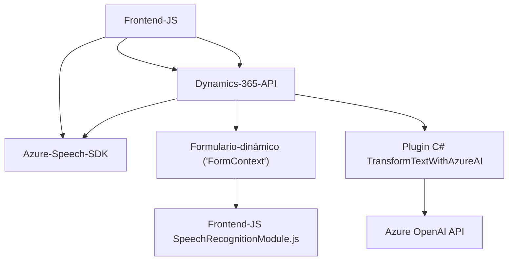

### Breve resumen técnico
Este repositorio parece ser parte de una solución híbrida que utiliza un sistema de integración con Microsoft Dynamics 365, Azure Speech SDK y Azure OpenAI API. Hay tres módulos principales: dos para la manipulación de interacciones con formularios en el frontend mediante JavaScript, y uno como plugin para Dynamics CRM escrito en C#. La solución parece destinada a facilitar la interacción entre usuarios y formularios a través de reconocimiento y síntesis de voz, además de incluir procesamiento avanzado de texto con inteligencia artificial (Azure OpenAI).

---

### Descripción de la arquitectura
La solución tiene las siguientes características:
1. **Multicapas**: Combina un frontend en JavaScript integrado con Dynamics 365 para manipular formularios dinámicos con voz, y un plugin backend desarrollado en .NET/C# que actúa como una capa de negocio para gestionar la lógica empresarial y las interacciones con Azure OpenAI.
2. **Arquitectura cliente-servidor**: La solución actúa como un puente entre el cliente (formulario en frontend) y el servidor (API de Dynamics/OpenAI).
3. **Dependencia de servicios externos**: El sistema aprovecha la integración con Azure Speech SDK para reconocimiento y síntesis de voz, y realiza llamadas a una API basada en Azure OpenAI para el procesamiento de texto y generación de JSON estructurados.

---

### Tecnologías usadas
1. **Frontend**:
   - Lenguaje: JavaScript.
   - Framework: Dynamics 365 API.
   - Servicio externo: Azure Speech SDK (acceso mediante scripts cargados dinámicamente).
   - Patrones: Functional Programming, Dependency Injection, Facade.
   
2. **Backend**:
   - Lenguaje: C# (.NET Framework).
   - Framework: Microsoft Dynamics Plugins.
   - Servicio externo: Azure OpenAI API con llamada HTTP.
   - Patrones: Dependency Injection, REST APIs, Plugin-based architecture.
   
3. **Otros:**
   - Serialización: Newtonsoft.Json para JSON avanzado.
   - Manejo de contexto: Dynamics CRM API (`Xrm.WebApi`).

---

### Diagrama Mermaid

Este diagrama simplifica las interacciones entre las capas, tecnologías externas y modulos:

---

### Conclusión final
La solución implementada en este repositorio está diseñada para mejorar la interacción con datos de formulario en Dynamics 365 utilizando un enfoque centrado en voz e inteligencia artificial. Los archivos de JavaScript actúan como el punto principal de interacción con el usuario en el frontend, mientras que el backend en C# sirve para extender la funcionalidad de procesamiento empresarial, especialmente la generación de JSON estructurado con Azure OpenAI. Esta arquitectura es ideal para sistemas SaaS integrados con servicios en la nube como Dynamics CRM y Azure.

La estructura está optimizada para manejar la carga de dependencias dinámicas y facilitar una experiencia fluida con servicios de nube. Sin embargo, el sistema podría beneficiarse de mayores medidas de seguridad y manejo de excepciones para evitar vulnerabilidades en la integración con los servicios externos.