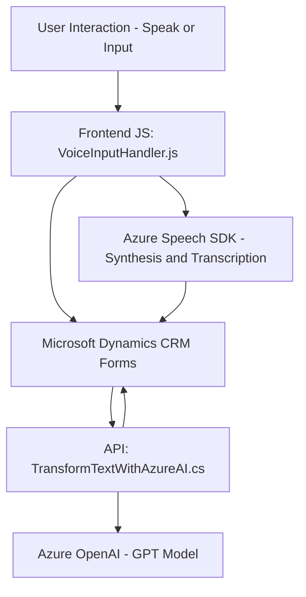

#### Breve resumen técnico:

Este sistema implementa una solución que integra funcionalidades de procesamiento de voz a texto, síntesis de voz y transformación de texto estructurado mediante inteligencia artificial. Está diseñado para interactuar con formularios y entidades de Microsoft Dynamics CRM, utilizando una arquitectura modular y extensible. Las partes clave incluyen un frontend en JavaScript que habilita la funcionalidad basada en voz y un plugin de backend para procesar transformaciones avanzadas de texto con Azure OpenAI.

---

#### Descripción de arquitectura:

El sistema tiene una arquitectura **n capas**, que incluye:
1. **Frontend**: Implementado en JavaScript, maneja la interfaz con usuarios, incluyendo entrada de voz (Azure Speech SDK) y procesamiento del contenido de formularios.
2. **Backend**: A través de plugins para Microsoft Dynamics CRM (en C#), realiza procesamiento avanzado de texto con el modelo GPT de Azure OpenAI.
3. **Integración de servicios externos**: Comunicación asincrónica con el servicio de Azure OpenAI API para transformar texto y la CDN para cargar dinámicamente el Azure Speech SDK.

---

#### Tecnologías usadas:

1. **Lenguajes**:
   - Frontend: JavaScript y APIs del navegador.
   - Backend: C#.

2. **Frameworks y SDKs**:
   - **Azure Speech SDK**: Para sintetizar voz y transcribir entrada de audio.
   - **Microsoft Dynamics CRM API**: Para interacción con formularios y llamadas de API.
   - **Azure OpenAI (GPT)**: Para procesamiento avanzado de texto.

3. **Patrones de diseño**:
   - Modularización: División en funciones (JavaScript) y métodos (C#).
   - Eventos asincrónicos (callbacks y promesas) para carga dinámica del SDK y llamadas a APIs.
   - External SDK Integration para coordinar funcionalidades con servicios externos.

---

#### Dependencias externas o componentes:

1. **Azure Speech SDK**: Usado para conversión de texto a voz y reconocimiento de voz.
2. **Azure OpenAI API**: Modelo GPT para procesamiento avanzado de texto.
3. **Microsoft Dynamics CRM API (`Xrm.WebApi`)**: Para manipulación de datos del CRM y accesos a formularios.
4. **JavaScript browser APIs**: Para dinámicas del DOM y micrófono del navegador.
5. **System.Net.Http** y **Newtonsoft.Json** (en C#): Para solicitudes HTTP y manejo de JSON.

---

#### Diagrama Mermaid válido para GitHub:

---

#### Conclusión final:

Este sistema es una solución **híbrida entre frontend y plugin para un CRM**, que aprovecha servicios de **Azure Speech SDK** para habilitar entrada de audio y síntesis de voz en el cliente, mientras que el backend gestiona transformaciones complejas de texto usando **Azure OpenAI API**. Su arquitectura modular y el uso de patrones como eventos y llamados a APIs permite escalabilidad, integración avanzada y adaptabilidad con otras tecnologías. La elección de tecnologías y patrones la hace robusta y adecuada para escenarios de automatización e interacción dinámica con formularios empresariales.