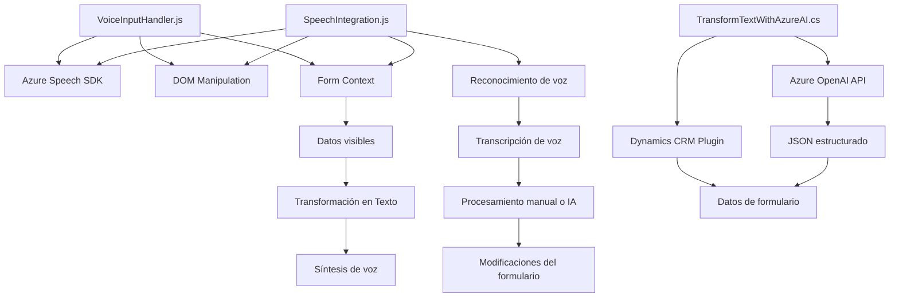

### Breve resumen técnico
El repositorio contiene diferentes archivos enfocados en la integración de servicios del SDK de Azure Speech y OpenAI en un entorno CRM (Dynamics 365). Los archivos implementan funcionalidades para la transcripción de voz, síntesis, actualización de formularios y procesamiento automático de texto mediante inteligencia artificial.

---

### Descripción de arquitectura
1. **Arquitectura General**:  
   - El sistema es **n capas** con segmentación clara entre lógica de frontend, servicios backend, y gestión de datos en el CRM.  
   - Algunas funcionalidades específicas como la síntesis de voz y reconocimiento de voz utilizan **patrones de integración vertical** con servicios de Azure.  
   - El cálculo y análisis mediante el plugin de Dynamics CRM y la interacción con APIs externas implementan una **arquitectura cliente-servidor**.

2. **Frontend**:  
   Los archivos JavaScript encapsulan funcionalidades para procesamiento de voz mediante Azure Speech SDK y manipulación de formularios en CRM. Además, el enfoque completamente modular facilita la reusabilidad de funciones.

3. **Backend Plugin**:  
   El archivo C# actúa como una extensión/plugin de Dynamics CRM. Esto facilita la creación de lógica personalizada que interactúa directamente con Azure OpenAI API para transformar datos.

---

### Tecnologías usadas
1. **Frontend:**
   - **JavaScript ES6+**: Uso de funciones y métodos modernos para encapsulación modular.
   - **Azure Speech SDK**: Implementado dinámicamente para funcionalidades como síntesis y reconocimiento de voz.
   - **API personalizada**: Creada para integrar una lógica avanzada que soporta inteligencia artificial desde Azure.

2. **Backend Plugin:**
   - **C#**: Utilizado para implementar lógica mediante el plugin de Dynamics CRM.
   - **Microsoft.Xrm.Sdk**: Para manipulación directa del contexto de Dynamics CRM.
   - **Azure OpenAI API**: Para procesamiento avanzado de texto utilizando modelos como GPT-4.

3. **Otros servicios:**
   - **DOM Manipulación**: Carga dinámica de librerías en el frontend.
   - **HTTP Client (.NET)**: Usado para integración directa con Azure OpenAI API desde el backend.

---

### Patrones y diseño
1. **Carga dinámica de dependencias**: Los SDKs y scripts necesarios son cargados justo en el momento en que se necesitan en el frontend.
2. **Modularidad**: Todas las funciones están organizadas según su propósito específico, promoviendo el reuso y la separación de responsabilidades.
3. **Facade**: Implementado como punto de inicio (por ejemplo, `startVoiceInput`) para simplificar interacciones complejas con los SDKs.
4. **Decoupling (Desacoplamiento)**: Separación de lógica de frontend y backend para distintas responsabilidades.
5. **Callback/Observer Pattern**: Uso intensivo de callbacks en la comunicación asincrónica con SDKs y APIs externas.

---

### Diagrama Mermaid válido para GitHub

---

### Conclusión final
El repositorio muestra una solución integrada para un sistema CRM (Dynamics 365) con apoyo en servicios de voz y procesamiento de lenguaje natural proporcionados por Azure. Implementa una arquitectura **n capas** con separación clara entre frontend y backend, utilizando un diseño modular y patrones como Facade y Observer para garantizar la claridad y mantenimiento del código. Los componentes externos son gestionados a través de carga dinámica en el frontend y consumo de APIs desde el backend. Es ideal para automatización de tareas y procesamiento de datos con soporte para voz y texto, lo que incrementa la experiencia del usuario y la eficacia operativa en aplicaciones empresariales.