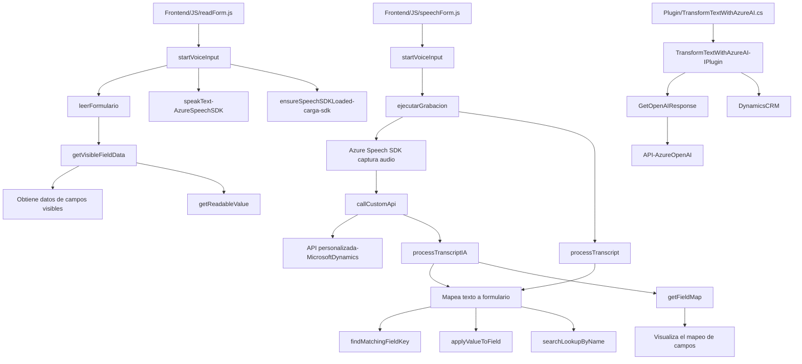

# Resumen técnico

El repositorio contiene archivos relacionados con la implementación de una solución tecnológica que integra reconocimiento de voz, síntesis de voz, procesamiento de formularios y un plugin para la transformación de texto mediante inteligencia artificial. La solución está orientada a integrarse con sistemas de CRM como Microsoft Dynamics, utilizando tecnologías y servicios en la nube como Azure Speech SDK y Azure OpenAI API.

---

### Descripción de la arquitectura

La solución combina un **frontend** (lógica UI en JavaScript) y un **backend plugin** de Dynamics CRM. Esto indica una **arquitectura de n capas**, donde el frontend interactúa con los usuarios y los datos recopilados son procesados en las capas de negocio (en Dynamics CRM) mediante el uso de plugins. Además, la integración con servicios externos, como **Azure Speech SDK** y **Azure OpenAI**, sugiere una arquitectura basada en **servicios**.

Esta separación de responsabilidades indica una implementación sólida para un sistema empresarial que opera en un modelo de integración basado en la nube y servicios distribuidos.

---

### Tecnologías usadas

#### Frontend (JavaScript):
- **Azure Speech SDK**: Utilizado para la síntesis de voz y reconocimiento de audio.
- **JavaScript**: Lenguaje principal de desarrollo utilizado junto con objetos globales (`window`, `document`) para la interacción con el DOM.
- **Dynamics CRM Framework (Xrm)**: Facilitación de interacciones con formularios dinámicos y servicios de datos.

#### Backend (C#):
- **Microsoft Dynamics Plugin SDK**:
  - `IPlugin` y `IOrganizationService`: Interfaces para definir el comportamiento del backend y comunicar la base de datos CRM.
- **Azure OpenAI API**: Para transformar texto hacia salida estructurada basada en ciertos parámetros.
- **System.Net.Http**: Para realizar solicitudes HTTP al servicio de inteligencia artificial.
- **Newtonsoft.Json.Linq**: Para manejar JSON, aunque también se utiliza `System.Text.Json` para la serialización (pueden optarse por uno de los dos).

---

### Diagrama Mermaid

---

### Conclusión final

En general, la arquitectura es un **sistema de n capas** con algunas características de integración basada en **servicios externos**. El frontend interactúa con el usuario para capturar datos formales del sistema y dar soporte a funcionalidades avanzadas con voz (entrada y síntesis), mientras que el backend (plugin CRM) emplea inteligencia artificial para procesar lo capturado en formato estructurado. Esta solución se adapta perfectamente a entornos empresariales y CRM que necesiten expandir sus capacidades de interacción con voz e inteligencia artificial.

Sin embargo, el código presenta algunas áreas de mejora, particularmente en seguridad, considerando que incluye claves de acceso y lógica que podría ser mejor gestionada mediante la configuración de variables de entorno o soluciones dedicadas para gestión segura de secretos en conjunto con Azure Key Vault.