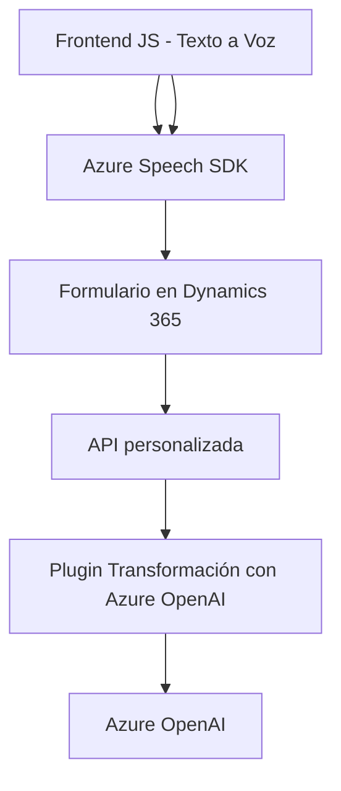

### Breve resumen técnico
El repositorio describe una solución que combina la manipulación de datos en formularios de **Dynamics 365** con integración de **Azure Speech SDK** para accesibilidad y entrada de voz, además de un plugin en **Azure AI OpenAI** para transformar texto mediante reglas específicas. Esto implica un enfoque de procesamiento de datos y voz, dirigido a ambientes CRM.

---

### Descripción de arquitectura
La solución tiene una estructura modular que permite interacción entre componentes basados en:
1. **Frontend:** JavaScript funciones que utilizan **Azure SDK** para texto a voz y voz a texto. Se procesan y actualizan formularios en Dynamics 365.
2. **Plugin Backend:** Implementación en C# para manejar datos estructurados dentro del contexto de Dynamics 365 y llamar la API de Azure OpenAI para transformación de datos.
3. **Integración externa:** Comunicación fluida entre API Azure Speech para reconocimiento y síntesis de voz, junto al plugin de **Azure OpenAI** para reglas de transformación.

El modelo arquitectónico inferido es **monolítico modular**, porque aunque el sistema usa SDK y APIs externas, los componentes están interconectados en un único entorno de Dynamics 365 evitando una separación por servicios o capas claras.

---

### Tecnologías usadas
1. **Frontend (JavaScript):**
   - **Azure Speech SDK:** Para convertir datos de formularios en texto hablado y voz capturada en texto procesado.
   - **Consumo de APIs personalizadas (Dynamics API).**
   - Gestión dinámica del estado de formularios usando objetos `executionContext`.

2. **Plugin Backend (C#):**
   - **Microsoft Dynamics SDK:** Para lógica de negocio en el plugin.
   - **Azure OpenAI Service:** Para transformación textual avanzada.
   - **Newtonsoft Json:** Procesamiento flexible con JSON.

3. **Patrones:**
   - **Cargar SDK dinámico:** En el frontend JS con `ensureSpeechSDKLoaded`.
   - **Plugin Pattern:** En el backend, ejecutando operaciones en Dynamics CRM.
   - **MVC inferido:** Interacción directa modelo-vista desde componentes frontend y backend.

---

### Diagrama Mermaid válido para GitHub

---

### Conclusión final
Esta solución destaca por su integración eficiente con **Dynamics 365**, utilizando reconocimiento de voz, generación de texto hablado y transformación textual basada en IA. Aunque los componentes están bien diseñados para cumplir con tareas específicas, no se utilizan patrones de microservicios ni arquitecturas descentralizadas (como hexagonal). Esto define una solución integrada que está altamente acoplada al ecosistema de Dynamics y Azure, ofreciendo accesibilidad avanzada y procesamiento inteligente en tiempo real.