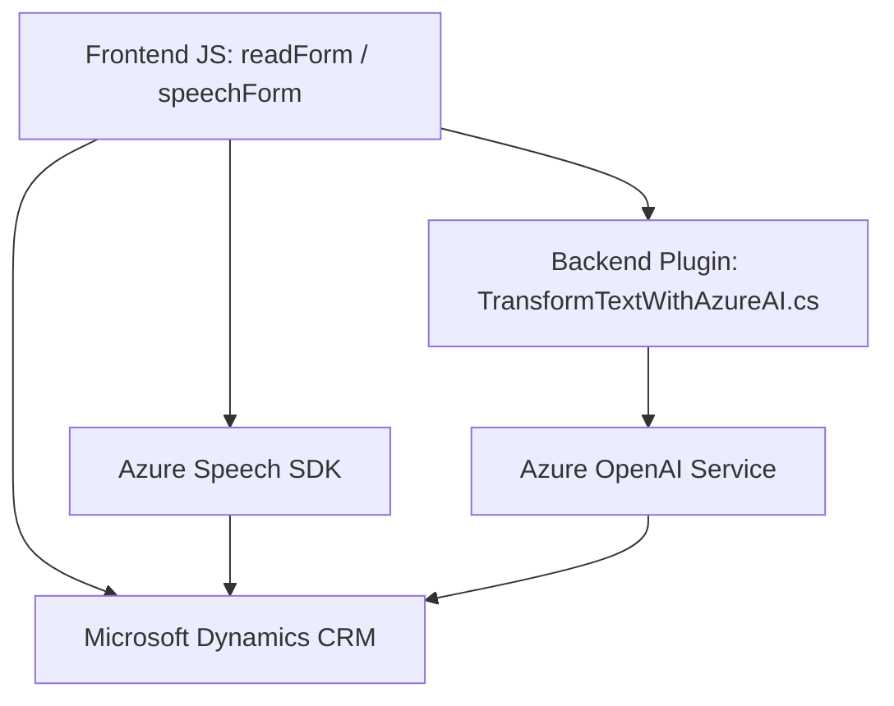

#### **Breve resumen técnico**
Este repositorio implementa un sistema que integra capacidades de entrada y salida de voz, edición de formularios dinámicos, y procesamiento avanzado de texto utilizando tecnologías como Azure Speech SDK y la API de OpenAI en Azure. Los tres componentes descritos (2 archivos en el frontend y 1 plugin en el backend) coordinan la gestión de interacciones con sistemas CRM, permitiendo flujos de trabajo interconectados entre un frontend basado en entrada de voz y un backend que procesa texto utilizando IA.

---

#### **Descripción de arquitectura**
La solución sigue un enfoque basado en arquitectura de **n capas**:
1. **Capa de presentación (Frontend)**:
   - Procesa datos del formulario y utiliza un SDK externo (Azure Speech SDK) para entrada y salida de voz.
   - Módulos como `readForm.js` y `speechForm.js` se encargan de abstraer la lógica de la interacción por voz y actualizar los campos del formulario dinámico en CRM.
   
2. **Capa de negocio (Backend)**:
   - El plugin `TransformTextWithAzureAI.cs` en el sistema CRM se integra como lógica accesoria, procesando los datos mediante la API de Azure OpenAI. Este plugin aplica transformación avanzada y genera JSON estructurado basado en reglas predefinidas.

La arquitectura tiene elementos de patrones como **Cliente-Servidor**, donde el cliente (frontend) solicita funcionalidades del servidor (backend conectado con API externas utilizando HTTP). Existe un claro desacoplamiento entre las capas.

---

#### **Tecnologías usadas**
1. **Frontend**:
   - Lenguaje: JavaScript (EcmaScript).
   - Framework: Entorno de aplicación basado en sistemas CRM como Dynamics.
   - Bibliotecas/Servicios:
     - Azure Speech SDK: Para entrada, salida de voz, y síntesis de texto.
     - Navegador: APIs de HTML/JS nativas (DOM, window, document).
   - Patrones de diseño: Modular, SRP (principio de responsabilidad única), integración de eventos.

2. **Backend**:
   - Lenguaje: C# (.NET Framework o .NET Core).
   - Framework: Microsoft Dynamics CRM SDK.
   - Servicios externos: Azure OpenAI para procesamiento de texto.
   - Bibliotecas:
     - `System.Net.Http`: Realiza peticiones HTTP para la comunicación con OpenAI.
     - `System.Text.Json` y `Newtonsoft.Json`: Manipulan respuestas y transformación de estructuras JSON.
   - Patrones de diseño: Plugin extensible, integración con API externas, Facade para encapsulación de lógica de OpenAI.

---

#### **Dependencias o componentes externos**
1. **Azure Speech SDK** (Frontend):
   - Usado para entrada y salida de voz.
   - Cargado dinámicamente desde CDN: `https://aka.ms/csspeech/jsbrowserpackageraw`.

2. **Azure OpenAI Service** (Backend):
   - Utilizado para procesamiento de datos y generación de respuestas estructuradas de texto.
   - Manejo de credenciales: API Key, región y endpoint específicos.

3. **Microsoft Dynamics CRM**:
   - Contexto del sistema en el que se integran los formularios (frontend) y el plugin para manipulación dinámica de atributos y datos relacionados.

4. **Navegador y APIs JS**:
   - Facilita la interacción con formularios y DOM en el navegador.

---

#### **Diagrama Mermaid**

---

#### **Conclusión final**
El repositorio implementa una solución orientada a enriquecer formularios CRM con accesibilidad por voz y procesamiento inteligente de texto mediante IA. La arquitectura sigue el paradigma de n capas, con una clara separación entre presentación (frontend), lógica de negocio (backend) y servicios externos (Azure). 

La elección de integrar tecnologías como Azure Speech SDK y OpenAI demuestra un esfuerzo por incorporar capacidades avanzadas en plataformas CRM, mejorando la experiencia del usuario y automatizando tareas vinculadas con formularios.