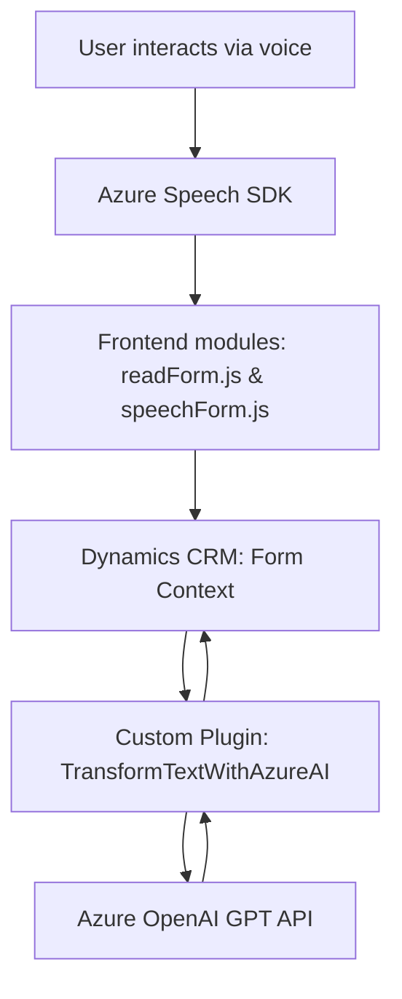

### Análisis detallado del repositorio
#### Breve resumen técnico
El repositorio contiene dos archivos de JavaScript (ubicados en la carpeta `FRONTEND/JS`) y un archivo C# (ubicado en la carpeta `Plugins`). La solución parece estar diseñada para integrar un frontend dinámico de formulario en Dynamics 365 CRM con servicios en la nube de Azure (Speech SDK y OpenAI GPT) para síntesis de voz y procesamiento de texto con IA. Se destaca el uso eficiente de la integración entre servicios externos y la modularidad de los componentes. 

---

#### Descripción de la arquitectura
La solución presentada combina elementos de diseño de **n capas** y es altamente orientada hacia un modelo de **arquitectura microservicios**. Esto se evidencia en:
1. **Frontend**: Gestión de formularios y funciones de interacción con el usuario, por medio de voz, integrando el servicio de Azure Speech SDK.
2. **Backend (Plugins)**: Complementado por servicios integrados de Microsoft Dynamics CRM. Utiliza el plugin `TransformTextWithAzureAI` para consumos externos con Azure OpenAI GPT.
   
El patrón de diseño modular y la separación de responsabilidades entre módulos aseguran una arquitectura escalable y reutilizable.

---

#### Tecnologías, frameworks y patrones usados
1. **JavaScript (Frontend)**:
   - Manipulación del DOM mediante funciones nativas.
   - Integración con **Azure Speech SDK**.
   - Uso de **Dynamic Dependency Loading** para cargar el SDK según necesidad.

2. **C# Plugin (Backend)**:
   - Extensión de funcionalidades de Dynamics CRM mediante **Microsoft.Xrm.Sdk**.
   - Comunicación con servicios externos utilizando **HttpClient** y serialización `JSON`.
   - **Integración con Azure OpenAI GPT API**.

3. **Patrones arquitectónicos**:
   - **Modularización funcional**: Las funciones y métodos están diseñados con tareas específicas para aislar lógica en componentes.
   - **Orientación a eventos**: El sistema reacciona a eventos de usuarios (entrada de voz, procesamiento de transcripciones).
   - **Integración API externa**: Interacción con Azure Speech SDK y Azure OpenAI GPT API.

---

#### Dependencias o componentes externos
1. **Frontend**:
   - **Azure Speech SDK**:
     - Realiza síntesis de voz y reconocimiento de transcripciones.
   - **Dynamics CRM (Xrm.WebApi)**:
     - Se utiliza para actualizar y gestionar formularios en tiempo real.
2. **Backend**:
   - **Azure OpenAI GPT API**:
     - Transformación de texto usando IA.
   - **Microsoft Dynamics CRM Plugins**:
     - Extiende funcionalidad del CRM mediante la integración de lógica personalizada.
   - **System.Text.Json / Newtonsoft.Json**: 
     - Manipulación JSON.

---

#### Diagrama Mermaid
A continuación, se presenta un diagrama para representar la interacción entre los componentes del sistema:

---

### Conclusión final
El repositorio define una solución sólida basada en la interacción de funcionalidades de Dynamics CRM con servicios de Azure. Se trata de una **aplicación de n-capas** debido a la separación entre frontend, backend dentro de Dynamics CRM y la integración con APIs externas. El diseño modular y los patrones de eventos hacen que la solución sea flexible y adaptable al uso de IA y servicios en la nube. Sin embargo, se recomienda trabajar en la seguridad del manejo de claves de API y expandir pruebas de errores para escenarios dinámicos.