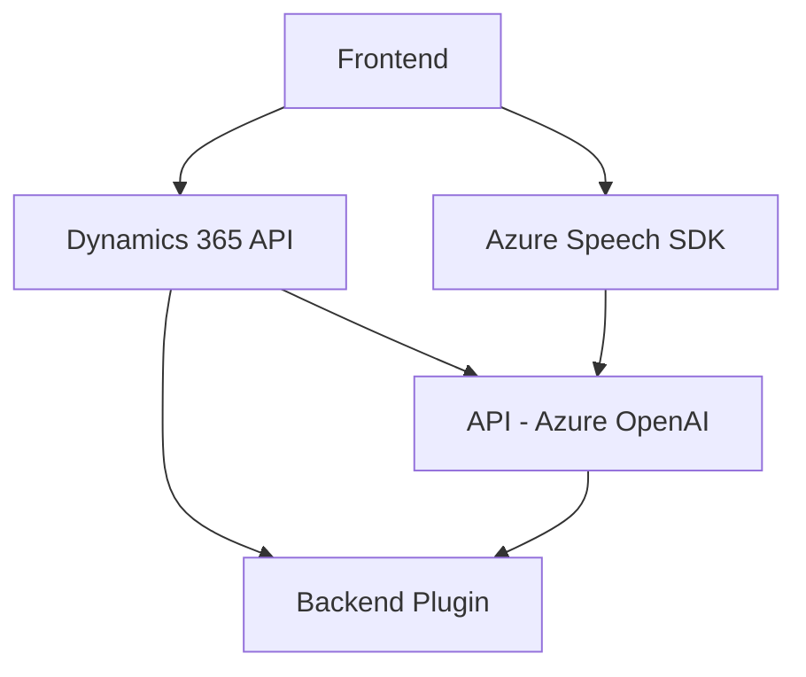

### Breve resumen técnico

El repositorio analiza la integración de **Azure Speech SDK** y **Azure OpenAI** con un formulario en Dynamics 365. Implementa una solución que permite interacción a través de voz para lectura y escritura en formularios, mientras transforma texto usando inteligencia artificial externa. Esto abarca tanto el frontend como un plugin backend para Dynamics 365.

---

### Descripción de arquitectura

La arquitectura es una solución híbrida **client-server** que combina las siguientes componentes clave:
1. **Frontend (JavaScript)**: Proporciona interacción en tiempo real con las funcionalidades de reconocimiento y síntesis de voz mediante Azure Speech SDK. Utiliza callbacks para cargar el SDK dinámicamente y manejar eventos relacionados.
2. **Backend (C#)**: Implementa un plugin en Dynamics CRM que integra funcionalidad de transformación de texto con **Azure OpenAI**, permitiendo análisis avanzado.
3. **Integración con APIs externas (Azure Speech y Azure OpenAI)**: Realiza solicitudes y sincronización con servicios de reconocimiento y generación de texto en la nube.

La arquitectura utiliza un **patrón de capas** combinado con modularidad funcional:
- **Frontend**: Lógica para interacción en tiempo real con el usuario, extracción/formateo de datos desde el formulario y conexión con APIs externas.
- **Backend**: Implementación del plugin con lógica encapsulada para transformar texto proporcionado por el sistema Dynamics CRM.

---

### Tecnologías usadas

1. **Frontend**:
   - **JavaScript**:
     - Azure Speech SDK: Para reconocer y sintetizar voz.
     - JavaScript puro: Manejo del DOM y creación dinámica de scripts.
   - **Dynamics 365 API**:
     - `Xrm.WebApi.online`: Interactúa con el sistema de CRM para gestionar datos.

2. **Backend**:
   - **C#**:
     - Uso de eventos e implementación de `IPlugin` en Dynamics CRM.
     - `Microsoft.Xrm.Sdk`: Manejo del contexto y datos de Dynamics.
     - `System.Net.Http`: Realización de solicitudes HTTP.
     - `Newtonsoft.Json.Linq` y `System.Text.Json`: Manipulación eficiente de JSON.

3. **Servicios Externos**:
   - **Azure Speech SDK**: Reconocimiento/síntesis de voz.
   - **Azure OpenAI**: Transformación de texto en base a IA.

---

### Diagrama Mermaid válido para GitHub Markdown

---

### Conclusión final

1. **Tipo de solución**: El repositorio combina un **frontend** interactivo en JavaScript con un **backend plugin** en Dynamics 365, utilizando APIs externas. La solución puede clasificarse como una integración completa **client-server** destinada al procesamiento de voz y transformación avanzada de texto.
2. **Patrones y diseño**: La arquitectura está orientada al servicio y utiliza el principio de modularidad:
   - **SDK cargado bajo demanda** para eficiencia en tiempo real.
   - **Enfoque de capas** con separación clara entre frontend y backend.
   - Implementación dinámica de la **programación asincrónica** para flujo eficiente.
3. **Tecnologías** incluyen:
   - **Azure Speech/AI SDKs**.
   - **Microsoft Dynamics CRM APIs**.
   - Combina JavaScript en el cliente y C# en el servidor para cubrir toda la funcionalidad.