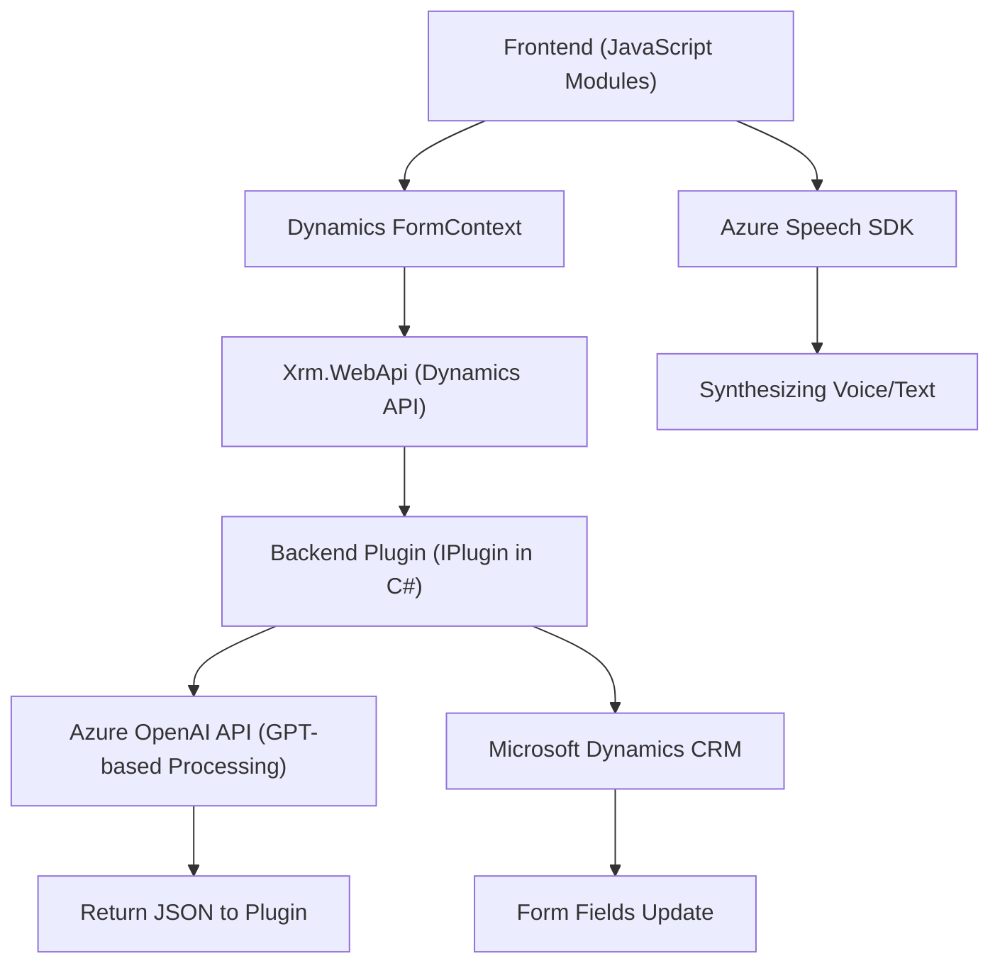

### Resumen técnico
Este proyecto es una solución híbrida que integra un **frontend en JavaScript** con un **plugin para Microsoft Dynamics CRM**, complementada por el uso de servicios externos como **Azure Speech SDK** y **Azure OpenAI API**. Ofrece soporte para funcionalidades avanzadas, como sintetización de voz con texto y procesamiento de comandos en lenguaje natural.

---

### Descripción de arquitectura
La arquitectura predominante combina elementos de una **arquitectura por capas**, típica de sistemas CRM, con la integración de **servicios externos** vía API para ampliar las capacidades estándar. El plugin de Dynamics actúa como una capa de lógica de negocio, mientras que los archivos de frontend son módulos independientes que gestionan la interacción de usuario (entrada/salida de voz) a través de servicios externos como Azure Speech y Azure OpenAI.

- **Backend (Dynamics Plugin):**
  - Implementado como un Microsoft Dynamics CRM plugin, siguiendo el patrón de extensibilidad de Dynamics CRM.
  - Encapsula las reglas de negocio y coordina la transformación del texto.
- **Frontend:**
  - Modularizado en archivos de JavaScript que interactúan con el contexto del formulario (modelos dinámicos) en Dynamics.
  - Provee entrada/salida de voz con APIs de Azure Speech y usa condicionales para bifurcar lógica estándar o "IA".

---

### Tecnologías usadas

1. **Frontend:**
   - **JavaScript:** Para manejo de eventos, integración con APIs y lógica de procesamiento.
   - **Azure Speech SDK:** Utilizado para sintetizar salida en voz desde texto y procesar entrada por voz.
   - **Xrm.WebApi:** De Dynamics CRM, para acceder y manipular la data del sistema CRM.

2. **Backend Plugin:**
   - **C#:**
     - Implementa la lógica empresarial mediante la interfaz `IPlugin` del SDK de Microsoft Dynamics.
     - Interfaz para integrar procesos personalizados directamente con Dynamics 365.
   - **Microsoft Dynamics CRM SDK**: Para acceso a servicios, parámetros y contexto del ciclo de plugins.
   - **Azure OpenAI API:** Consume OpenAI GPT para transformar texto en JSON estructurado.
   - **Newtonsoft.Json**: Serialización/deserialización de JSON.
   - **System.Net.Http**: Manejo de llamadas HTTP al servicio Azure OpenAI.

---

### Arquitectura del sistema
**Híbrida con 2 elementos predominantemente establecidos:**
1. **Arquitectura por capas:**
   - El plugin sigue la estructura estándar de **Microsoft Dynamics CRM** (capa de plugin que interactúa con contexto, parámetros y datos de la plataforma).
   - **Frontend** actúa como capa de presentación orientada al usuario (UI) dentro del entorno web de Dynamics CRM.

2. **Integración con API externas:**
   - Conexión al **Azure Speech SDK** y **Azure OpenAI API** como componentes externos.
   - Utiliza dos enfoques complementarios:
     - **Frontend:** Directa para sintetización de voz o reconocimiento.
     - **Backend:** Procesos de transformación e interacción con OpenAI mediante HTTP.

---

### Dependencias o componentes externos
1. **Azure Speech SDK:**
   - Generación de síntesis y reconocimiento de voz.
   - SDK cargado dinámicamente en el frontend (`https://aka.ms/csspeech/jsbrowserpackageraw`).

2. **Azure OpenAI API:**
   - Servicio para procesamiento avanzado de texto basado en GPT.
   - Llamadas desde el plugin (backend).

3. **Microsoft Dynamics SDK y API Xrm.WebApi:**
   - Manejo de datos y entidades en Dynamics.
   - Actualización dinámica de campos de formulario usando `formContext`.

4. **Newtonsoft.Json y JSON APIs:**
   - Procesamiento de estructuras JSON en el backend (con C#).

---

### Diagrama Mermaid

---

### Conclusión final
La solución está diseñada como una **extensión personalizada para Microsoft Dynamics CRM**, integrada con **Azure Speech SDK** y **Azure OpenAI API** para agregar capacidades inteligentes relacionadas con voz y lenguaje natural. Sigue una **arquitectura híbrida**: por capas (Dynamics plugin y frontend interactúan con APIs externas). Es modular, lo que facilita su mantenimiento, extensión y escalabilidad.