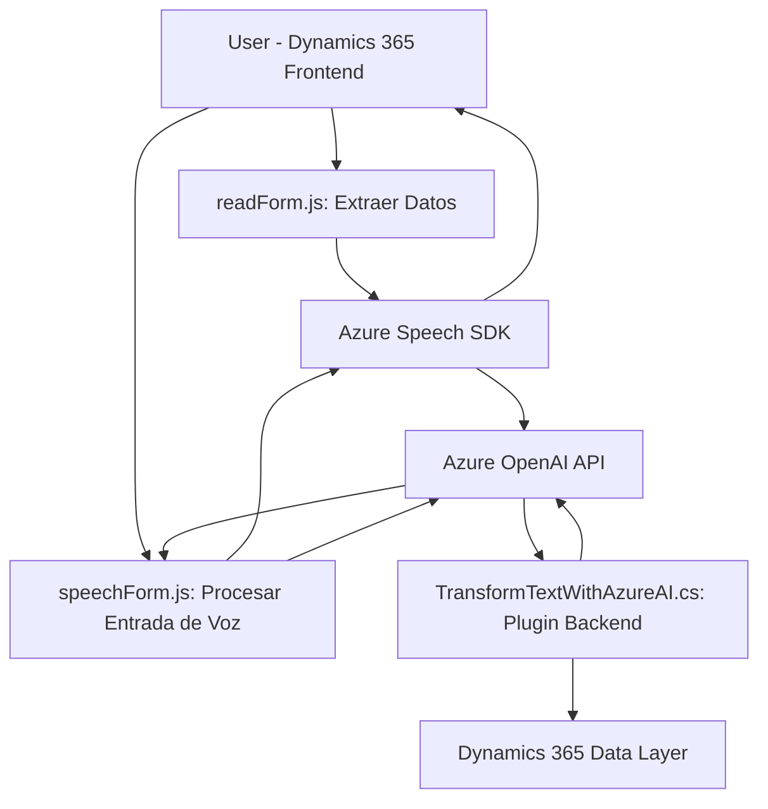

## Breve resumen técnico

Este repositorio contiene ejemplos de código orientados a la interacción con formularios y datos en **Dynamics 365**, utilizando **Azure Speech SDK** y **Azure OpenAI**. La solución integra funcionalidad avanzada de síntesis de voz, reconocimiento de voz, y procesamiento automatizado de texto mediante inteligencias artificiales y servicios en la nube.

---

## Descripción de arquitectura

La arquitectura general del repositorio sigue un modelo **n-capas** con una estructura modular. Cada componente se organiza para cumplir con responsabilidades específicas:
- **Frontend**: Proporciona la capacidad de interactuar con formularios en Dynamics 365, tanto para extracción y síntesis de datos visibles como para imputación de datos provenientes de voz o reglas de IA.
- **Plugins CRM (Backend)**: Realizan procesamiento de datos y transformación de texto a través de servicios en la nube (Azure OpenAI) directamente en el contexto del CRM.
- **Infraestructura basada en servicios en la nube**: Utiliza Azure Speech SDK y Azure OpenAI como servicios externos para el procesamiento de voz y texto.

El diseño tiene características del **patrón de arquitectura de puerto y adaptadores (hexagonal)**, con integración directa a servicios externos como Azure Speech SDK y Azure OpenAI, que actúan como adaptadores para la lógica implementada.

---

## Tecnologías usadas

1. **Frontend**:
   - **Lenguajes**: JavaScript.
   - **Frameworks internos**: Dynamics 365 (entorno frontend, XRM API).
   - **Servicios externos**:
     - **Azure Speech SDK** (síntesis y reconocimiento de voz).
     - **Azure OpenAI API** (transformación de texto con IA).

2. **Plugins Backend**:
   - **Lenguajes**: C#.
   - **Frameworks**:
     - `Microsoft.Xrm.Sdk` (interacciones con el contexto CRM y servicios organizacionales).
     - `Newtonsoft.Json` y `System.Text.Json` (manipulación de JSON).
   - **Servicios externos**:
     - **Azure OpenAI API** mediante llamadas `HttpClient`.

3. **Patrones arquitectónicos usados**:
   - **Hexagonal (Puerto y Adaptador)**: En la interacción con los servicios externos (Azure SDKs).
   - **Encapsulación**: Separación estricta de las responsabilidades en funciones y clases.
   - **Event-Driven**: Adopción de callbacks y patrones asíncronos (e.g., para la carga del SDK de Azure Speech).

---

## Diagrama Mermaid válido para GitHub

---

## Conclusión final

La solución es una integración completa entre una capa de frontend (para interacción con formularios en Dynamics 365) y un backend de plugins en C#. Se posiciona como una arquitectura híbrida **n-capas con características de diseño hexagonal**. Utiliza una combinación de servicios en la nube (Azure Speech SDK y Azure OpenAI) para enriquecer la funcionalidad de Dynamics 365, como síntesis de voz, reconocimiento de voz y transformación de texto mediante IA. Su diseño modular y orientación hacia la integración asíncrona demuestra solidez y escalabilidad para entornos basados en la nube.