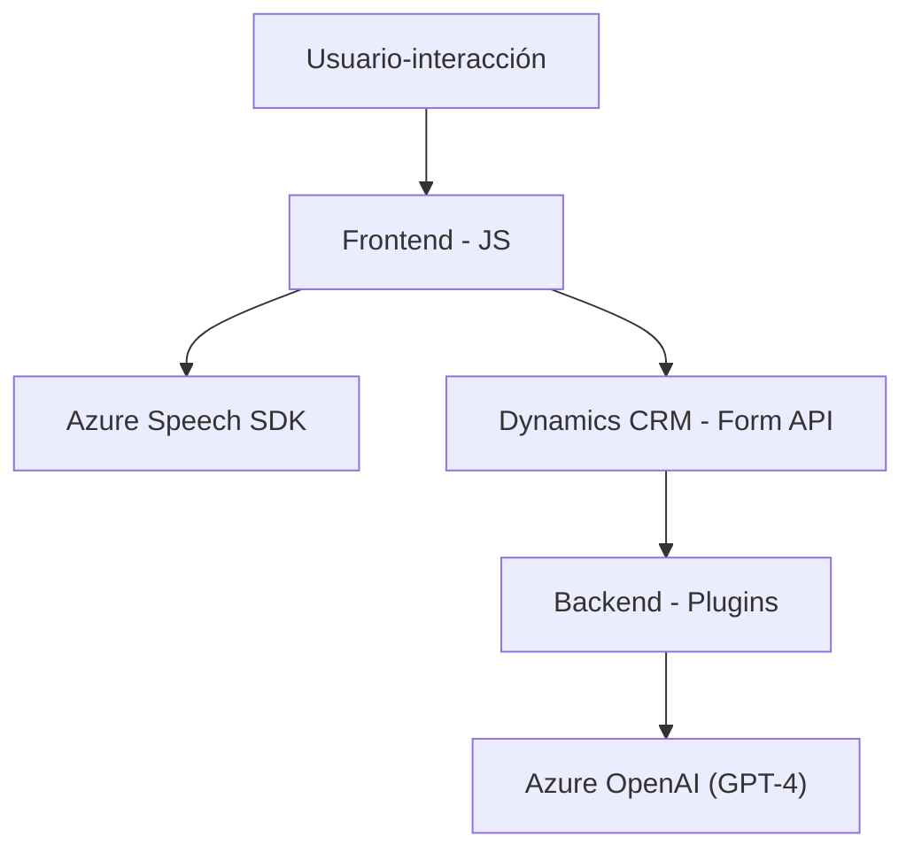

### Breve resumen técnico
El repositorio presenta una solución híbrida con un enfoque en la integración entre la interacción humana (voz y texto) y aplicaciones empresariales avanzadas de CRM (Dynamics CRM). Se utiliza el Azure Speech SDK para manejar reconocimiento y síntesis de voz, además de aprovechar el servicio Azure OpenAI para transformar texto en JSON validado. 

---

### Descripción de arquitectura
La arquitectura de la solución puede describirse como **n capas**, donde cada componente tiene funciones específicas:
1. **Frontend**: Gestiona la interacción directa con el usuario mediante el navegador, procesando formularios y comunicación por voz.
2. **Backend/Plugins**: Implementa lógica empresarial a través de plugins de Dynamics CRM, integrando reglas de negocio y dependencias con servicios externos (Azure OpenAI).
3. **Servicios externos**: Azure Speech SDK y Azure OpenAI actúan como capas externas para reconocimiento de voz y procesamiento avanzado de texto.

---

### Tecnologías usadas
1. **Frontend**:
   - JavaScript: Para extracción y transformación de datos de formularios.
   - Azure Speech SDK: Manejo de voz (reconocimiento y síntesis).
   - Dynamics CRM APIs: Para interacción con datos del formulario.
   - DOM Manipulation: Para operaciones dinámicas en el navegador.

2. **Backend**:
   - C# (.NET Framework): Implementación del plugin.
   - Microsoft Dynamics SDK: Manejo de eventos y datos del CRM.
   - Azure OpenAI: Procesamiento inteligente de texto mediante modelos GPT.

3. **Servicios externos**:
   - Azure Speech SDK: Reconocimiento y síntesis de voz.
   - Azure OpenAI (GPT): Generación de JSON según reglas empresariales.

4. **Otros**:
   - APIs personalizadas para integración y extensibilidad.
   - Librerías de JSON: Newtonsoft.Json para manipulación de datos JSON.

---

### Diagrama Mermaid válido para GitHub

---

### Conclusión final
Esta solución está orientada a entornos empresariales, especialmente aquellos que utilizan Dynamics CRM, integrando funcionalidades avanzadas de voz y procesamiento de datos mediante Azure Speech SDK y OpenAI. La arquitectura **n capas** proporciona separación de responsabilidades, mientras que patrones como **event-driven** y **facade** garantizan modularidad y flexibilidad. Es robusta para operar en escenarios de alta demanda, como la gestión automatizada en CRM, lectura dinámica de formularios y transformación inteligente de datos.